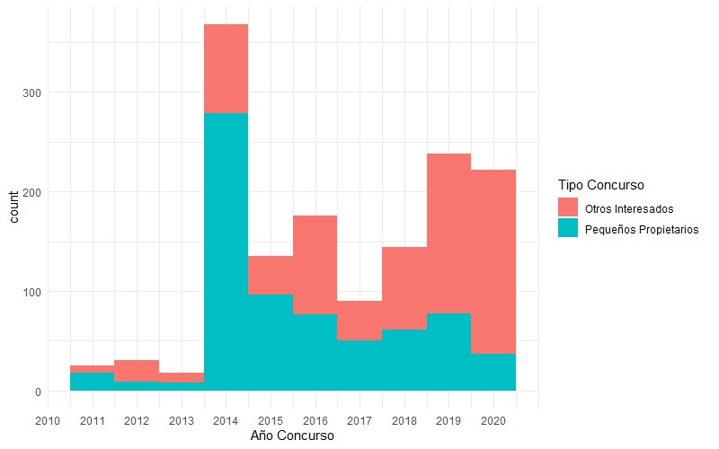

\doublespacing
\sectionfont{\fontsize{11}{11}\selectfont}
\subsectionfont{\fontsize{11}{11}\selectfont}

```{r setup, include=FALSE}
library(knitr)
library(ggplot2)
library(kableExtra)
library(tidyverse)
library(stargazer)

source('summarySE.R')

knitr::opts_chunk$set(echo = FALSE, warnings = FALSE, messages = FALSE, out.width="49%", fig.align = "center")
```
<!-- # Abstract {-} -->
<!-- \{in progress\} -->
Hi everyone,

Thank you in advance for reading this paper and providing feedback. I'll quickly outline the state of this research. While I plan to adjust the outcome and empirics, I'm seeking feedback mainly on the framing and motivation. 

At this point, I've decided that I want the following question to be a part of the paper: What impact did subsidies under Chile's Native Forest Law have on carbon sequestration? I'd also like to determine what was the price for carbon removals via the payments for reforestation. There are a couple obstacles to answering these questions, including differentiating between the effect of enrollment and getting at the carbon gains that were actually paid for. However, I feel like there's a contribution to be made by explicitly estimating the carbon price, and I think there's a path to do so. I discuss these in more detail in the paper, but I quickly map out the other questions that I'm interested in exploring further below:

\begin{outline}
\1 What are the drivers of success/failure in payments for reforestation settings?
\1 Does targeting PES for equity reduce environmental effectiveness?
\2 If yes and assuming equity is a priority, could any environmental gains be had without sacrificing equity goals?
\2 How could the program's targeting mechanisms be altered to achieve these goals efficiently
\3 the current draft probably goes after this set of questions most
\1 What drives low follow-through, and could it be improved with different contract design?
\2 feedback on which aspects this setting might be well positioned to answer could be useful
\end{outline}

\clearpage

# Introduction

In order to achieve the warming targets set by the IPCC, both emissions reductions and removals of carbon from the atmosphere will be necessary [@bastin_global_2019]. Reforestation has been lauded as a potentially near term, large scale and low-cost option to achieve these carbon removals [@busch_potential_2019], however, there is limited evidence documenting the effectiveness of policies seeking to encourage reforestation at large scales. One policy that is expected to play an important role in helping countries meet their reforestation commitments is a system in which private landowners are paid to engage in reforestation [@gichuki_reviving_2019]. While similar payment for ecosystem services (PES) programs have garnered widespread scientific interest [@borner_effectiveness_2017], empirical studies documenting the impacts of large-scale reforestation programs are critical to guide the effective design of policies as more countries adopt this model. 

Within the natural climate solutions literature, ample attention has been given to the co-benefits and co-risks that can arise from the growing market for carbon removals. As a result of the emphasis on generating biomass, many programs have encouraged afforestation with monocultures of quick-growing exotic species such as eucalyptus and monterrey pine [@iucn_afforestation_2016]. This model can have co-risks such as the conversion of native ecosystems, loss of biodiversity, and exacerbation of distributional issues [@heilmayr_impacts_2020]. On the other hand, many argue that these schemes can avoid the aforementioned risks and generate substantial co-benefits if done properly. These often cited co-benefits include biodiversity conservation, habitat improvement, watershed protection, and support for lower-income and indigenous communities. 

A vast targeting literature aims to enhance cost-effectiveness and environmental gains of PES programs [@alix-garcia_payment_2014]. In many cases, the social planner hopes to generate co-benefits and to target for both environmental and social development goals. @alix-garcia_only_2015 show that an avoided deforestation program generated positive but small gains in forest cover and poverty alleviation. They highlight that environmental gains were mostly in low poverty areas, but household gains ocurred in high poverty areas, emphasizing the difficulty of meeting multiple policy objectives with a single tool. To what degree the touted win-wins of natural climate solutions can be achieved in practice is an area in need of further exploration. In the avoided deforestation case, environmental benefits are largely driven by the presence of deforestation risk, however, in the reforestation case, effectiveness relies on whether landowners can be incentivized to make the longer-term investment in tree survival. 

Efficient targeting of public programs is difficult when the costs or benefits to potential recipients is private information [@jack_private_2013]. This is a major consideration in the payments for reforestation case, where the opportunity cost of restoration to landowners is unknown to program administrators. The optimal contract and program design literature has sought to find ways to circumvent this issue in PES contexts. For example, @jack_private_2013 shows that an auction mechanism can generate significant cost savings by identifying users with high private benefit-to-opportunity cost ratios for tree maintenance. @jack2017 further show that auctions can effectively mitigate the risk of leakage in PES scenarios. Ultimately, auctions clearly reduce informational rents for program administrators and help to obtain cost-effective program results, but there can be substantial equity trade-offs in many circumstances [@alix-garcia_payment_2014]. Other factors such as uncertainty can influence the effectiveness of certain contract designs [@oliva_technology_2020], and understanding why low-follow through rates are common in many settings is an open area of research. 

In this paper, we evaluate the land cover impacts of Chile’s Native Forest Law. A key concern with evaluations of these types of programs is that apparent effectiveness may be driven by unobservable differences in participation costs, meaning that performance may be attributed to these omitted characteristics rather than participation in the program [@alix-garcia_only_2015]. From a pool of over five hundred thousand untreated properties, we construct a set of counterfactual properties based on a detailed set of land use and property characteristics in order to alleviate some of the concerns surrounding selection. We evaluate land cover impacts for eleven cohorts (2009–2019) using annual data from 2005–2020 and difference-in-differences regressions that are robust to general treatment effect heterogeneity.

We then analyze the Native Forest Law’s program design and the drivers of program additionality to understand whether improved environmental impacts could have been achieved and whether doing so would sacrifice program goals such as the involvement of smallholders and indigenous peoples. The program targets for both environmental and social benefits in two ways: 1) holding separate contests for smallholders and larger landowners and 2) scoring proposed projects based on pre-determined applicant and project criteria. We explore whether this approach might create tradeoffs between environmental and social development goals. Ultimately, it appears that smallholders experience smaller treatment effects, but this is largely driven by pre-program land use characteristics that are likely indicative of the landowner's prior forestry experience and the property's productive potential. It may be possible to improve program performance without sacrificing smallholder involvement by targeting smallholders with certain characteristics or with prior forest management experience. The program's scoring mechanism appears to predict performance relatively well and is positively correlated with property characteristics that drive improved performance. 

Lastly, I'm hoping to explore whether this paper can contribute to the literature on optimal program design. This is an area where feedback is likely to be particularly helpful. Potentially reducing the environmental impacts of the policy is the fact that the rate of award payment is relatively low. In particular, payouts differ according to the type of project and the corresponding follow-through and payment schedule. Determining whether program outcomes could be improved with better contract design is a question that I hope to explore further in the context of the program. 

There are a few directions to take this work with varying contributions to the literature. The current structure aims to advance the literature that addresses whether reforestation may be a viable large-scale method for removing and storing CO2 and add to the limited existing evidence on the environmental effectiveness of large-scale native reforestation programs. Between 2009 and 2019, the National Forest Corporation (CONAF) allocated approximately US $58 million to enroll more than 235 hectares of land through the Native Forest Law, making it one of the largest native forest reforestation programs in the world. As other countries begin to contemplate reforestation policies, Chile’s experience provides a valuable case study from which to draw. 

I hope this paper can contribute to the literature on targeting and whether there exist tradeoffs between environmental efficacy and advancement of social development goals, particularly in the case of natural climate solutions. I evaluate the Native Forest Law's targeting approaches and show that while there are tradeoffs, it may be possible to achieve greater environmental gains without the exclusion of smallholders. Further, this paper shows that pre-program land use is a major determinant of whether a property is likely to provide much additionality. I also hope to make contributions to the literature on optimal program design, although, this has not been developed. The program suffers from low follow-through, raising several questions about why landowners would apply and fail to follow-through as well as whether higher follow-though could have been achieved with a different contract or payment structure. 

The remainder of the paper is organized as follows. Section 2 gives the broad setting and our data sources. Section 3 explores the program design and descriptive statistics surrounding the applicants and enrollees. I use this section to raise specific questions about the program that may be particularly interesting to explore further. Section 4 presents the preliminary impact evaluation and its results along with potential implications. Section 5 provides some initial estimates relevant for the discussion on environmental-equity tradeoffs, and section 6 proposes next steps and areas in which feedback may be particularly helpful. 

# Chile's Native Forest Law

Chile provides an ideal setting in which to explore the potential for large-scale payments for reforestation. First, the country has experienced diverse and widespread tree cover expansion [@heilmayr_plantation-dominated_2016]. This expansion includes extensive afforestation of pine and eucalyptus plantations [@echeverria2006], natural forest regeneration in the wake of disturbance [@albornoz_nucleation-driven_2013], and active native reforestation and restoration. Second, Chile’s long history of public policies supporting tree cover expansion provides an incredibly useful natural experiment in which to measure the impacts of payments for reforestation. Chile's decree  law no. 701  is one of the world's longest operating afforestation subsidies, but mainly promoted even-aged mococulture plantations of eucalyptus and pine that had negative effects on biodiversity and native forest cover [@heilmayr_impacts_2020]. 

In an attempt to encourage more reforestation of native forests, Chile passed the Ley de Recuperación del Bosque Nativo y Fomento Forestal (Native Forest Law) in 2008. In addition to protections for native forests, the law established an annual competition for grants to support private landowners in their efforts to restore or reforest their land using native species. Since 2009, more than $58 million have been allocated through these competitions for projects covering 235 thousand hectares, with a particular emphasis placed upon supporting smallholders and indigenous peoples. 

## Data

### administrative data

We have obtained property boundaries for all rural properties in the major forested regions of Chile as of the year 2009. Data on the awarded properties are available through CONAF and reflect aspects of the property and projects such as project surface area, bonus amount, and applicant race and gender. Also included is each property's parcel indentifier, which is unique to each property within a comuna, Chile's level 3 administrative unit. I match the enrolled properties to their corresponding boundaries via the unique parcel identifier. Figure XX shows the result of this process. 

```{r enrolled-map, fig.pos="H", out.width = '50%', fig.cap = "This figure shows properties enrolled through the Native Forest Law contest by year of enrollment. We have since expanded the matched property boundaries to the Chile-Argentina border.", echo=FALSE}
knitr::include_graphics("figs/propertymap_updated.pdf")
```

I have obtained the names of payment recipients associated with the Native Forest Law along with the date of the payment. Using fuzzy string matching on the names of the payment recipients and the program application names, I am able to match 85.67\% of the paid names to corresponding properties. Visual confirmation ensures that the fuzzy matching produces reasonable matches. 

### satellite data

I use normalized difference vegetation index (NDVI) as a proxy for each property's annual level of vegetation/forest cover. To generate the outcome for each property, I compute the average maximum NDVI value of each pixel (greenest pixel) within a property for a given year. I have generated NDVI time series of this sort for each property in the regions of Maule, Araucanía, Bío-Bío, Ñuble, and Los Ríos. These regions constitute the major forest areas of Chile and the regions that contain a majority of the Native Forest Law enrollees. Generating time series for all properties in these regions allows me to match on pre-trends of the outcome variable in the matching part of the program evaluation. 

One benefit of the use of NDVI is the ability to capture both new forest cover and changes in forest quality within a single index measure. A concern with this outcome is its propensity to become saturated in high biomass regions. Given Chile's extensive native and plantation forests and the fact that many enrolled properties already have forest cover, this may limit my ability to detect small changes in vegetation/forest cover through time. 
We have recently obtained forest inventory data from Chile's Institute of Forestry (INFOR) containing plot level volumes and densities along with the relevant geocoordinates and measurement years for the above regions. Working with colleagues in Bren, we hope use these as training and validation data to generate maps of aboveground biomass in the above regions. This will allow me to generate treatment effect estimates directly in terms of carbon in aboveground biomass. 

Lastly, Landsat resolution (30m) land-use maps of Chile for the year 2001 generated in @heilmayr_plantation-dominated_2016 allow me to see the proportion of each property engaged in specific land uses prior to the existence of the Native Forest Law or the announcement of the annual contests. 

# Important descriptive findings that motivate next steps

```{r, include = FALSE}
rolarea_covars <- data.frame(readRDS("rolarea_covars.rds"))
rolarea_df <- data.frame(readRDS("rolarea_df.rds"))
propertypaid_id <- data.frame(readRDS("propertypaid_id.rds"))
rolarea_df$geometry <- NULL
rolarea_covars$geometry <- NULL
enrolled_df <- rolarea_df %>%
  inner_join(rolarea_covars, by ="prop_ID")%>%
  mutate(forest = c_1,
         plantation = c_3,
         baresoil = c_12,+c_10,
         pasture = c_9,
         water = c_15,
         urban = c_16,
         shrub = c_5,
         timber = ifelse(rptpro_objetivo_manejo.x == "PRODUCCION MADERERA", 1, 0),
         nontimber = ifelse(rptpro_objetivo_manejo.x == "PRODUCCION NO MADERERA", 1, 0),
         ecologio = ifelse(rptpro_objetivo_manejo.x == "BOSQUE PRESERVACION Y FORMACIONES XEROFITICAS DE ALTO VALOR ECOLOGICO", 1, 0),
         reftype = ifelse(ecologio==1|reforestation2==1, 1, 0),
         female = ifelse(rptprop_sexo == "Masculino", 0, 1),
         indigenous = ifelse(rptprop_etnia == "Aymara" | rptprop_etnia == "Mapuche" | rptprop_etnia == "Otra", 1, 0),
         smallholder = ifelse(rptpro_tipo_concurso == "Otros Interesados", 0, 1))%>%
  mutate_at(vars(forest:shrub), ~replace(., is.na(.), 0))

enrolled_df$smallholder <- as.character(enrolled_df$smallholder)
pd <- position_dodge(0.25)

paid.enrolled <- enrolled_df %>%
  left_join(propertypaid_id) %>%
  mutate(paid = ifelse(is.na(paid), 0, paid))

```

## Motivating evidence part 1: The program's targeting strategies and heterogeneity in land use composition

The program sought to balance efficiency and equity outcomes by targeting smallholders and indigenous communities. The Native Forest Law targeted in two ways: 1) holding separate contests for smallholders and larger properties and 2) the scoring mechanism. If payments were less additional for smallholders or indigenous peoples, the program could have foregone carbon gains in exchange for this redistribution. Determining whether improved environmental effectiveness can be achieved without sacrificing the engagement of these groups depends on whether there exists systematic heterogeneity in impacts. If effectiveness could be improved without sacrificing smallholder engagement, what types of smallholders would be the best targets? How effective is the scoring mechanism at gauging social development or environmental gains? This is closer to the current draft. 

Pre-program land use is likely to be a significant driver of this heterogeneity. Recent studies have found that a major barrier to reforestation success is a lack of technical skills and prior experience [e.g., @powlen_identifying_2019]. Further, landowners with high initial participation costs are less likely to engage in reforestation. These aspects of reforestation mean that pre-program land use characteristics likely play a major role in shaping a landowner's forest management success. In this section, we use Landsat resolution land use maps of Chile in 2001 to explore the pre-program land use composition of properties that eventually enrolled in the program. I explore the proportion of each property under each of the following land uses in 2001: native forest, plantation forest, and pasture. 

Thinking about the pre-program land uses of eventually enrolled properties raises some interesting questions about the additionality of the policy. If properties with high levels of native forest cover are receiving subsidies through the Native Forest Law contest, it is possible that additionality will be low. Landowners who maintain a significant amount of native forest may already undertake these activities in the absence of the payments. These properties may be able to provide native forest cover or forest quality gains at a lower cost, meaning they are inefficiently being paid above their opportunity cost for the projects. Properties with plantation forestry may be using funds from the Native Forest Law to substitute toward native forest. While the carbon additionality may be low in this case, co-benefits such as biodiversity gains and habitat connectivity would likely be had. If these landowners are extending forest cover on the property and doing so using native species, these properties may provide significant gains, because they have the experience and resources to ensure survival of trees and forest. If properties with high amounts of pasture move away from livestock grazing or even enrich the grasslands that exist on the property, carbon additionality could be high. These could conceivably be properties that face higher costs to initiate forest management activities that the landowner does not have much experience with. 

Given that pre-program land use is likely to be a significant determinant of additionality and the fact that the directions of these signs may be unclear, this has important repercussions for the program administrator from a targeting perspective.

### land use composition by application score

```{r, include =FALSE}
test <- within(enrolled_df, quartile <- as.integer(cut(rptpro_puntaje, quantile(rptpro_puntaje, probs=0:4/4), include.lowest=TRUE)))

q_forest <- ggplot(summarySE(test, measurevar="forest", groupvars=c("quartile"), na.rm = TRUE),
  aes(x=quartile, y=forest)) + 
    geom_errorbar(aes(ymin=forest-se, ymax=forest+se), width=.25, position=pd, color = "darkgreen") +
    geom_line(position=pd, color = "darkgreen") +
    geom_point(position=pd, size=3, shape=21, fill="white")+
  ylab("proportion forest")+ggtitle("native forest")

q_plantation <- ggplot(summarySE(test, measurevar="plantation", 
                                 groupvars=c("quartile")#, "contest")
                                 , na.rm = TRUE),
  aes(x=quartile, y=plantation)) + 
    geom_errorbar(aes(ymin=plantation-se, ymax=plantation+se), width=.25, position=pd, color = "mediumseagreen") +
    geom_line(position=pd, color = "mediumseagreen") +
    geom_point(position=pd, size=3, shape=21, fill="white")+
  ylab("proportion plantation")+ggtitle("plantation forest")
  
  
q_past <- ggplot(summarySE(test, measurevar="pasture", groupvars=c("quartile"), na.rm = TRUE),
  aes(x=quartile, y=pasture)) + 
    geom_errorbar(aes(ymin=pasture-se, ymax=pasture+se), width=.25, position=pd, color = "goldenrod4") +
    geom_line(position=pd, color = "goldenrod4") +
    geom_point(position=pd, size=3, shape=21, fill="white")+
  ylab("proportion grassland")+ggtitle("pasture and grassland")

```

A large literature shows that targeting on observables could improve environmental outcomes of public programs [e.g., @mason_2013; @cho2019]. The Native Forest Law made a significant effort to engage smallholders, indigenous groups, and women, possibly conceding some environmental gains. In order to balance this trade-off, the program assigns each application a score based on applicant, property, and project characterisitcs. Smaller properties and properties in indigenous communities get additional points, but other applicants may be able to make up for some shortcomings by simply enrolling more land in the program or taking on higher value activities. It is unclear that this scoring mechanism makes efficient tradeoffs between equity and the environment. We have the unusual ability to match a specific property with its score, and thus, explore these tradeoffs. 

Figure \@ref(fig:score-quart) shows how pre-program land use varies by score quartile. The left panel shows how the average proportion of native forest varies across score quartiles. The middle and right panels show the same for plantation and pasture, respectively. While the average proportion of a property with native forest doesn't vary much across score quartiles, proportions of plantation forest and grassland are clearly associated with score. Score quartile and the proportion of the property with plantation forest are positively correlated, while score quartile and the proportion of the property with pasture are negatively correlated. If these pre-program land uses are determinants of how effective a landowner is at implementing the reforestation project, the score is likely a good predictor of environmental performance. If so, it may be interesting for future work to explore how well the score correlates with social metrics such as communal poverty and applicant race or gender. 

```{r score-quart, fig.pos="H", fig.show="hold", out.width="32.5%", fig.cap = "Left: average pre-program proportion of property classified as native forest by application score quartile; Middle: average pre-program proportion of property classified as plantation forest by application score quartile; Right: average pre-program proportion of property classified as grasslands/pasture by application score quartile"}
q_forest
q_plantation
q_past

```

### land use composition by cohort

Figure \@ref(fig:landuse) shows the composition of cohorts' land use with regards to each land class. The left panel shows that early cohorts had higher levels of native forest than later enrollees. The middle panel shows that the proportion of the average property with plantation forestry hasn't clearly changed over time. Lastly, the right panel shows that later cohorts had higher levels of pasture on their property on average.  

```{r , include = FALSE}
enrolled_df$contest <- ifelse(enrolled_df$smallholder==1, "smallholder", "other interested parties")

p_forest <- ggplot(summarySE(enrolled_df, measurevar="forest", groupvars=c("first.treat"), na.rm = TRUE), 
       aes(x=first.treat, y=forest)
       ) + 
    geom_errorbar(aes(ymin=forest-se, ymax=forest+se), width=.1, position=pd, color = "darkgreen") +
    geom_line(position=pd, color = "darkgreen") +
    geom_point(position=pd, size=3, shape=21, fill="white")+
  xlab("cohort")+
  ylab("proportion forest")+ggtitle("native forest")

p_plantation <- ggplot(summarySE(enrolled_df, measurevar="plantation", groupvars=c("first.treat"), na.rm = TRUE), 
       aes(x=first.treat, y=plantation)) + 
    geom_errorbar(aes(ymin=plantation-se, ymax=plantation+se), width=.1, position=pd, color = "mediumseagreen") +
    geom_line(position=pd, color = "mediumseagreen") +
    geom_point(position=pd, size=3, shape=21, fill="white")+
  xlab("cohort")+
  ylab("proportion plantation")+ggtitle("plantation forest")

p_pasture <- ggplot(summarySE(enrolled_df, measurevar="pasture", groupvars=c("first.treat"), na.rm = TRUE), 
       aes(x=first.treat, y=pasture)) + 
    geom_errorbar(aes(ymin=pasture-se, ymax=pasture+se), width=.1, position=pd, color = "goldenrod4") +
    geom_line(position=pd, color = "goldenrod4") +
    geom_point(position=pd, size=3, shape=21, fill="white")+
  xlab("cohort")+
  ylab("proportion grasslands")+ggtitle("pasture and grasslands")

p_shrub <- ggplot(summarySE(enrolled_df, measurevar="shrub", groupvars=c("first.treat","contest"), na.rm = TRUE), 
       aes(x=first.treat, y=shrub, colour=contest)) + 
    geom_errorbar(aes(ymin=shrub-se, ymax=shrub+se), width=.1, position=pd) +
    geom_line(position=pd) +
    geom_point(position=pd, size=3, shape=21, fill="white")+
  xlab("cohort")+
  ylab("proportion shrub")

NFL_df <- readRDS("NFL_df.rds")%>%
  mutate(ecologio = ifelse(rptpro_objetivo_manejo.x == "BOSQUE PRESERVACION Y FORMACIONES XEROFITICAS DE ALTO VALOR ECOLOGICO", 1, 0))

p_ref <- ggplot(summarySE(NFL_df, measurevar="reforestation2", groupvars=c("first.treat"), na.rm = TRUE), 
       aes(x=first.treat, y=reforestation2)) + 
    geom_errorbar(aes(ymin=reforestation2-se, ymax=reforestation2+se), width=.1, position=pd) +
    geom_line(position=pd) +
    geom_point(position=pd, size=3, shape=21, fill="white")+
  xlab("cohort")+
  ylab("proportion planting")

p_eco <- ggplot(summarySE(NFL_df, measurevar="ecologio", groupvars=c("first.treat"), na.rm = TRUE), 
       aes(x=first.treat, y=ecologio)) + 
    geom_errorbar(aes(ymin=ecologio-se, ymax=ecologio+se), width=.1, position=pd) +
    geom_line(position=pd) +
    geom_point(position=pd, size=3, shape=21, fill="white")+
  xlab("cohort")+
  ylab("proportion ecologically valuable")


```


```{r landuse, fig.pos="H", fig.show="hold", out.width="32.5%", fig.cap = "Left: average pre-program proportion of property classified as native forest by cohort; Middle: average pre-program proportion of property classified as plantation forest by cohort; Right: average pre-program proportion of property classified as grasslands/pasture by cohort"}
p_forest
p_plantation
p_pasture
#p_shrub
```

Given the trends we see above with respect to the properties that are enrolling in the program, additionality could either decrease or increase through time depending on how pre-program land use drives treatment effect heterogeneity. For example, if properties with high levels of grassland see low additionality, the program may see declining returns over time, as these types of properties are beginning to enroll at higher rates. 

### land use composition by contest

```{r , include = FALSE}

contest_forest <- ggplot(summarySE(enrolled_df, measurevar="forest", groupvars=c("contest"), na.rm = TRUE), 
       aes(x=contest, y=forest, fill=c("firebrick4", "green4"))
       ) + 
  geom_bar(position=position_dodge(), stat="identity") +
  geom_errorbar(aes(ymin=forest-se, ymax=forest+se), width=.25, position=pd) +
  xlab("contest")+
  ylab("proportion of property with native forest")+ggtitle("native forest")+theme(legend.position = "none")

contest_plantation <- ggplot(summarySE(enrolled_df, measurevar="plantation", groupvars=c("contest"), na.rm = TRUE), 
       aes(x=contest, y=plantation, fill=c("firebrick4", "green4"))
       ) + 
  geom_bar(position=position_dodge(), stat="identity") +
  geom_errorbar(aes(ymin=plantation-se, ymax=plantation+se), width=.25, position=pd) +
  xlab("contest")+
  ylab("proportion of property with plantation forest")+ggtitle("plantation forest")+theme(legend.position = "none")

contest_pasture <- ggplot(summarySE(enrolled_df, measurevar="pasture", groupvars=c("contest"), na.rm = TRUE), 
       aes(x=contest, y=pasture, fill=c("firebrick4", "green4"))
       ) + 
  geom_bar(position=position_dodge(), stat="identity") +
  geom_errorbar(aes(ymin=pasture-se, ymax=pasture+se), width=.25, position=pd) +
  xlab("contest")+
  ylab("proportion of property with pasture")+ggtitle("pasture and grassland")+theme(legend.position = "none")


```

Figure \@ref(fig:landuse-contest) shows how pre-program land use composition varies between properties in the smallholder vs. other interested party contest. We see that the average property's land use composition in the smallholder contest differs from that of the average other interested party's across all three land use types. We see that on average, smallholders have a higher proportion of their property with pasture. Meanwhile, other interested parties have a higher proportion of their property with both native and plantation forest, on average.  

```{r landuse-contest, fig.pos="H", fig.show="hold", out.width="32.5%", fig.cap = "Left: average pre-program proportion of property classified as native forest by contest type; Middle: average pre-program proportion of property classified as plantation forest by contest type; Right: average pre-program proportion of property classified as grasslands/pasture by contest type"}
contest_forest
contest_plantation
contest_pasture
```

There may have implications for the desired social development and evironmental win-wins. Smallholders and other interested parties on average have different pre-program land uses, of which the plantation forest and grassland differences are fairly large. If pre-program land use is a good predicitor of heterogeneity in treatment effects, this may mean that the program could have difficulties improving environmental outcomes without sacrificing the social development goals. For example, if properties with significant pre-program levels of plantation forest (indicative of prior forest management experience) see high levels of additionality, the awarding of smallholders instead of additional larger properties may reduce overall program impact. 

## Motivating evidence 2: How did program design impact program effectiveness?

Reforestation may provide an interesting lens through which to explore optimal program design, and this setting has several interesting design components. First is the differentiation between "planting" and "enrichment" vs. other forest management projects. This makes sense, as program administrators want to ensure tree survival in planting projects, and therefore, require a lengthier follow through period. However, these properties with these projects are less less likely to be paid on (partially due to the fact that the follow through period is longer). What exactly led to such low follow through rates overall, and why did planting projects suffer in particular? @oliva_technology_2020 explore low follow-through in the context of a field experiment that offers a tree species that provides fertilization benefits to farmers. They find that uncertainty in the opportunity cost of adoption can increase take-up rates at the cost of reducing average follow-through rates, even when the technology is beneficial. In the case of the Native Forest Law, it is unclear why landowners would engage in a lengthy application process unless they intended to follow through. Perhaps a similar explanation exists. Exploring the design of the program and what leads to low follow-through is an interesting direction as well.  

### Different projects have different contract designs and payment schedules

Two types of projects have a longer follow-through period and payment timing than other projects. I refer to these as "planting" and "ecologically valuable" projects. While planting is fairly self-explanatory, ecologically valuable projects involve activities such as enrichment of the ecological foundation, assisting the recovery of post-disturbance ecosystems, or establishing connections between forest areas. Figure \@ref(fig:ref-eco-plots) shows that more recent cohorts may be more likely to pursue "ecologically valuable" projects and less likely to pursue projects that explicitly plant trees. 

```{r ref-eco-plots, fig.pos="H", fig.show="hold", out.width="49%", fig.cap = "Left: take-up of planting projects by cohort; Right: take-up of ecologically valuable projects by cohort"}
p_ref
p_eco
```

```{r, include = FALSE}

NFL_df <- NFL_df %>%
  mutate(ecologio = ifelse(rptpro_objetivo_manejo.x=="BOSQUE PRESERVACION Y FORMACIONES XEROFITICAS DE ALTO VALOR ECOLOGICO",1,0),
         smallholder = as.character(ifelse(rptpro_tipo_concurso=="Otros Interesados", 0, 1)),
         reftype = ifelse(ecologio ==1|reforestation2==1, 1, 0))

paid_full <- NFL_df %>%
  left_join(propertypaid_id, by = "prop_ID")%>%
  mutate(paid = ifelse(is.na(paid), 0, 1))

paid_full$contest <- ifelse(paid_full$smallholder==1, "smallholder", "other interested parties")

p_payments <- ggplot(summarySE(paid_full, measurevar="paid", groupvars=c("first.treat","contest"), na.rm = TRUE), 
       aes(x=first.treat, y=paid, colour=contest)) + 
    geom_errorbar(aes(ymin=paid-se, ymax=paid+se), width=.1, position=pd) +
    geom_line(position=pd) +
    geom_point(size=3, shape=21, fill="white", position=pd)+
  xlab("cohort")

paid_full$project <- ifelse(paid_full$reftype==1, "reforestation or ecologically valuable", "other")

p_refpayments <- ggplot(summarySE(paid_full, measurevar="paid", groupvars=c("first.treat","project"), na.rm = TRUE), 
       aes(x=first.treat, y=paid, colour=project)) + 
    geom_errorbar(aes(ymin=paid-se, ymax=paid+se), width=.1, position=pd) +
    geom_line(position=pd) +
    geom_point(size=3, shape=21, fill="white", position=pd)+
    scale_color_manual(values=c("firebrick4", "green4"))+
  xlab("cohort")

NFL_df$contest <- ifelse(NFL_df$rptpro_tipo_concurso=="Otros Interesados", "other interested parties", "smallholder")

NFL_df$reftype <- ifelse(NFL_df$reforestation2==1|NFL_df$ecologio==1, 1,0)

# Error bars represent standard error of the mean
refor_smallys <- ggplot(summarySE(NFL_df, measurevar="reftype", groupvars=c("contest")), aes(x=contest,  y=reftype, fill=c("firebrick4", "green4"))) + 
    geom_bar(position=position_dodge(), stat="identity") +
    geom_errorbar(aes(ymin=reftype-se, ymax=reftype+se),
                  width=.2,                    # Width of the error bars
                  position=position_dodge(.9))+
   theme(legend.position = "none")+
  ylab("proportion of projects with longer verification period")

```

In order to receive the agreed upon payment, landowners must provide proof of activity completion via a certified third party report. In general, this report must be submitted within two years. However, for "planting" or "ecologically valuable" projects, the report must be presented between the second and fourth year of the activity.

We see that follow through and payment is relatively low amongst all types of projects. In the entire population of projects, only 44.4\% have been paid out. This is partly due to the fact that more recent enrollees have not had time to do the project yet. As mentioned in the data section, I am able to match approximately 85\% of payments to the associated property. The left panel of Figure \@ref(fig:paid) shows how payment varies across cohort years, with smallholders more likely to be paid in all years. While payouts seem relatively stable through 2017, recently enrolled properties have not yet completed projects and submitted the report for payment. The right panel shows that smallholders are less likely to take on projects with the longer follow-through period, which may help to explain why smallholders are paid out at higher rates if they take-up projects that are simply more likely to be followed-through on. 

```{r paid, fig.pos="H", fig.show="hold", out.width="49%", fig.cap = "Left: proportion of properties that have been paid by cohort for smallholders and other interested parties; Right: take up of planting or ecologically valuable projects by smallholders vs. other interested parties"}

p_payments

refor_smallys

```

Figure \@ref(fig:refpaid) shows that properties that take on projects that fall under the longer contract period (payment between year two and four) are less likely to be paid. This is partly due to the fact that these properties will simply take longer to be paid, since the payment schedule is later. However, early cohort properties fall prey to this pattern as well, implying that these properties are less likely to ever be paid.  

```{r refpaid, fig.pos="H", fig.show="hold", out.width="75%", fig.cap = "proportion of properties paid by project type; planting and elocogically valuable vs. all other types"}

p_refpayments

```

I also explore whether observables can help predict follow-through. Table \@ref(tab:paid-unpaid-covars) shows that some covariates are significantly different (by statistical standards) between paid and unpaid properties that were in pre-2017 cohorts. For example, average property slope tends to be slightly higher in unpaid properties, which could indicate a lower productive potential of the land in unpaid properties. Paid properties also had a higher proportion of the property with plantation forest prior to the existence of the program, possibly meaning that these landholders had more experience managing forests and trees. I will note that some of these differences are not particularly large, and the economic significance of some differences could be doubted. 

```{r, include = FALSE}
paid_covs <- paid.enrolled %>%
  filter(first.treat < 2017)

score <- t.test(rptpro_puntaje ~ paid, data = paid.enrolled)
payment <- t.test(rptpre_monto_total ~ paid, data = paid.enrolled)
area <- t.test(rptpre_superficie_bonificada ~ paid, data = paid.enrolled)
forest <- t.test(forest ~ paid, data = paid.enrolled)
plantation <- t.test(plantation ~ paid, data = paid.enrolled)
pasture <- t.test(pasture ~ paid, data = paid.enrolled)
slope <- t.test(slope ~ paid, data = paid.enrolled)
elev <- t.test(elev ~ paid, data = paid.enrolled)

covar <- c("score", "award (UTM)", "bonus area (ha)", "slope", "proportion forest", "proportion plantation", "proportion pasture")
paid <- c(score$estimate[2], payment$estimate[2], area$estimate[2],  slope$estimate[2],  forest$estimate[2], plantation$estimate[2], pasture$estimate[2])
unpaid <- c(score$estimate[1], payment$estimate[1],  area$estimate[1], slope$estimate[1],   forest$estimate[1], plantation$estimate[1], pasture$estimate[1])
p_value <-  c(score$p.value, payment$p.value, area$p.value, slope$p.value,  forest$p.value, plantation$p.value, pasture$p.value)

paid_covars_df <- data.frame(covar, paid, unpaid, p_value)  

```

```{r paid-unpaid-covars, fig.pos="H"}
kable(paid_covars_df, format = "latex", row.names = FALSE, booktabs = T, col.names = c("covariate", "paid mean", "unpaid mean", "p-value from t-test of difference"), align='c',
      caption = "differences in observables between paid and unpaid properties (limited to pre-2017 applicants)")%>%
  row_spec(0,bold=TRUE)
```

These findings raise questions about the contract design as well as the behavior of the applicants. Presumably, landowners have some intention of completing the project, since they went through the application process. The application definitely requires some effot, as applicants need to detail the project they hope to pursue as well as provide geocoordinates and cartographic details of the property. 

# Program evaluation

## Selection, matching, and a convincing counterfactual

As is the problem with many PES impact evaluations, enrollment is non-random. Landowners choose to enroll in the program and, in theory, have an opportunity cost equal to or lower than program enrollment. It is then ill-advised to simply use unenrolled properties as the counterfactual, since unobservable factors affecting enrollment could drive changes in forest cover outcomes, not enrollment. In order to generate a more convincing counterfactual, I match properties to ones that should have more similar opportunity costs than amongst the general population. 

The covariates used for matching include property size, slope, elevation, distance to road, and proportion of the property under each of the following land-uses in 2001: native forest, plantation, pasture, shrubland, water, and bare soil. I also include the 2007 levels of NDVI for each property, which should correspond to the overall vegetation cover prior to the existence or announcement of the Native Forest Law contest. Lastly, matching on 5 years of NDVI pre-trends will help me to build confidence in the common trends identification assumption that I make for the difference-in-differences estimation strategy in the next section. Matches are made with replacement based on nearest neighbor propensity scores from a logit regression. My main process matches each program enrollee with two control properties, however, I also include estimates based on matching each enrolled property with one nearest neighbor as a robustness check.  

The covariates included should allow me to match properties with similar opportunity costs to enrollment. Of particular value is the ability to match on land use prior to the existence of the program. Landowners with similar levels of forest plantation, native forest, and other land uses on the property should face a similar decision about whether to enroll in a program involving native forest management. Slope and elevation tend to be highly correlated with the productive potential of the land, and distance to road provides a proxy of a property's remoteness. Table \@ref(tab:covar-bal) shows how covariate balance drastically improved between treatment and control properties after matching. 


```{r covar-bal, fig.pos = "H", fig.cap = "Covarate balance between treated and untreated groups with and without matching. The leftmost panel is based on nearest neighbor matching with two nearest neighbors (r =2), the middle panel is based on one nearest neighbor (r=1), and the right panel is the unmatched data"}

covar_bal <- readRDS("covariate_balance.rds")[-11,]
covar_bal[9, 1] <- "area (ha)"
covar_bal[10, 1] <- "dist. to road"

kable(covar_bal, format = "latex", row.names = FALSE, booktabs = T, 
      caption = "Covariate balance with and without matching", 
      col.names = c("covariate", "norm. diff.", "threshold", "norm. diff.", "threshold", "norm. diff.", "threshold"), escape = TRUE) %>% 
  add_header_above(c(" "=1, "matched (r=1)"=2, "matched (r=2)"=2, "unmatched" = 2), escape = TRUE, line =FALSE, bold = TRUE)%>%
  kable_classic()

```

In my case, I will need to make a conditional common trends assumption, which amounts to assuming that without enrolling in the Native Forest Law contest, enrolled properties would have continued to follow the same evolution in NDVI as matched control properties, conditioning on covariates. While fundamentally untestable, we can build confidence in this assumption by examining pre-trends of both enrolled and matched control properties. Further, the use of matching to generate properties with more comparable opportunity costs and future land use intentions should lend additional creedence to this assumption. 

One concern may be my decision to exclude rejected applicants from the control group. Given that these properties have revealed their intention to enroll in the program, it seems that they may have opportunity costs similar to program enrollees. However, the composition of the rejected applicants differs between smallholders and other interested parties depending on year, and many rejected applicants are able to reapply and be awarded in later years. This means that the composition of the rejected applicant group is relatively unstable through time. Further, it would be difficult to make claims about the differences between the smallholders and other interested parties, because the rejected group differs through time for each. I discuss the rejected applicants in more detail in the Appendix. 

## DID

In order to estimate the program impact, I use a difference-in-differences event study that is robust to general treatment effect heterogeneity. Recent papers have shown that the typical two-way fixed effects estimator may generate biased results in the presence of treatment effect heterogeneity [e.g, @goodman-bacon_did_2018; @callaway_did_2020; @dechaisemartin2020]. This could be particularly important in our case, given that there are over 150 cohort-time cells. I individually estimate the average treatment effect for each cohort-time cell, $\beta_{g,t}$, where $g$ denotes the cohort, and $t$ denotes the year. I then aggregate the $\beta_{g,t}$s into a summary measure of the overall $ATT$ based on @callaway_did_2020.

To generate the $\beta_{g,t}$s, I first subset the data to only contain observations at time $t$ and $g − 1$, from units with either $G_i = g$ or that are in the control group. For example, for the $\beta_{2019, 2019}$, I subset to only the 2019 cohort and control group for the years 2018 and 2019. Then using only the observations from this subset, I calculate propensity scores with a logit regression and use the weights in the following difference-in-differences style regression:

$$ NDVI_{it} = \alpha_1 + \alpha_2 \mathbb{1}\{ G_i = g \} + \alpha_3 \mathbb{1}\{ T = t \} +\beta_{g,t} \mathbb{1}\{ G_i = g \} \mathbb{1}\{ T = t \}+ \gamma X_i + e_{it}$$

I use two measures of the $ATT$ in this paper. The first measure provides event study estimates. Here, within each event time window, I aggregate the $\beta_{g,t}$s with weights corresponding to group size. 

$$ ATT_{es}(e) = \sum_{g\in G} \mathbb{1}\{ g+e \leq \Tau\} P(G_i=g | G_i+e\leq \Tau)\beta_{g,g+e} $$

This is the average effect of participating in the treatment $e$ time periods after a characteristic property is enrolled in the program across all cohorts that are ever observed to have participated in the treatment for exactly $e$ time periods. The year a property enrolls in the program is denoted by $e=0$. 

My second summary measure, $ATT_{ovr}$, provides an estimate of the overall $ATT$. 
$$ ATT_{ovr} =\frac{1}{T-t_0+1} \sum_{e=0}^{T-t_0}ATT_{es}(e)$$
, where in my case $t_0 = 2009$ and $T=2020$.

Thus, $ATT_{ovr}$ is simply an average of all event time treatment effect estimates after treatment. One potential concern about $ATT_{ovr}$ is that each $ATT_{es}(e)$ has equal weight, meaning cohorts that are treated for longer have a larger influence on the $ATT_{ovr}$ relative to their group size. In this circumstance, I actually view this potential concern as a benefit. In the case of forest regeneration, restoration, and reforestation, we shouldn't expect a huge "on-impact" treatment effect, but rather a steady accumulation of biomass and foliage through time. Further, the benefits of these activities are closely related to their permanence, meaning that forest cover must be sustained over time. As such, it is unclear that giving equal weight to later event time treatment effects is problematic in this context, given that those event times are the most important and policy relevant. Future iterations of the paper will provide alternative aggregations as well. 

## Overall program results

I first measure the impact of the program on all enrolled properties. This is similar to an intention to treat estimate, given that many of these properties have not been paid and the fact that they may not all intend to follow through. It is, however, an important treatment effect from the program administrator's perspective. This is the effect of being granted enrollment in the program and having the project and subsequent payment approved, regardless of whether the landowner does ultimately follow through. While not particularly useful for estimates of cost-effectiveness, it is a good estimate of the impact of overall program enrollment. Figure \@ref(fig:enrolled-dynamic) shows that the NDVI on the characteristic awarded property steadily increases through time on average relative to the control properties following treatment.

```{r enrolled-dynamic, fig.pos="H", out.width = '75%', fig.cap = "This figure shows event time treatment effects of the native forest law for all enrolled properties. The control group has been formed via nearest neighbor propensity score matching with replacement (r=2).", echo=FALSE}
knitr::include_graphics("figs/enrolled_dynamic_2r.png")
```

Figure \@ref(fig:enrolled-dynamic) also allows us to examine the plausibility of our conditional common trends assumption. We do see that pre-trends are relatively stable, lending creedence to the assumption. As discussed previously, matching on detailed land use and property characteristics allows us to compare properties that likely had similar future land use intentions and opportunity costs. Looking at Table 3, we see that the overall treatment effects ($ATT_{ovr}$) are also positive and statistically significant. 

\begin{table}[H]\centering
\caption{Overall treatment effect estimates for all enrolled properties}
\smallskip
\begin{tabular}{c c c}

\toprule
  Dependent variable: NDVI & &\\ 
\cmidrule(l){2-3} 
 & \textbf{1} & \textbf{2} \\ 
\midrule
 enrolled  &           0.00894***  &  0.00908***       \\
        &         (0.00149)  &  (0.00191)     \\ 
\midrule
 \# properties      &     6880       &     4707       \\          
match ratio        &       2       &       1    \\
\bottomrule
\addlinespace[1ex]
\multicolumn{3}{l}{\textsuperscript{***}$p<0.01$, 
  \textsuperscript{**}$p<0.05$, 
  \textsuperscript{*}$p<0.1$}
\end{tabular}
\end{table}

One potentially important thing to note is that, as seen in Figure \@ref(fig:enrolled-dynamic), the treatment effects may not have stabilized yet. It is then difficult to claim that this estimate of the $ATT$ is indicative of the total effect of the program. 

# Moving toward secondary questions

The above section indicates that on average, the Native Forest Law is effective in generating vegetation and forest cover on enrolled properties. While it is dificult to interpret changes in NDVI, it is likely that improved targeting could have improved program outcomes based on findings in section 2. Whether or not program managers could actually improve the environmental effectiveness of the program depends on whether systematic heterogeneity in forest cover impacts can better inform the application and award process. Here, I briefly explore how heterogeneity in program impacts can provide lessons for targeting and reforestation program success. Note again, that while these estimates reveal the impact of enrollment, not follow through, they are of particular value from a targeting perspective. It is plausible that given the program's budget constraint, the objective is to maximize environmental gains, regardless of the ultimate amount that is requested in payment later on.

## pre-program land use composition helps to explain treatment effect heterogeneity

This section shows that program additionality varies heavily depending on the pre-program land-use of the property. Table 4 shows that properties with a higher proportion of their property as grassland see lower treament effects, while properties with higher proportions of plantation forest have higher treatment effects. While higher levels of native forest cover are associated with lower treatment effects, it is not significant. 

\begin{table}[H]\centering
\caption{Treatment effect heterogeneity based on pre-program land uses}
\smallskip
\begin{tabular}{c c c c}

\toprule
   Dependent variable: NDVI & & &\\ 
\cmidrule(l){2-4} 
 & \textbf{1} & \textbf{2} & \textbf{3} \\ 
\midrule
enrolled                       &      0.00804***   &    0.00936***   &      0.001344  \\
                            &      (0.00196)       &      (0.00156)       &      (0.00151) \\ 
                       
enrolled x forest            &              -0.00611 &     &\\
                          &              (0.00403)      &      &\\
                       
enrolled x pasture           & &          -0.01291*** &         \\
                          & &          (0.00450)    &         \\
                       
enrolled x plantation        & & &        0.04161***\\
                          & & &      (0.01162)\\
                       
\midrule
 \# properties                     &     6880    &     6880   & 6880\\          
match ratio            &    2       &       2    & 2 \\
\bottomrule
\addlinespace[1ex]
\multicolumn{3}{l}{\textsuperscript{***}$p<0.01$, 
  \textsuperscript{**}$p<0.05$, 
  \textsuperscript{*}$p<0.1$}
\end{tabular}
\end{table}

Recall the land use trends by program cohort seen in Figure \@ref(fig:landuse). We saw that in more recent cohorts, the average enrolled property had a higher pre-program proportion of pasture and less native forest. These findings, therefore, may raise concerns about the expected performance of more recent cohorts, given that higher pre-program proportions of pasture and native forest are associated with lower treatment effects. 

In addition, Figure \@ref(fig:landuse-contest) showed that smallholders generally had a larger proportion of their property with pasture and less with plantation than larger properties. This raises questions about whether program administrators could improve the program's evironmental effectiveness without sacrificing smallholder participation. 

These findings do make sense. Landowners with plantation forest are likely to have more experience and the technical skills needed to manage a forest restoration or management project. Properties with more grassland may be less well suited to generate high amounts of additional forest cover, and these landowners may have, on average, less experience with forest management. 

## Impact heterogeneity by score bin

Here is an instance in which I benefit from few properties being rejected in the earlier years of the program, as I am able to see the performance of projects with both low and high scores. This helps me to understand how the scoring mechanism might be able to predict program performance. Table 5 displays the treatment effects across each quartile of project score. 

\begin{table}[H]\centering
\caption{Treatment effects by score quartile}
\smallskip
\begin{tabular}{c c c c c}

\toprule
   Dependent variable: NDVI & & & &\\ 
\cmidrule(l){2-5} 
 & \textbf{1st quartile} & \textbf{2nd quartile} & \textbf{3rd quartile} & \textbf{4th quartile} \\ 
\midrule
enrolled                       &      -0.00052   &    0.00843***   &      0.01336***   & 0.01324*** \\
                            &      (0.00300)  &  (0.00288)      &      (0.00352)   & (0.00359)  \\ 
                       
\midrule
 \# properties         &     1760    &     1737   & 1721 & 1662\\          
match ratio            &    2       &       2    & 2  & 2\\
\bottomrule
\addlinespace[1ex]
\multicolumn{3}{l}{\textsuperscript{***}$p<0.01$, 
  \textsuperscript{**}$p<0.05$, 
  \textsuperscript{*}$p<0.1$}
\end{tabular}
\end{table}

These results indicate that performance is likely increasing in score. Projects with scores in the first quartile are not generating much additional forest cover or vegetation at all, while properties whose applications received high scores see relatively large treatment effects. These results correspond well with the results in section 5.1, given the trends in land use by score we saw in Figure \@ref(fig:score-quart). Future work will need to examine the application characteristics and their relationship to the score. This will help to get at cost-effectiveness across scores. 

## smallholder vs. other interested party performances

I present this section last, as there are many questions about whether these results are very meaningful right now. I do not offer solutions at this point. I compare the overall performances of smallholders and other interested parties. Columns 1 and 2 of Table 6 show that when compared separately, other interested parties outperform smallholders, although smallholders still see a positive effect from enrollment. Column 3 shows that when compared together, there is no meaningful difference between the two groups. 

One possible explanation is that this difference is due to the interpretation on each coefficient. Since the unit of analysis is the property, the interpretation on the treatment effect estimate is relative to the characteristic property in that regression. It's then possible that the difference in treatment effects between the smallholders and other interested parties can be attributed to differences in the characteristics of the properties, but is not due to anything about being a smallholder in and of itself. However, I hesitate to lean too far into this story for several reasons. The use of an average NDVI across properties as the outcome will respond differently to the same forest cover change in a small versus large property. The average project area is smaller for a smallholder, along with the payment. Further, the size of a project relative to the property size likely varies across property sizes as well as the payment per hectare. Comparing treatment effects in mean NDVI might impose structure on these relationships that is not warranted. This also says nothing about cost-effectiveness. For cost effectiveness, we will ultimately care about how much was paid for the gains. At this point, it is difficult to say whether smallholders offered more or less cabon stored per dollar than other interested parties. 

\begin{table}[H]\centering
\caption{smallholder vs. other interested party treatment effects}
\smallskip
\begin{tabular}{c c c c}

\toprule
   Dependent variable: NDVI & & & \\ 
\cmidrule(l){2-4} 
 & \textbf{1} & \textbf{2} & \textbf{3}  \\ 
\midrule
enrolled                       &      0.00761***   &    0.01004***   &      0.00581**   \\
                            &      (0.00180)  &  (0.00308)      &      (0.00178)  \\ 
                            
enrolled x smallholder        &                  &                 &       0.00031          \\
                          &                  &                 &        (0.00250)             \\                       
\midrule
 sample               & \textbf{smallholders} & \textbf{other interested parties} & \textbf{full sample} \\
 \# properties         &     4576    &     2304   & 6880\\          
match ratio            &    2       &       2    & 2  \\
\bottomrule
\addlinespace[1ex]
\multicolumn{3}{l}{\textsuperscript{***}$p<0.01$, 
  \textsuperscript{**}$p<0.05$, 
  \textsuperscript{*}$p<0.1$}
\end{tabular}
\end{table}

## Repercussions for targeting and meeting multiple goals

We learned that properties with higher pre-program proportions of plantation saw higher treatment effects, while properties with higher pre-program proportions of pasture/grassland saw lower treatment effects. We also saw that the average smallholder has less of their land in plantation and more in pasture prior to the program. If these property characteristics alone drive a difference in smallholder vs. other interested party performances (which I do not claim at this point), program administrators may be able to achieve higher environmental gains without sacrificing smallholder involvement. It would be interesting to see if this holds on the poverty fron t as well. Since experience with plantation forest is likely indicative of skill, these characteristics could involve prior experience with tree planting or forest management. From a policy perspective, another solution could be technical assistance for smallholders to fill the experience gap. 

We also learned that the program's current scoring mechanism is generally a good predictor of performance. The score is likely reflective of the size of the projects and cost, so conclusions on this front also need to be evaluated. 

# Next steps

I'd love to think through what kinds of questions might be able to be addressed from the contract design/option value angle. While these questions might usually be best addressed in an experimental design, this setting has a couple advantages. First, I am able to observe properties for an extended period of time. This includes before enrollment as well as before and after payment. I also have enough spatial and temporal variation to possibly find exogenous variation from outside the current system. 

On the impact evaluation front, I need to more effectively reconcile the distinction between the treatment effect of enrollment and the treatment effect of the award as I move toward the price paid for carbon. From the social planner's perspective, the overall environmental impacts of the program are of importance, however, making any claims about the program's cost-effectiveness (which will be my goal) depends on who is actually being paid. 

On the targeting path, the program administrators likely want to involve not only smallholders, but those in low-income areas. Further, I have not explored the involvement or performance of indigenous communities or landowners at this point. 

# References

<div id="refs"></div>

# Appendix {-}

## Comparing enrolled smallholders and other interested parties on observables {-}

Table 7: comparing enrolled smallholders vs. other interested parties on observables

```{r, include = FALSE}
score <- t.test(rptpro_puntaje ~ smallholder, data = enrolled_df)
payment <- t.test(rptpre_monto_total ~ smallholder, data = enrolled_df)
area <- t.test(rptpre_superficie_bonificada ~ smallholder, data = enrolled_df)
elev <- t.test(elev ~ smallholder, data = enrolled_df)
size <- t.test(area_ha ~ smallholder, data = enrolled_df)
slope <- t.test(slope ~ smallholder, data = enrolled_df)
propawarded <- t.test(rptpre_superficie_bonificada/area_ha ~ smallholder, data = enrolled_df)
awdperha <- t.test(rptpre_monto_total/rptpre_superficie_bonificada ~ smallholder, data = enrolled_df)

covar <- c("score", "award (UTM)", "bonus area (ha)", "property size (ha)", "slope", "elevation" , "UTM per ha", "proportion of property subsidized")
smallholder <- c(score$estimate[2], payment$estimate[2], area$estimate[2], size$estimate[2], slope$estimate[2], elev$estimate[2], awdperha$estimate[2], propawarded$estimate[2])
other <- c(score$estimate[1], payment$estimate[1],  area$estimate[1], size$estimate[1],   slope$estimate[1], elev$estimate[1], awdperha$estimate[1], propawarded$estimate[1])
p_value <-  c(score$p.value, payment$p.value, area$p.value, size$p.value,  slope$p.value, elev$p.value, awdperha$p.value, propawarded$p.value)

contestdiff_df <- data.frame(covar, smallholder, other, p_value)  

```

```{r contest-covars, fig.pos="H"}

kable(contestdiff_df, format = "latex", row.names = FALSE, booktabs = T, col.names = c("covariate", "smallholder mean", "other interested mean", "p-value"), align='l')%>%
  row_spec(0,bold=TRUE)

```

## Rejected applicants {-}

During the annual Native Forest Law contest, applicants submit a management plan detailing the specifics of the project to be considered for an award. Judges score each application based on a number of criteria including the size of the property, project extent, specific activities to be performed, and the cost of the project. After scores are tallied, awards are dispersed in order of project score. Awards are given to the smallholder contest first, and subsequently to the other interested party contest. Thus, in years when the contest's funds run out, other interested parties generally go unfunded. In years in which the contest does not exceed the funding theshold for both groups, a second smallholder-only contest is held for any additional project applicants. These contests generate unawarded smallholders. Projects can become rejected either by scoring below the threshold that receives funding or because of unapproved proposed activities in the application itself. Thus there are two ways to get rejected. 

Figure \@ref(fig:allreject-hist) shows the distribution of rejected applicants by contest across different contest years. One thing to note is that many of the rejected applicants are able to adjust their application, reapply, and enroll in subsequent years. 

```{r allreject-hist, fig.pos="H", out.width = '75%', fig.cap = "This histogram shows the number of rejected applicants by year across contest types", echo=FALSE}

```

In order to understand whether the enrolled set of properties differs from the full set of applicants, I compare the two groups based on a set of covariates below. (still in progress)

Because so few projects went unawarded in the early years of the program, program officials awarded projects that might not have been awarded in later years. This has pros and cons with regards to my program evaluation.  