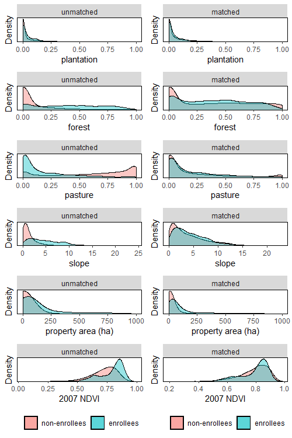
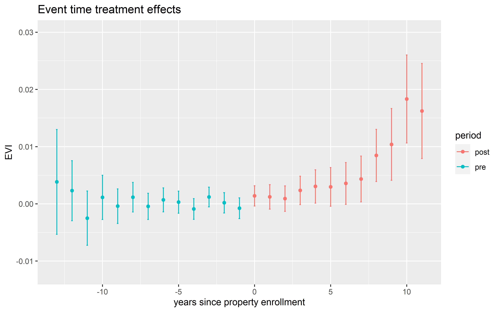

\doublespacing
\sectionfont{\fontsize{11}{11}\selectfont}
\subsectionfont{\fontsize{11}{11}\selectfont}

```{r setup, include=FALSE}

source('summarySE.R')
library(knitr)
#library(dplyr)
library(ggplot2)
library(stringi)
library(stargazer)
library(kableExtra)
library(tidyverse)


knitr::opts_chunk$set(echo = FALSE, warnings = FALSE, messages = FALSE, out.width="49%", fig.align = "center")

options(scipen = 999)
```

# Abstract {-}
Widespread reforestation has become an important part of global efforts to address the intertwined challenges posed by climate change, biodiversity loss, and rural poverty. In response to concerns that plantations of exotic species may undermine objectives of increased carbon storage, biodiversity, and community involvement, some policies have sought to reforest with native species. We evaluate land cover impacts of a Chilean federal program that pays landowners to reforest their property with native species and prioritizes program co-benefits such as erosion mitigation and the engagement of smallholders, women, and indigenous peoples. Panel data for program beneficiaries and comparable unawarded properties allow us to control for fixed differences and time trends affecting both groups. While follow-through is low, we find that the program increased vegetation cover on the properties of both smallholders and larger landowners. A number of factors including pre-program land use and project objective are major determinants of additionality. In contrast to avoided deforestation, where additionality is driven by deforestation risk, this indicates the importance of targeting based on individual and property characteristics for reforestation success. Finally, we evaluate whether targeting for co-benefits comes at the cost of environmental effectiveness. 

\clearpage

# Introduction

In order to achieve the warming targets set by the IPCC, both emissions reductions and removals of carbon from the atmosphere will be necessary [@bastin_global_2019]. Reforestation has been lauded as a potentially near term, large scale and low-cost option to achieve these carbon removals [@busch_potential_2019], however, there is limited evidence documenting the effectiveness of policies seeking to encourage reforestation at large scales. One policy that is expected to play an important role in helping countries meet their reforestation commitments is a system in which private landowners are paid to engage in reforestation [@gichuki_reviving_2019]. While similar payment for ecosystem services (PES) programs have garnered widespread scientific interest [@borner_effectiveness_2017], empirical studies documenting the impacts of large-scale reforestation programs are critical to guide the effective design of policies as more countries adopt this model. 

Within the natural climate solutions literature, ample attention has been given to the co-benefits and co-risks that can arise from the growing market for carbon removals. As a result of the emphasis on generating biomass, many programs have encouraged afforestation with monocultures of quick-growing exotic species such as eucalyptus and monterrey pine [@iucn_afforestation_2016]. This model can have co-risks such as the conversion of native ecosystems, loss of biodiversity, and exacerbation of distributional issues [@heilmayr_impacts_2020]. On the other hand, many argue that these schemes can avoid the aforementioned risks and generate substantial co-benefits if done properly. These often cited co-benefits include biodiversity conservation, habitat improvement, erosion reductions, watershed protection, and support for lower-income and indigenous communities. 

A vast targeting literature aims to enhance cost-effectiveness and environmental gains of PES programs [@alix-garcia_payment_2014]. In many cases, the social planner hopes to generate co-benefits and to target for both environmental and social development goals. @alix-garcia_only_2015 show that an avoided deforestation program generated positive but small gains in forest cover and poverty alleviation. They highlight that environmental gains were mostly in low poverty areas, but household gains ocurred in high poverty areas, emphasizing the difficulty of meeting multiple policy objectives with a single tool. To what degree the touted win-wins of natural climate solutions can be achieved in practice is an area in need of further exploration. In the avoided deforestation case, environmental benefits are largely driven by the presence of deforestation risk, however, in the reforestation case, effectiveness relies on whether landowners can be incentivized to make the sustained investment in tree survival. 

In this paper, we evaluate the land cover impacts of Chile’s Native Forest Law. A key concern with evaluations of these types of programs is that apparent effectiveness may be driven by unobservable differences in participation costs, meaning that performance may be attributed to these omitted characteristics rather than participation in the program [@alix-garcia_only_2015]. From a pool of over five-hundred-thousand untreated properties, we construct a set of counterfactual properties based on a detailed set of land use and property characteristics in order to alleviate some of the concerns surrounding selection. We evaluate land cover impacts for eleven cohorts (2009–2019) using annual data from 2005–2020 and a difference-in-differences approach that is robust to general treatment effect heterogeneity and relies on a plausible conditional parallel trends assumption. 

We then analyze the Native Forest Law’s program design and the drivers of program additionality to understand whether improved environmental impacts could have been achieved and whether doing so would sacrifice program goals such as the involvement of smallholders, women, and indigenous peoples. The program targets for both environmental and social benefits in two ways: 1) holding separate contests for smallholders and larger landowners, with smallholders paid more for the same set of activities and 2) scoring proposed projects based on pre-determined applicant and project criteria. 

We show that the prgram's scoring methodology, which is based on both political economy factors such as employment potential, smallholder and indigenous participation, and funding many projects, does not have a strong correlation with program additionality. We use detailed program documentation to remove the influence of social components of the score, but this does not improve the scores ability to predict additionality. We then show that a simple score based on observables and determined by factors that drive treatment effect heterogeneity significantly outperforms the real score without sacrificing participation of smallholders and indigenous peoples. 

This draft aims to advance the literature that addresses whether reforestation may be a viable large-scale method for removing and storing CO2 and add to the limited existing evidence on the environmental effectiveness of large-scale native reforestation programs. Between 2009 and 2019, the National Forest Corporation (CONAF) allocated approximately US $58 million to enroll more than 235 hectares of land through the Native Forest Law, making it one of the largest native forest reforestation programs in the world. As other countries begin to contemplate reforestation policies, Chile’s experience provides a valuable case study from which to draw. 

We contribute to the literature on targeting and whether there exist tradeoffs between environmental efficacy and advancement of social development goals, particularly in the case of natural climate solutions. This paper shows that pre-program land use is a major determinant of whether a property is likely to provide much additionality. Further, we show that targeting for co-benefits may indeed be efficient in terms of carbon removals even when these groups need higher payments to participate.

# Chile's Native Forest Law and its desired co-benefits

Chile provides an ideal setting in which to explore the potential for large-scale payments for reforestation. First, the country has experienced diverse and widespread tree cover expansion [@heilmayr_plantation-dominated_2016]. This expansion includes extensive afforestation of pine and eucalyptus plantations [@echeverria2006], natural forest regeneration in the wake of disturbance [@albornoz_nucleation-driven_2013], and active native reforestation and restoration. Second, Chile’s long history of public policies supporting tree cover expansion provides an incredibly useful natural experiment in which to measure the impacts of payments for reforestation. Chile's decree law no. 701 (DL 701) is one of the world's longest operating afforestation subsidies, but mainly promoted even-aged mococulture plantations of eucalyptus and pine that had negative effects on biodiversity and native forest cover [@heilmayr_impacts_2020]. Further, only about 3\% of subsidized plantaions were additional. 

In an attempt to encourage the recovery and protection of native forests, Chile sought to pass the Ley de Recuperación del Bosque Nativo y Fomento Forestal (Native Forest Law) as a successor to DL701 [@clapp1998]. Initially expected in 1994, it became frozen in legislature before finally passing in 2008. In addition to protections for native forests, the law established an annual competition for grants to support private landowners in their efforts to manage, restore, or reforest their land using native species. Since 2009, more than $58 million have been allocated through these competitions for projects covering 235 thousand hectares. Much of this allocated funding has not been paid to landowners, however, as program follow-through is relatively low. Program administrators are unsure exactly why enrolled applicants fail to complete projects at these rates (@conaf_2019). 

The subsidy component of the law encourages three types of activities: 1) the regeneration, recovery or protection of native preservation forests; 2) Silvicultural activities aimed at managing and recovering native forests for timber production purposes; and 3) Silvicultural activities aimed at managing and recovering native forests for non-timber production purposes. Of the 12,889 projects enrolled between 2009 and 2019, 415 (3.22\%) were classified as 1), 10912 (84.66\%) were classified as 2), and 1562 (12.12\%) were classified as 3). The majority of the projects, therefore, recovered native forest for the purposes of timber production. 

Few estimates on the impacts of the Native Forest Law on land cover currently exist. CONAF estimated the carbon impacts of the Native Forest Law through 2018 as it relates to Chile's Nationally Determined Contribution (NDC) as part of the Paris Argeement. These estimates, however, assume that the carbon stored by every subsidized hectare is the direct result of the law. These types of estimates ignore the concept of additionality, since some of this forest would likely exist even in the absence of the law. 

The Native Forest Law prioritizes not only forest cover in line with Chile's NDC goal of managing 200,000 ha of native forest, but also co-benefits such as biodiversity preservation and the participation of underrepresented groups. By prioritizing native forest rather than monocultures of pine or eucalyptus, the law seeks to incentivize the preservation of biological diversity. Prioritizing carbon-plantings without consideration of other co-benefits may result in negligible biodiversity co-benefits [@bryan2016]. In fact, DL701 resulted in the decline of native forest and biodiversity, as native forests provide significantly more biodiversity than plantation forests in Chile [@heilmayr_impacts_2020]. 

Reforestation is well understood to mitigate erosion, both stabilizing eroded areas and preventing new erosion. In Chile, widespread erosion on marginal agricultural lands has motivated forest policy for over a century [@heilmayr_impacts_2020; @clapp1998]. DL701 and the Native Forest Law both prioritize erosion mitigation in the implementation of the law. The Native Forest law prioritizes areas with moderate to severe erosion and subsidizes projects aimed at erosion mitigation. All projects that occur in areas of moderate-to-severe erosion must specify additional measures to prevent erosion in the management plan. 

In response to concerns that large companies benefited disproportionately from the DL701 subsidies, Native Forest Law bonuses place an emphasis upon supporting smallholders, women-headed households, and indigenous peoples. The contest provides additional support for properties awarded through the smallholder contest. In particular, smallholder awards are worth 15\% more than awards in the other interested parties contest for the same set of activities. Further, smaller properties are more likely to be awarded based on the application scoring system. Applications from indigenous communities are also substantially more likely to receive funding based on the application scoring process. Projects proposed by indigenous peoples or communities generally receive a 10\% score boost. 

One major question is whether targeting for these co-benefits reduces the primary objective of the policy. This is particularly interesting in the case of the Native Forest Law, where program follow-through is low. Even when targeting specific groups for enrollment does not impact program cost-effectiveness, if these groups are ex-ante less likely to follow through, overall program impact will be reduced because of this targeting. 

## Data

### administrative data

We have obtained property boundaries for all rural properties in the major forested regions of Chile as of the year 2009. Data on the awarded properties are available through CONAF and reflect aspects of the property and projects such as project objective, project surface area, bonus amount, and applicant race and gender. Also included is each property's parcel indentifier, which is unique to each property within a comuna, Chile's level 3 administrative unit. We match the enrolled properties to their corresponding boundaries via this unique parcel identifier. In addition, we are able to match payment recipients to the corresponding program application. 

### satellite data

We use the enhanced vegetation index (EVI 2) as a proxy for each property's annual level of vegetation/forest cover. To generate the outcome for each property, we compute the average maximum EVI value of each pixel within a property for a given year. We have generated EVI time series of this sort for each property in the regions of O'Higgins, Maule, Araucanía, Bío-Bío, Ñuble, Los Ríos, and Los Lagos. These regions constitute the major forest areas of Chile and the regions that contain the vast majority of the Native Forest Law enrollees. Generating time series for all properties in these regions allows us to match on pre-trends of the outcome variable in the matching part of the program evaluation. 

One benefit of the use of EVI is the ability to capture both new forest cover and changes in forest quality within a single index measure. We prefer EVI to normalized difference vegetation index (NDVI) because of its propensity to become saturated in high biomass regions. Given Chile's extensive native and plantation forests and the fact that many enrolled properties already have some degree of forest cover, this could limit our ability to detect small changes in the area or density of vegetation/forest cover through time. In contrast, EVI corrects for canopy background noise and is more sensitive in areas with dense vegetation [add Cite].

Lastly, Landsat resolution (30m) land-use maps of Chile for the year 2001 generated in @heilmayr_plantation-dominated_2016 allow us to see the proportion of each property engaged in specific land uses prior to the existence of the Native Forest Law or the announcement of the annual contests. 

# Program evaluation

## Parallel trends, matching, and a convincing counterfactual

As is the problem with many PES impact evaluations, enrollment is non-random. Landowners choose to enroll in the program and, in theory, have an opportunity cost equal to or lower than program enrollment. It is then ill-advised to simply use unenrolled properties as the counterfactual, since unobservable factors affecting enrollment could drive changes in forest cover outcomes, not enrollment. In order to generate a more convincing counterfactual, we match properties to ones that should have more similar opportunity costs than amongst the general population. 

The covariates used for matching include property size, slope, elevation, distance to road, distance to timber processing (e.g., sawmill; separately for native specific), and proportion of the property under each of the following land-uses in 2001: native forest, plantation, pasture, shrubland, water, urban, and bare soil. We also include the 2007 levels of NDVI for each property, which should correspond to the overall vegetation cover prior to the existence or announcement of the Native Forest Law contest. Lastly, matching on EVI pre-trends will help us to build confidence in the conditional common trends identification assumption that we make for the difference-in-differences strategy in the next section. Matches are made with replacement based on nearest neighbor propensity scores from a logit regression. Our main strategy matches each program enrollee with two control properties, however, we also include estimates based on matching each enrolled property with one nearest neighbor as a robustness check.  

The covariates included should allow us to match properties with similar opportunity costs to enrollment. Of particular value is the ability to match on land use prior to the existence of the program. Landowners with similar levels of forest plantation, native forest, and other land uses on the property should face a similar decision about whether to enroll in a program involving native forest management. Slope and elevation tend to be highly correlated with the productive potential of the land, and distance to road provides a proxy of a property's remoteness. Figure \@ref(fig:m-dist) shows how covariate balance drastically improved between treatment and control properties after matching for select covariates. Table \@ref(tab:covar-bal) in the Appendix displays a more complete balance check for all covariates used. 

```{r m-dist, fig.pos="H", out.width = '75%', fig.cap = "Covariate distributions for awarded and non-enrolled properties before (left) and after (right) propensity score matching for key covariates", echo=FALSE}

```

We need to make an appropriate common trends assumption in order to make inference about causal effects of the program, and this choice leads us to our preferred estimator [@marcus2021]. As mentoned above, many PES programs operate on voluntary enrollment into the program. This is indeed the case with the Native Forest Law, in which enrollees must apply and be selected for participation. Because enrollment is unlikely to be exogenous, we opt for a relatively weak common trends assumption: 

\textbf{Conditional common trends based on unawarded properties:}
For all $g, t = 2,...,\Tau,$ such that $t\geq g$, 
$$  E[evi_t(0)-evi_{t-1}(0)|X_i, G_g=1] = E[evi_t(0)-evi_{t-1}(0)|X_i, C=1] $$
This amounts to assuming that without enrolling in the Native Forest Law contest, awarded properties would have continued to follow the same evolution in EVI as matched control properties, after conditioning on pre-treatment covariates. In order to rely on this common trends assumption, we must have a relatively large set of properties that do not experience treatment, or inference procedures may not be as precise as procedures that align with an alternative assumption. However, it is important to stress that this potential “loss of efficiency” is a direct consequence of not exploiting restrictions on pretreatment trends across cohorts [@marcus2021]. Luckily, in our case, we can take advantage of our matching procedure, which uses an extremely large pool of unawarded properties, detailed covariates including pre-program land uses, and explicit pre-trends. As such, we benefit from the fact that our common trends assumption does not restrict pre-trends across cohorts and does not presume that later cohorts are viable counterfactuals for early cohorts. Settling on this specific common trends assumption helps us to determine the appropriate estimator. The estimator developed in @callaway_did_2020 relies on the common trends assumption above, which we believe is reasonable to make. Robustness checks do include the use of not yet treated observations (and thus, a stronger common trends assumption).

One concern may be our decision to exclude rejected applicants from the control group. Given that these properties have revealed their intention to enroll in the program, it seems that they may have opportunity costs similar to program enrollees. However, the composition of the rejected applicants differs between smallholders and other interested parties depending on year, and many rejected applicants are able to reapply and be awarded in later years. This means that the composition of the rejected applicant group is relatively unstable through time. Further, it would be difficult to make claims about the differences between the smallholders and other interested parties, because the rejected group differs through time for each. We discuss the rejected applicants in more detail in the Appendix and give creedence to our analysis by using the rejected group in a placebo test. 

## DID

In order to estimate the program impact, we use a difference-in-differences event study that is robust to general treatment effect heterogeneity. Recent papers have shown that the typical two-way fixed effects estimator may generate biased results in the presence of treatment effect heterogeneity [e.g., @goodman-bacon_did_2018; @callaway_did_2020; @de_chaisemartin_2020]. This could be particularly important in our case, given that there are over 150 cohort-time cells. We individually estimate the average treatment effect for each cohort-time cell, $ATT_{g,t}$, where $g$ denotes the cohort, and $t$ denotes the year, before aggregating the $ATT_{g,t}$s into a summary measure of the overall $ATT$ based on @callaway_did_2020. The estimand for each of the $ATT_{g,t}$s is as follows:

$$ATT_{g,t} =  E[evi_{it}(1) - evi_{it}(0) | G_i = g, t \geq t_o]$$

Each $ATT_{g,t}$ then represents the treatment effect for group $g$ in time $t$. To generate the $ATT_{g,t}$s, we first subset the data to only contain observations at time $t$ and $g − 1$, from units with either $G_i = g$ or that are in the control group. For example, for the $\beta_{2019, 2019}$, we subset to only the 2019 cohort and control group for the years 2018 and 2019. Then using only the observations from this subset, we calculate $\beta_{g,t}$ using the doubly robust difference-in-differences estimator developed in @santanna_doubly_2020. This involves first estimating a propensity score using a logit model and allows for common trends to hold only after conditioning on pre-treatment covariates. With this method, we can identify the $ATT_{g,t}$s if either (but not necessarily both) the propensity score or outcome regression is correctly specified [@santanna_doubly_2020]. 

We use two measures of the $ATT$ in this paper. The first measure provides event study estimates. Here, within each event time window, we aggregate the $ATT_{g,t}$s with weights corresponding to group size. 

$$ ATT_{es}(e) = \sum_{g\in G} \mathbb{1}\{ g+e \leq \Tau\} P(G_i=g | G_i+e\leq \Tau)ATT_{g,g+e} $$

This is the average effect of participating in the treatment $e$ time periods after a characteristic property is enrolled in the program across all cohorts that are ever observed to have participated in the treatment for exactly $e$ time periods. The year a property enrolls in the program is denoted by $e=0$. 

Our second summary measure, $ATT_{ovr}$, provides an estimate of the overall $ATT$. 
$$ ATT_{ovr} =\frac{1}{T-t_0+1} \sum_{e=0}^{T-t_0}ATT_{es}(e)$$
, where in our case $t_0 = 2009$ and $T=2020$.

Thus, $ATT_{ovr}$ is simply an average of all event time treatment effect estimates after treatment. One potential concern about $ATT_{ovr}$ is that each $ATT_{es}(e)$ has equal weight, meaning cohorts that are treated for longer have a larger influence on the $ATT_{ovr}$ relative to their group size. In this circumstance, we view this as a benefit. In the case of forest regeneration, restoration, and reforestation, we shouldn't expect a huge "on-impact" treatment effect, but rather a steady accumulation of biomass and foliage through time. Further, the benefits of these activities are closely related to their permanence, meaning that forest cover must be sustained over time. As such, it is unclear that giving equal weight to later event time treatment effects is problematic in this context, given that those event times are the most representative of program success. 

Finally, we present a third summary measure, $ATT_{equal}$, which provides an estimate of the overall $ATT$ similar to $ATT_{ovr}$.  
$$ ATT_{equal} =\frac{1}{ \sum_{t_0}^{T}\sum_{g \in G} \mathbb{1}\{ g \leq t \} P(G_i=g | G_i\leq \Tau)} \sum_{t_0}^{T}\sum_{g \in G}\mathbb{1}\{ g \leq t \} P(G_i=g | G_i\leq \Tau) ATT_{g,t}$$

$ATT_{equal}$ is simply an average of all $ATT_{g,t}$s after treatment. Relative to $ATT_{ovr}$, $ATT_{equal}$ places less weight on time periods further from initial treatment. This may help reduce the influence of early cohorts at the expense of downweighting time periods in which we expect treament effects to be most relevant. 

# Overall program results

We first measure the impact of the program on all enrolled properties. This is the effect of being granted enrollment in the program and submitting the management plan within the required time frame, which generally predicts successful project completion and payment. Figure \@ref(fig:main-es) shows that the EVI on the characteristic awarded property steadily increases through time relative to the counterfactual following treatment. We do note that these effects, while statistically significant, are rather small. For reference, the average awarded property had a pre-treatment EVI equal to .4738, meaning that an effect of .006103 represents a 1.29\% increase on average. 

```{r main-es, fig.pos="H", out.width = '100%', fig.cap = "This figure shows event time treatment effects of the native forest law for awarded properties.", echo=FALSE}


n = 8556
```

Figure \@ref(fig:main-es) also allows us to examine the plausibility of our conditional common trends assumption. We do see that pre-trends are relatively stable, lending creedence to the assumption made previously. As discussed, matching on detailed land use and property characteristics allows us to compare properties that likely had similar future land use intentions and opportunity costs. Looking at Table 1, we see that the overall treatment effects ($ATT_{ovr}$, $ATT_{equal}$) are also positive and statistically significant. 

\begin{table}[H]\centering
\caption{Overall treatment effect estimates for awarded properties}
\smallskip
\begin{tabular}{c c c}

\toprule
  Dependent variable: EVI & &\\ 
\midrule
 $ATT_{ovr}$  &           0.006103*** &  \\
             &         (0.000905)  &  \\ 
  $ATT_{equal}$      &  0.003287*** & \\
                    &  (0.000664)  & \\
\midrule
 N      &     `r n`    & \\          
\bottomrule
\addlinespace[1ex]
\multicolumn{3}{l}{\textsuperscript{***}$p<0.01$, 
  \textsuperscript{**}$p<0.05$, 
  \textsuperscript{*}$p<0.1$}
\end{tabular}
\end{table}

One potentially important thing to note is that, as seen in Figure \@ref(fig:main-es), the treatment effects may not have stabilized yet. It is then difficult to claim that this estimate of the $ATT$ is indicative of the total effect of the program. As such, we view these estimates as the medium-run impact, since the analysis gives a glimpse 10 years after a property is awarded. 

## Implicit price for carbon

In this section, we will estimate the payment per hectare necessary to increase the probability of woody biomass by 1. Then, using an estimate of the carbon content of one hectare of native forest, we can calculate the average price paid per tCO2 paid through the program. 
<!-- 1 UTM was 49673 CLP on Jan 1, 2020 -->


# Additionality and the program's scoring mechanism 

PES programs are designed to offset this expected increase in agricultural rents by offering a corresponding increase in forest rents [@alix-garcia_payment_2014]. However, regulators may also target the program to land with certain characteristics [@alix-garcia_only_2015]. In the case of the Native Forest Law, this is done in two main ways: 1) holding separate contests for smallholders and larger properties, where the smallholder contest pays 15\% higher and 2) a scoring mechanism that prioritizes indigenous peoples, smaller properties, and other landowner and property characteristics.

Much research has addressed targeting in PES programs in the context of avoided deforestation. The key to gaining high environmental effectiveness at least cost is to enroll only the parcels at risk of deforestation [@alix-garcia_only_2015]. This can be achieved by providing adequate payments and focusing on parcels in areas of high deforestation. This is not the case in the reforestation context, where high environmental effectiveness is determined by whether landowners can generate and maintain new forest cover. The characteristics likely to determine effectiveness in the reforestation setting may thus be less easily targeted than in the deforestation setting.

We briefly outline the program's scoring mechanism here, but more detailed explanation can be found in the appendix. 


# Observables drive treatment effect heterogeneity 

On average, the Native Forest Law is effective in increasing vegetation on awarded properties. In the context of avoided deforestation, program additionality is likely to be highest in areas with high levels of deforestation risk. This is not applicable in the reforestation case, however, as additionality is driven by landowners that generate new forest cover at least cost and maintain it through time. Here, we explore the factors that drive program impacts and how targeting for co-benefits might have affected program effectiveness.

## Property characteristics

We slightly adapt @callaway_did_2020 in order to highlight treatment effect heterogeneity that depends on property characteristics. We still estimate each $ATT_{g,t}$ individually before aggregating to our summary measures of the treatment effect, however, we adjust the method by which each $ATT_{g,t}$ is computed. After calculating propensity score weights in the fashion of @santanna_doubly_2020, we run the following difference-in-differences style regression:

$$ EVI_{it} = \alpha_1 + \alpha_2 \mathbb{1}\{ G_i = g \} + \alpha_3 \mathbb{1}\{ T = t \} +\beta_{1g,t} \mathbb{1}\{ G_i = g \} \mathbb{1}\{ T = t \} +\beta_{2g,t} \mathbb{1}\{ G_i = g \} \mathbb{1}\{ T = t \} \times Z_i+ \gamma X_i + e_{it}$$
, where $\beta{1g,t}$ represents the $ATT_{g,t}$ and $\beta{2g,t}$ represents the impact of $Z_i$ on the $ATT_{g,t}$. We aggregate $\beta{1g,t}$ and $\beta{2g,t}$ in order to retrieve a summary measure of both the overall $ATT$ and the overall effect of $Z_i$ on the Native Forest Law's effectiveness. 

### Pre-program land use 

Pre-program land use is likely to be a significant driver of this heterogeneity. Recent studies have found that a major barrier to reforestation success is a lack of technical skills and prior experience [e.g., @powlen_identifying_2019]. Further, landowners with high initial participation costs are less likely to engage in reforestation. These aspects of reforestation mean that pre-program land use characteristics likely play a major role in shaping a landowner's forest management success.  We examine how the make-up of a property's pre-program land uses affects the impact of the Native Forest Law on forest cover. 
In this section, $Z_i$ represents the proportion of each property under each of the following land uses in 2001: native forest, plantation forest, shrub, and pasture.

Thinking about the pre-program land uses of eventually enrolled properties raises some interesting questions about the additionality of the policy. If properties with high levels of native forest cover are receiving subsidies through the Native Forest Law contest, it is possible that additionality will be low. Landowners who maintain a significant amount of native forest may already undertake these activities in the absence of the payments. These properties may be able to provide native forest cover or forest quality gains at a lower cost, meaning they are inefficiently being paid above their opportunity cost for the projects. Properties with plantation forestry may be using funds from the Native Forest Law to substitute toward native forest. While the carbon additionality may be low in this case, co-benefits such as biodiversity gains and habitat connectivity would likely be had. If these landowners are extending forest cover on the property and doing so using native species, these properties may provide significant gains, because they have the experience and resources to ensure survival of trees and forest. If properties with high amounts of pasture or shrubland move away from livestock grazing or even enrich the existing vegetation on the property, carbon additionality could be high. These could, however, conceivably be properties that face higher costs to initiate forest management activities that the landowner does not have much experience with. 


```{r}

##Read files 
filenames <- list.files(path="../chile_reforestation/results",
    pattern="*csv")

##Create list of data frame names without the ".csv" part 
names <-str_extract(filenames, '.*(?=\\.csv)')

myfunc <- function(path){
 temp <- read.csv(path)%>%
   dplyr::mutate(se = round(as.numeric(se), digits=5),
          ATT = round(as.numeric(ATT), digits=4))
 return(temp) 
  
}

###Load all files
for(i in names){
    filepath <- file.path("../chile_reforestation/results",paste(i,".csv",sep=""))
    assign(i, myfunc(filepath)
    #colClasses=c("character","factor",rep("numeric",4)),
    #sep = ",")
    )
}

subsample_res <- read.csv("../chile_reforestation/results/subsample_results/subsample_results.csv")%>%
  dplyr::mutate(std.error = round(as.numeric(std.error), digits=5),
          ATT = round(as.numeric(ATT), digits=4),
         subsample = ifelse(subsample == "not timber", "not_timber", subsample))

for (v in unique(subsample_res$subsample)){
  tmp <- subset(subsample_res, subsample == v)
  assign(paste0('df_', tolower(v)), tmp)
}

```

\begin{table}[H]\centering
\caption{Treatment effect heterogeneity based on pre-program land uses}
\smallskip
\begin{tabular}{c c c c c c c c c}

\toprule
   outcome: EVI & & & & & & & &\\ 
\cmidrule(l){2-9} 
 & \textbf{1} & \textbf{2} & \textbf{3} & \textbf{4} & \textbf{5} & \textbf{6} & \textbf{7} & \textbf{8} \\ 
\midrule
enrolled    &     `r shrub_boot[3,3]`***   &  `r pasture_boot[3,3]`   & `r plantation_boot[3,3]`**  & `r forest_boot[3,3]` & `r shrub_boot[4,3]`***   &  `r pasture_boot[4,3]`   & `r plantation_boot[4,3]`  & `r forest_boot[4,3]` \\

         &      (`r shrub_boot[3,5]`)  &   (`r pasture_boot[3,5]`)  &  (`r plantation_boot[3,5]`) & (`r forest_boot[3,5]`)&      (`r shrub_boot[4,5]`)  &   (`r pasture_boot[4,5]`)  &  (`r plantation_boot[4,5]`) & (`r forest_boot[4,5]`)\\ 
                       
enrolled x shrub            &              `r shrub_boot[1,3]`*** &         &  &  &              `r shrub_boot[2,3]`*** &         &  &\\
                          &               (`r shrub_boot[1,5]`)      &      &   &  &               (`r shrub_boot[2,5]`)      &      &   &\\
                       
enrolled x pasture           & &         `r pasture_boot[1,3]`* &    &    & &         `r pasture_boot[2,3]`* &    &     \\
                          & &       (`r pasture_boot[1,5]`)    &       &   & &       (`r pasture_boot[2,5]`)    &       &  \\
                       
enrolled x plantation        & & &  `r plantation_boot[1,3]` &  & & &  `r plantation_boot[2,3]`** &\\
                          & & &    (`r plantation_boot[1,5]`)    &  & & &    (`r plantation_boot[2,5]`)    &\\
                          
enrolled x forest        & & & &  `r forest_boot[1,3]`   & & & &  `r forest_boot[2,3]` \\
                         & & & &    (`r forest_boot[1,5]`)    & & & &    (`r forest_boot[2,5]`)    \\
                       
\midrule
 N                     &      `r n`    &      `r n`   &  `r n` &  `r n`  &      `r n`    &      `r n`   &  `r n` &  `r n`\\   
 
 aggregation                     &   $ATT_{ovr}$       &    $ATT_{ovr}$     & $ATT_{ovr}$   & $ATT_{ovr}$   &    $ATT_{equal}$      &   $ATT_{equal}$      & $ATT_{equal}$  & $ATT_{equal}$ \\
 
\bottomrule
\addlinespace[1ex]
\multicolumn{3}{l}{\textsuperscript{***}$p<0.01$, 
  \textsuperscript{**}$p<0.05$, 
  \textsuperscript{*}$p<0.1$}
\end{tabular}
\end{table}


Table 2 shows how pre-program land use drives treatment effect heterogeneity. Properties with more proportion of the land dedicated to pasture (columns 2 and 6) and plantation forest (columns 3 and 7) see relatively higher treatment effects. Meanwhile, properties with more land under shrubland (columns 1 and 5) see substantially lower treatment effects. 


### Erosion

Erosion mitigation has been recognized as one of the major co-benefits of reforestation. This has influenced Chile's forest policy and the Native Forest Law. We take the same approach as above to examine how subsidizing reforestation and forest management on properties with more erosion affects project effectiveness. Our covariate of interest is the proportion of the property experiencing moderate to severe erosion. Table 3 shows that when more of a property lies on eroded land, the award is less effective in generating or improving forest cover. This implies that erosion reduction may come at the expense of forest cover and carbon removal in the medium-run. 

\begin{table}[H]\centering
\caption{Treatment effect heterogeneity based on proportion of property experiencing moderate-to-severe erosion}
\smallskip
\begin{tabular}{c c c}

\toprule
   Dependent variable: EVI & &\\ 
\cmidrule(l){2-3} 
 & \textbf{1} & \textbf{2} \\ 
\midrule

enrolled    &       `r erosion_boot[3,3]`**   & `r erosion_boot[4,3]`     \\
                      &   (`r erosion_boot[3,5]`)   &  (`r erosion_boot[4,5]`) \\

enrolled x erosion     &    `r erosion_boot[1,3]`**   &     `r erosion_boot[2,3]`***      \\
                         (`r erosion_boot[1,5]`)    &  (`r erosion_boot[2,5]`)  &\\
                       

\midrule
N         &      `r n`    &      `r n`  \\          
 aggregation         &     $ATT_{ovr}$    &     $ATT_{equal}$  \\          
 
\bottomrule
\addlinespace[1ex]
\multicolumn{3}{l}{\textsuperscript{***}$p<0.01$, 
  \textsuperscript{**}$p<0.05$, 
  \textsuperscript{*}$p<0.1$}
\end{tabular}
\end{table}

## Targeting for co-benefits

### Targeted social groups

In this section, we repeat our main DID analysis on subsamples of the data to examine treatment effect heterogeneity across targeted groups. The program sought to balance efficiency and equity outcomes by targeting smallholders and encouraging participation amongst indigenous communities and female landowners. The Native Forest Law targeted for these outcomes by holding separate contests for smallholders, where smallholders were awarded 15\% higher bonuses. In addition, indigenous landowners were given score boosts, increasing their projects' odds of funding. Table 4 shows the overall performance of each targeted group compared to the subsample without these properties. 

\begin{table}[H]\centering
\caption{Overall treatment effect estimates for subsamples based on target group}
\smallskip
\begin{tabular}{c c c c c c}
\toprule
  Outcome: EVI & & & & &\\
\cmidrule(l){2-6} 
\midrule
 $ATT_{ovr}$   &   `r df_indigenous$ATT[1]`*** & `r df_female$ATT[1]`*** & `r df_male$ATT[1]`*** & `r df_smallholder$ATT[1]`*** & `r df_other$ATT[1]`***\\
               &  (`r df_indigenous$std.error[1]`)  &(`r df_female$std.error[1]`) & (`r df_male$std.error[1]`) & (`r df_smallholder$std.error[1]`) & (`r df_other$std.error[1]`)\\ 
  $ATT_{equal}$ &  `r df_indigenous$ATT[2]`*** & `r df_female$ATT[2]`* & `r df_male$ATT[2]`*** & `r df_smallholder$ATT[2]`*** & `r df_other$ATT[2]`*\\
               &  (`r df_indigenous$std.error[2]`)  &(`r df_female$std.error[2]`) & (`r df_male$std.error[2]`) & (`r df_smallholder$std.error[2]`) & (`r df_other$std.error[2]`)\\ 
\midrule
 subsample         &    indigenous   &  reported female   &  not female  &  smallholder  &  other interested \\
 \# treated properties   &   `r df_indigenous$treated_props[1]` & `r df_female$treated_props[1]` & `r df_male$treated_props[1]` & `r df_smallholder$treated_props[1]` & `r df_other$treated_props[1]`\\          
\bottomrule
\addlinespace[1ex]
\multicolumn{3}{l}{\textsuperscript{***}$p<0.01$, 
  \textsuperscript{**}$p<0.05$, 
  \textsuperscript{*}$p<0.1$}
\end{tabular}
\end{table}

We see that smallholder projects on average experience a higher treatment effect than those awarded through the other interested party contest. We also see that indigenous peoples and communities tend to see higher treatment effects than other properties as well. Lastly, while female headed projects do not experience treatment effects as high as properties with projects without a female head of household reported, both groups see positive impacts from the program on forest cover. We note that smallholders were awarded 15\% more for than properties awarded through the other interested party contest for the same activities. This may affect the relative cost-effectiveness for smallholders vs. other interested parties. Future iterations of this paper will report carbon prices for each group separately to help compare which groups were provided the most cost-effective forest cover gains and carbon removals. 

### project objective

A majority of projects funded through the Native Forest Law had a primary objective of timber production. While harvested wood leads to a reduction in the carbon stock in forests themselves, the overall carbon impact of timber harvests is ambiguous and largely depends on the post-harvest use of the timber products. The use of wood for energy and production of wood-based materials provides no carbon storage but may result in emission reductions by substituting in place of greenhouse gas (GHG) intensive fuels and energy-intensive non-wood materials [@kohl2020]. The use of timber for long-lasting wood products such as housing or furniture is likely to generate positive and relatively longer term carbon removals, while short-term uses such as paper products are unlikely to result in much overall carbon reduction at all. 

Table 5 shows that projects for the purpose of timber production drive most of the forest cover gains, while projects for the purposes of non-timber production and ecologically beneficial activities saw no statistically or economically meaningful impact. This implies that landowners may need the incentive of the future benefots of the harvest in order to make the investment reforestation. 

\begin{table}[H]\centering
\caption{Treatment effect heterogeneity based on project objective}
\smallskip
\begin{tabular}{c c c}

\toprule
   Dependent variable: EVI & &\\ 
\cmidrule(l){2-3} 
 & \textbf{1} & \textbf{2} \\ 
\midrule

$ATT_{ovr}$    &     `r df_timber$ATT[1]`*** & `r df_not_timber$ATT[1]`         \\
                       &  (`r df_timber$std.error[1]`)  &(`r df_not_timber$std.error[1]`)\\

  $ATT_{equal}$   &      `r df_timber$ATT[2]`*** & `r df_not_timber$ATT[2]`         \\
                      &  (`r df_timber$std.error[2]`)  &(`r df_not_timber$std.error[2]`)\\
                       

\midrule
\# treated properties         &     `r df_timber$treated_props[1]`    &     `r df_not_timber$treated_props[1]`  \\          
 subsample         &     timber production    &     other projects  \\          
 
\bottomrule
\addlinespace[1ex]
\multicolumn{3}{l}{\textsuperscript{***}$p<0.01$, 
  \textsuperscript{**}$p<0.05$, 
  \textsuperscript{*}$p<0.1$}
\end{tabular}
\end{table}


# Generating an informative score


## Results and implications for social development goals

# Discussion

Prominent initiatives such as the Bonn Challenge, Trillion Trees Initiative, and UN Decade on Ecosystem Restoration hope to address the intertwined challenges of rural poverty, climate change and biodiversity loss through large-scale afforestation and reforestation. Initial national plans indicate that many countries will follow Chile’s model for tree cover expansion, relying heavily upon subsidies and plantation forests to achieve their commitments [@heilmayr_impacts_2020]. In light of the fact that this model may have negative impacts on native forest extent, biodiversity, and other outcomes, payments for native reforestation may provide a more sustainable and socially optimal path forward. This paper shows that payments for native reforestation may be a viable policy to increase carbon removals from the atmosphere for many countries. Further, this may lead to increased additionality if alternative policies simply subsidize plantation forests that would have been planted anyways. While the cost per ton of removed carbon associated with this strategy is unclear, Native Forest Law payments led to increased forest cover amongst smallholders, larger landowners, and several other groups. 

In order to maximize program impacts and ensure participation of smallholders and other marginalized groups, these payment for reforestation plans must carefully consider which landowners are likely to ensure tree survivorship and complete their reforestation projects. Program administrators must seek to maximize not only cost-effectiveness but also overall program impact. If many projects are not completed, this may undermine program impact even if the program targets in a cost-effective fashion. We find that while effectiveness was often high amongst targeted groups, follow-through rates in these groups may undermine overall program impacts in some cases. 

We find that of the properties that completed their projects, ones that had engaged in plantation forestry or had more agricultural land prior to the existence of the Native forest Law were most likely to generate additional forest cover. These properties were also more likely to follow through at all. This may suggest that prior forestry experience or technical support is likely to be key for landowners' project success. Further, projects that deal with the conversion of marginal cropland where little forest was present may be more additional. Ultimately, our results reinforce that well designed payments for reforestation can lead to increased forest cover while maintaining environmental and social safeguards such as the protection of native forest and the involvement of smallholders. 

# References

<div id="refs"></div>

# Appendix 

## Subsample event studies


```{r objective-es,  fig.show="hold", fig.pos="H", out.width = '49%', fig.cap = "This figure shows event time treatment effects for Left: projects awarded with the objective of timber production; and Right: other project objectives", echo=FALSE}
knitr::include_graphics(c("figs/timber_did.png", "figs/ntimber_did.png"))
```

```{r contest-es, fig.show="hold", fig.pos="H", out.width = '49%', fig.cap = "This figure shows event time treatment effects for awards granted in Left: the smallholder contest; and Right: the other interested parties contest", echo=FALSE}
knitr::include_graphics(c("figs/smallholder_did.png", "figs/otros_did.png"))
```

```{r indig-es, fig.show="hold", fig.pos="H", out.width = '49%', fig.cap = "This figure shows event time treatment effects for awards granted to Left: indigenous landowners and communities; adn Right: non-indigenous landowners or communities.", echo=FALSE}
knitr::include_graphics(c("figs/indig_did.png", "figs/nonindig_did.png"))
```

```{r female-es, fig.show="hold", fig.pos="H",  out.width = '49%', fig.cap = "This figure shows event time treatment effects for Left: female landowners; and Right: male landowners.", echo=FALSE}
knitr::include_graphics(c("figs/female_did.png", "figs/male_did.png"))
```


\clearpage

## Robustness of overall treatment effects


\clearpage

## Smallholders vs. other interested parties on observables

```{r, include = FALSE}

NFL_df <- readRDS("C:/Users/garci/Dropbox/chile_reforestation/data/submittedmp_analysis/NFL_df.rds")
#property_df <- readRDS("property_df.rds")

my_match <- data.frame(readRDS("C:/Users/garci/Dropbox/chile_reforestation/data/submittedmp_analysis/my_match.rds"))
my_match$geometry.x<- NULL
my_match$geometry.y<- NULL

native_df <- NFL_df %>%
  dplyr::mutate(submitted_mp = ifelse( rptpro_tiene_plan_saff=="Si", 1, 0))%>%
  dplyr::distinct(prop_ID, submitted_mp, .keep_all = TRUE)

accents <- function(x){
  x <- stri_trans_general(x, id = "Latin-ASCII")
}


follow_thru <- my_match %>%
  inner_join(native_df, by = "prop_ID")%>%
  dplyr::mutate(treat=1,
         forest = c_1,
         plantation = c_3,
         baresoil = c_12,+c_10,
         pasture = c_9,
         shrub = c_5,
         water = c_15,
         urban = c_16,
         road_dist = unlist(road_dist),
         industry_dist = unlist(industry_dist),
         native_industry_dist = unlist(native_industry_dist),
         female = ifelse(rptprop_sexo == "Femenino", "Female", ifelse(rptprop_sexo == "Masculino", "Male", "Not reported")),
         reported_female = ifelse(rptprop_sexo != "Femenino" | is.na(rptprop_sexo), 0, 1),
         indig_etnia = ifelse(is.na(rptprop_etnia) & treat==1, 0, ifelse(treat==0, NA, 1)), 
         ind_comunidad = grepl(pattern = "indigena", accents(tolower(rptprop_razon_social)))*1,
         indigenous = ifelse(ind_comunidad==1 | indig_etnia==1, "indigenous", "not indigenous"))%>%
  filter(rptpro_ano < 2019)%>%
  drop_na(submitted_mp)

source('summarySE.R')

full_samp <- summarySE(follow_thru, measurevar="submitted_mp", na.rm = TRUE)%>%
  dplyr::mutate(submitted_mp= round(submitted_mp, digits = 4),
         se= round(se, digits = 5))

contest <- summarySE(follow_thru, measurevar="submitted_mp",groupvars = c("rptpro_tipo_concurso"), na.rm = TRUE)%>%
  dplyr::mutate(submitted_mp= round(submitted_mp, digits = 4),
         se= round(se, digits = 5))

objective <- summarySE(follow_thru, measurevar="submitted_mp", groupvars=c("rptpro_objetivo_manejo"), na.rm = TRUE)%>%
  dplyr::mutate(submitted_mp= round(submitted_mp, digits = 4),
         se= round(se, digits = 5))

rep_female <- summarySE(follow_thru, measurevar="submitted_mp", groupvars=c("reported_female"), na.rm = TRUE)%>%
  dplyr::mutate(submitted_mp= round(submitted_mp, digits = 4),
         se= round(se, digits = 5))

indig <- summarySE(follow_thru, measurevar="submitted_mp", groupvars=c("indigenous"), na.rm = TRUE)%>%
  dplyr::mutate(submitted_mp= round(submitted_mp, digits = 4),
         se= round(se, digits = 5))

```


```{r, include = FALSE}
follow_thru <- subset(follow_thru, submitted_mp == 1)

score <- t.test(rptpro_puntaje ~ rptpro_tipo_concurso, data = follow_thru)
payment <- t.test(rptpre_monto_total ~ rptpro_tipo_concurso, data = follow_thru)
area_bono <- t.test(rptpre_superficie_bonificada ~ rptpro_tipo_concurso, data = follow_thru)
area_prop <- t.test(rptpre_superficie_predial ~ rptpro_tipo_concurso, data = follow_thru)
forest <- t.test(forest ~ rptpro_tipo_concurso, data = follow_thru)
plantation <- t.test(plantation ~ rptpro_tipo_concurso, data = follow_thru)
pasture <- t.test(pasture ~ rptpro_tipo_concurso, data = follow_thru)
slope <- t.test(slope ~ rptpro_tipo_concurso, data = follow_thru)
elev <- t.test(elev ~ rptpro_tipo_concurso, data = follow_thru)
native_ind <- t.test(native_industry_dist ~ rptpro_tipo_concurso, data = follow_thru)
industry <- t.test(industry_dist ~ rptpro_tipo_concurso, data = follow_thru)
road <- t.test(road_dist ~ rptpro_tipo_concurso, data = follow_thru)
erosion <- t.test(proportion_erosion ~ rptpro_tipo_concurso, data = follow_thru)
shrub <- t.test(shrub ~ rptpro_tipo_concurso, data = follow_thru)


covar <- c("score", "award (UTM)", "bonus area (ha)", "property area (ha)", "proportion forest", "proportion plantation", "proportion pasture", "proportion shrub", "mod-to-severe erosion", "slope", "elevation", "dist. to native timber processing", "dist. to any timber processing", "dist. to road" )
paid <- c(score$estimate[2], payment$estimate[2], area_bono$estimate[2],  area_prop$estimate[2],  forest$estimate[2], plantation$estimate[2], pasture$estimate[2], shrub$estimate[2], erosion$estimate[2], slope$estimate[2], elev$estimate[2], native_ind$estimate[2], industry$estimate[2], road$estimate[2])
unpaid <- c(score$estimate[1], payment$estimate[1], area_bono$estimate[1],  area_prop$estimate[1],  forest$estimate[1], plantation$estimate[1], pasture$estimate[1], shrub$estimate[1], erosion$estimate[1], slope$estimate[1], elev$estimate[1], native_ind$estimate[1], industry$estimate[1], road$estimate[1])
p_value <-  c(score$p.value, payment$p.value, area_bono$p.value,  area_prop$p.value,  forest$p.value, plantation$p.value, pasture$p.value, shrub$p.value, erosion$p.value, slope$p.value, elev$p.value, native_ind$p.value, industry$p.value, road$p.value)

contest_covars <- data.frame(covar, paid, unpaid, p_value) %>%
  mutate(p_value = round(p_value, digits = 5))


```


```{r contest-covars, fig.pos="H"}

kable(contest_covars, format = "latex", row.names = FALSE, booktabs = T, col.names = c("covariate", "smallholder mean", "other mean", "p-value from t-test of difference"), align='c',
      caption = "differences in observables between properties awarded in the smallholder vs. other interested parties contest)")%>%
  row_spec(0,bold=TRUE)
```

\clearpage
## Matching diagnostics

```{r covar-bal, fig.pos = "H", fig.cap = "Covarate balance between treated and untreated groups with and without matching. The leftmost panel is based on nearest neighbor matching, and the right panel is the unmatched data"}

covar_bal <- readRDS("covariate_balance.rds")
covar_bal[8, 1] <- "elevation"
covar_bal[9, 1] <- "area (ha)"
covar_bal[10, 1] <- "dist. to road"
covar_bal[11, 1] <- "dist. to timber processing"
covar_bal[12, 1] <- "dist. to native timber processing"
covar_bal[13, 1] <- "moderate-to-severe erosion"
covar_bal[14, 1] <- "2007 NDVI"


kable(covar_bal, format = "latex", row.names = FALSE, booktabs = T,
      caption = "Covariate balance with and without matching",
      col.names = c("covariate", "norm. diff.", "threshold", "norm. diff.", "threshold"), escape = TRUE) %>%
  add_header_above(c(" "=1, "matched"=2, "unmatched" = 2), escape = TRUE, line =FALSE, bold = TRUE)%>%
  kable_classic()

```

\clearpage
## Native Forest Law follow-through and expected program impacts of targeted groups: 


<!-- \begin{table}[H]\centering -->
<!-- \caption{Treatment effect heterogeneity based on pre-program land uses} -->
<!-- \smallskip -->
<!-- \begin{tabular}{c | c c c c} -->

<!-- \toprule -->

<!-- targeted group & $ATT$ of follow-throughs &  P(follow-through) & expected impact & expected impact of non-targeted \\  -->
<!-- \midrule -->

<!-- full sample  &    0.006103*** & `r full_samp$submitted_mp` & `r .006103 * full_samp$submitted_mp` & NA\\ -->
<!--              &         (0.000905)  & (`r full_samp$se`) & () & NA\\ -->

<!-- smallholder     &    `r df_smallholder$ATT[1]`*** & `r contest$submitted_mp[2]` & `r df_smallholder$ATT[1] * contest$submitted_mp[2]`  & `r df_other$ATT[1]*contest$submitted_mp[1]`\\ -->
<!--              &         (`r df_smallholder$std.error[1]`)   & (`r contest$se[2]`) & () & ()\\ -->

<!-- indigenous    &    `r df_indigenous$ATT[1]`*** & `r indig$submitted_mp[1]` & `r df_indigenous$ATT[1] * indig$submitted_mp[1]`  & `r 0.005681506*indig$submitted_mp[2]`\\ -->
<!--              &         (`r df_indigenous$std.error[1]`)   & (`r indig$se[1]`) & () & ()\\                     -->

<!-- female    &    `r df_female$ATT[1]`*** & `r rep_female$submitted_mp[2]` & `r df_female$ATT[1]*rep_female$submitted_mp[2]`  & `r df_male$ATT[1]*rep_female$submitted_mp[1]`\\ -->
<!--              &         (`r df_female$std.error[1]`)   & (`r rep_female$se[2]`) & () & ()\\ -->

<!-- \bottomrule -->
<!-- \addlinespace[1ex] -->
<!-- \multicolumn{3}{l}{\textsuperscript{***}$p<0.01$,  -->
<!--   \textsuperscript{**}$p<0.05$,  -->
<!--   \textsuperscript{*}$p<0.1$} -->
<!-- \end{tabular} -->
<!-- \end{table} -->

<!-- I need to calculate the standard errors still here, but we can see already that the expected impact considering follow through probabilities did not lead to a clear change in whether targeting these groups was costly in terms of expected impact, even though it was ikely beneficial from a cost-effectiveness perspective. Given that smallholders were both the higher performers on average and had a higher follow-through rate, and the opposite was true for females, this could not differ. However, the higher performance of indigenous peoples and communites was counteracted by their low follow-through rates. While they still maintained a slightly higher expected impact than the group without indigenous peoples, the expected impacts are much closer than when follow-through is ignored.  -->

<!-- Program beneficiaries from targeted groups often see treatment effects near or higher than those from non-targeted groups. After selecting the cohort of approved projects, Native Forest Law contest administrators require the submission of the final management plan within six months. Surprisingly, a significant number of landowners fail to submit the management plan in this time frame. This failure to submit the management plan essentially corresponds to the forfeiture of the expected bonus. We examine whether there exists significant heterogeneity in the characteristics of landowners who follow-through vs. those that do not. -->

```{r follow-thru-covars, fig.pos="H"}

follow_thru_covars <- readRDS("follow_thru_covars.rds")

kable(follow_thru_covars, format = "latex", row.names = FALSE, booktabs = T, col.names = c("covariate", "paid mean", "unpaid mean", "p-value from t-test of difference"), align='c',
      caption = "differences in observables between paid and unpaid properties (limited to pre-2018 applicants)")%>%
  row_spec(0,bold=TRUE)
```

Table \@ref(tab:follow-thru-covars) shows that landowners who follow-through differ from those who do not on a number of characteristics. This includes project and property characteristics. Notably, projects that do follow-through are worth less on average and represent a smaller total project area. They also have on average, a smaller share engaged in plantation forestry and in shrub. They also have a higher share of land that is moderately-to-severely eroded and engaged in pasture.

The left panel of Figure \@ref(fig:bar1) shows that properies awarded in the smallholder contest are more likely to follow-through with the project to the point of receiving payment. On the other hand, the right panel of Figure \@ref(fig:bar1) shows that projects from indigenous landowners and communities are less likely to follow-through with approved projects relative to non-indigenous landowners. 

```{r bar1,  fig.show="hold", out.width = '49%', fig.cap = "follow-through rates amongst Left: indigenous vs. non- indigenous landowners; and Right: smallholder vs. other interested party contest", echo=FALSE}
knitr::include_graphics(c("figs/followthru_contest.png", "figs/followthru_indingenous.png"))
```

```{r bar2, fig.show="hold", out.width = '49%', fig.cap = "follow-through rates amongst Left: timber production vs. other project objectives; and Right: female landowners", echo=FALSE}
knitr::include_graphics(c("figs/followthru_sex.png"))
```


<!-- ## The program's targeting strategies and heterogeneity in land use composition -->

<!-- The program sought to balance efficiency and equity outcomes by targeting smallholders and indigenous communities. The Native Forest Law targeted in two ways: 1) holding separate contests for smallholders and larger properties and 2) the scoring mechanism. If payments were less additional for smallholders or indigenous peoples, the program could have foregone carbon gains in exchange for this redistribution. Determining whether improved environmental effectiveness can be achieved without sacrificing the engagement of these groups depends on whether there exists systematic heterogeneity in impacts. If effectiveness could be improved without sacrificing smallholder engagement, what types of smallholders would be the best targets? How effective is the scoring mechanism at gauging social development or environmental gains? This is closer to the current draft.  -->

<!-- Pre-program land use is likely to be a significant driver of this heterogeneity. Recent studies have found that a major barrier to reforestation success is a lack of technical skills and prior experience [e.g., @powlen_identifying_2019]. Further, landowners with high initial participation costs are less likely to engage in reforestation. These aspects of reforestation mean that pre-program land use characteristics likely play a major role in shaping a landowner's forest management success. In this section, we use Landsat resolution land use maps of Chile in 2001 to explore the pre-program land use composition of properties that eventually enrolled in the program. We explore the proportion of each property under each of the following land uses in 2001: native forest, plantation forest, and pasture.  -->

<!-- Thinking about the pre-program land uses of eventually enrolled properties raises some interesting questions about the additionality of the policy. If properties with high levels of native forest cover are receiving subsidies through the Native Forest Law contest, it is possible that additionality will be low. Landowners who maintain a significant amount of native forest may already undertake these activities in the absence of the payments. These properties may be able to provide native forest cover or forest quality gains at a lower cost, meaning they are inefficiently being paid above their opportunity cost for the projects. Properties with plantation forestry may be using funds from the Native Forest Law to substitute toward native forest. While the carbon additionality may be low in this case, co-benefits such as biodiversity gains and habitat connectivity would likely be had. If these landowners are extending forest cover on the property and doing so using native species, these properties may provide significant gains, because they have the experience and resources to ensure survival of trees and forest. If properties with high amounts of pasture move away from livestock grazing or even enrich the grasslands that exist on the property, carbon additionality could be high. These could conceivably be properties that face higher costs to initiate forest management activities that the landowner does not have much experience with.  -->

<!-- Given that pre-program land use is likely to be a significant determinant of additionality and the fact that the directions of these signs may be unclear, this has important repercussions for the program administrator from a targeting perspective. -->

<!-- ### land use composition by application score -->

<!-- ```{r, include =FALSE} -->
<!-- test <- within(enrolled_df, quartile <- as.integer(cut(rptpro_puntaje, quantile(rptpro_puntaje, probs=0:4/4), include.lowest=TRUE))) -->

<!-- q_forest <- ggplot(summarySE(test, measurevar="forest", groupvars=c("quartile"), na.rm = TRUE), -->
<!--   aes(x=quartile, y=forest)) +  -->
<!--     geom_errorbar(aes(ymin=forest-se, ymax=forest+se), width=.25, position=pd, color = "darkgreen") + -->
<!--     geom_line(position=pd, color = "darkgreen") + -->
<!--     geom_point(position=pd, size=3, shape=21, fill="white")+ -->
<!--   ylab("proportion forest")+ggtitle("native forest") -->

<!-- q_plantation <- ggplot(summarySE(test, measurevar="plantation",  -->
<!--                                  groupvars=c("quartile")#, "contest") -->
<!--                                  , na.rm = TRUE), -->
<!--   aes(x=quartile, y=plantation)) +  -->
<!--     geom_errorbar(aes(ymin=plantation-se, ymax=plantation+se), width=.25, position=pd, color = "mediumseagreen") + -->
<!--     geom_line(position=pd, color = "mediumseagreen") + -->
<!--     geom_point(position=pd, size=3, shape=21, fill="white")+ -->
<!--   ylab("proportion plantation")+ggtitle("plantation forest") -->


<!-- q_past <- ggplot(summarySE(test, measurevar="pasture", groupvars=c("quartile"), na.rm = TRUE), -->
<!--   aes(x=quartile, y=pasture)) +  -->
<!--     geom_errorbar(aes(ymin=pasture-se, ymax=pasture+se), width=.25, position=pd, color = "goldenrod4") + -->
<!--     geom_line(position=pd, color = "goldenrod4") + -->
<!--     geom_point(position=pd, size=3, shape=21, fill="white")+ -->
<!--   ylab("proportion grassland")+ggtitle("pasture and grassland") -->

<!-- ``` -->

<!-- A large literature shows that targeting on observables could improve environmental outcomes of public programs [e.g., @mason_2013; @cho2019]. The Native Forest Law made a significant effort to engage smallholders, indigenous groups, and women, possibly conceding some environmental gains. In order to balance this trade-off, the program assigns each application a score based on applicant, property, and project characterisitcs. Smaller properties and properties in indigenous communities get additional points, but other applicants may be able to make up for some shortcomings by simply enrolling more land in the program or taking on higher value activities. It is unclear that this scoring mechanism makes efficient tradeoffs between equity and the environment. We have the unusual ability to match a specific property with its score, and thus, explore these tradeoffs.  -->

<!-- Figure \@ref(fig:score-quart) shows how pre-program land use varies by score quartile. The left panel shows how the average proportion of native forest varies across score quartiles. The middle and right panels show the same for plantation and pasture, respectively. While the average proportion of a property with native forest doesn't vary much across score quartiles, proportions of plantation forest and grassland are clearly associated with score. Score quartile and the proportion of the property with plantation forest are positively correlated, while score quartile and the proportion of the property with pasture are negatively correlated. If these pre-program land uses are determinants of how effective a landowner is at implementing the reforestation project, the score is likely a good predictor of environmental performance. If so, it may be interesting for future work to explore how well the score correlates with social metrics such as communal poverty and applicant race or gender.  -->

<!-- ```{r score-quart, fig.pos="H", fig.show="hold", out.width="32.5%", fig.cap = "Left: average pre-program proportion of property classified as native forest by application score quartile; Middle: average pre-program proportion of property classified as plantation forest by application score quartile; Right: average pre-program proportion of property classified as grasslands/pasture by application score quartile"} -->
<!-- q_forest -->
<!-- q_plantation -->
<!-- q_past -->

<!-- ``` -->

<!-- ### land use composition by cohort -->

<!-- Figure \@ref(fig:landuse) shows the composition of cohorts' land use with regards to each land class. The left panel shows that early cohorts had higher levels of native forest than later enrollees. The middle panel shows that the proportion of the average property with plantation forestry hasn't clearly changed over time. Lastly, the right panel shows that later cohorts had higher levels of pasture on their property on average.   -->

<!-- ```{r , include = FALSE} -->
<!-- enrolled_df$contest <- ifelse(enrolled_df$smallholder==1, "smallholder", "other interested parties") -->

<!-- p_forest <- ggplot(summarySE(enrolled_df, measurevar="forest", groupvars=c("first.treat"), na.rm = TRUE),  -->
<!--        aes(x=first.treat, y=forest) -->
<!--        ) +  -->
<!--     geom_errorbar(aes(ymin=forest-se, ymax=forest+se), width=.1, position=pd, color = "darkgreen") + -->
<!--     geom_line(position=pd, color = "darkgreen") + -->
<!--     geom_point(position=pd, size=3, shape=21, fill="white")+ -->
<!--   xlab("cohort")+ -->
<!--   ylab("proportion forest")+ggtitle("native forest") -->

<!-- p_plantation <- ggplot(summarySE(enrolled_df, measurevar="plantation", groupvars=c("first.treat"), na.rm = TRUE),  -->
<!--        aes(x=first.treat, y=plantation)) +  -->
<!--     geom_errorbar(aes(ymin=plantation-se, ymax=plantation+se), width=.1, position=pd, color = "mediumseagreen") + -->
<!--     geom_line(position=pd, color = "mediumseagreen") + -->
<!--     geom_point(position=pd, size=3, shape=21, fill="white")+ -->
<!--   xlab("cohort")+ -->
<!--   ylab("proportion plantation")+ggtitle("plantation forest") -->

<!-- p_pasture <- ggplot(summarySE(enrolled_df, measurevar="pasture", groupvars=c("first.treat"), na.rm = TRUE),  -->
<!--        aes(x=first.treat, y=pasture)) +  -->
<!--     geom_errorbar(aes(ymin=pasture-se, ymax=pasture+se), width=.1, position=pd, color = "goldenrod4") + -->
<!--     geom_line(position=pd, color = "goldenrod4") + -->
<!--     geom_point(position=pd, size=3, shape=21, fill="white")+ -->
<!--   xlab("cohort")+ -->
<!--   ylab("proportion grasslands")+ggtitle("pasture and grasslands") -->

<!-- p_shrub <- ggplot(summarySE(enrolled_df, measurevar="shrub", groupvars=c("first.treat","contest"), na.rm = TRUE),  -->
<!--        aes(x=first.treat, y=shrub, colour=contest)) +  -->
<!--     geom_errorbar(aes(ymin=shrub-se, ymax=shrub+se), width=.1, position=pd) + -->
<!--     geom_line(position=pd) + -->
<!--     geom_point(position=pd, size=3, shape=21, fill="white")+ -->
<!--   xlab("cohort")+ -->
<!--   ylab("proportion shrub") -->

<!-- NFL_df <- readRDS("NFL_df.rds")%>% -->
<!--   mutate(ecologio = ifelse(rptpro_objetivo_manejo.x == "BOSQUE PRESERVACION Y FORMACIONES XEROFITICAS DE ALTO VALOR ECOLOGICO", 1, 0)) -->

<!-- p_ref <- ggplot(summarySE(NFL_df, measurevar="reforestation2", groupvars=c("first.treat"), na.rm = TRUE),  -->
<!--        aes(x=first.treat, y=reforestation2)) +  -->
<!--     geom_errorbar(aes(ymin=reforestation2-se, ymax=reforestation2+se), width=.1, position=pd) + -->
<!--     geom_line(position=pd) + -->
<!--     geom_point(position=pd, size=3, shape=21, fill="white")+ -->
<!--   xlab("cohort")+ -->
<!--   ylab("proportion planting") -->

<!-- p_eco <- ggplot(summarySE(NFL_df, measurevar="ecologio", groupvars=c("first.treat"), na.rm = TRUE),  -->
<!--        aes(x=first.treat, y=ecologio)) +  -->
<!--     geom_errorbar(aes(ymin=ecologio-se, ymax=ecologio+se), width=.1, position=pd) + -->
<!--     geom_line(position=pd) + -->
<!--     geom_point(position=pd, size=3, shape=21, fill="white")+ -->
<!--   xlab("cohort")+ -->
<!--   ylab("proportion ecologically valuable") -->


<!-- ``` -->


<!-- ```{r landuse, fig.pos="H", fig.show="hold", out.width="32.5%", fig.cap = "Left: average pre-program proportion of property classified as native forest by cohort; Middle: average pre-program proportion of property classified as plantation forest by cohort; Right: average pre-program proportion of property classified as grasslands/pasture by cohort"} -->
<!-- p_forest -->
<!-- p_plantation -->
<!-- p_pasture -->
<!-- #p_shrub -->
<!-- ``` -->

<!-- Given the trends we see above with respect to the properties that are enrolling in the program, additionality could either decrease or increase through time depending on how pre-program land use drives treatment effect heterogeneity. For example, if properties with high levels of grassland see low additionality, the program may see declining returns over time, as these types of properties are beginning to enroll at higher rates.  -->

<!-- ### land use composition by contest -->

<!-- ```{r , include = FALSE} -->

<!-- contest_forest <- ggplot(summarySE(enrolled_df, measurevar="forest", groupvars=c("contest"), na.rm = TRUE),  -->
<!--        aes(x=contest, y=forest, fill=c("firebrick4", "green4")) -->
<!--        ) +  -->
<!--   geom_bar(position=position_dodge(), stat="identity") + -->
<!--   geom_errorbar(aes(ymin=forest-se, ymax=forest+se), width=.25, position=pd) + -->
<!--   xlab("contest")+ -->
<!--   ylab("proportion of property with native forest")+ggtitle("native forest")+theme(legend.position = "none") -->

<!-- contest_plantation <- ggplot(summarySE(enrolled_df, measurevar="plantation", groupvars=c("contest"), na.rm = TRUE),  -->
<!--        aes(x=contest, y=plantation, fill=c("firebrick4", "green4")) -->
<!--        ) +  -->
<!--   geom_bar(position=position_dodge(), stat="identity") + -->
<!--   geom_errorbar(aes(ymin=plantation-se, ymax=plantation+se), width=.25, position=pd) + -->
<!--   xlab("contest")+ -->
<!--   ylab("proportion of property with plantation forest")+ggtitle("plantation forest")+theme(legend.position = "none") -->

<!-- contest_pasture <- ggplot(summarySE(enrolled_df, measurevar="pasture", groupvars=c("contest"), na.rm = TRUE),  -->
<!--        aes(x=contest, y=pasture, fill=c("firebrick4", "green4")) -->
<!--        ) +  -->
<!--   geom_bar(position=position_dodge(), stat="identity") + -->
<!--   geom_errorbar(aes(ymin=pasture-se, ymax=pasture+se), width=.25, position=pd) + -->
<!--   xlab("contest")+ -->
<!--   ylab("proportion of property with pasture")+ggtitle("pasture and grassland")+theme(legend.position = "none") -->


<!-- ``` -->

<!-- Figure \@ref(fig:landuse-contest) shows how pre-program land use composition varies between properties in the smallholder vs. other interested party contest. We see that the average property's land use composition in the smallholder contest differs from that of the average other interested party's across all three land use types. We see that on average, smallholders have a higher proportion of their property with pasture. Meanwhile, other interested parties have a higher proportion of their property with both native and plantation forest, on average.   -->

<!-- ```{r landuse-contest, fig.pos="H", fig.show="hold", out.width="32.5%", fig.cap = "Left: average pre-program proportion of property classified as native forest by contest type; Middle: average pre-program proportion of property classified as plantation forest by contest type; Right: average pre-program proportion of property classified as grasslands/pasture by contest type"} -->
<!-- contest_forest -->
<!-- contest_plantation -->
<!-- contest_pasture -->
<!-- ``` -->

<!-- There may have implications for the desired social development and evironmental win-wins. Smallholders and other interested parties on average have different pre-program land uses, of which the plantation forest and grassland differences are fairly large. If pre-program land use is a good predicitor of heterogeneity in treatment effects, this may mean that the program could have difficulties improving environmental outcomes without sacrificing the social development goals. For example, if properties with significant pre-program levels of plantation forest (indicative of prior forest management experience) see high levels of additionality, the awarding of smallholders instead of additional larger properties may reduce overall program impact.  -->


<!-- ## Rejected applicants -->

<!-- During the annual Native Forest Law contest, applicants submit a management plan detailing the specifics of the project to be considered for an award. Judges score each application based on a number of criteria including the size of the property, project extent, specific activities to be performed, and the cost of the project. After scores are tallied, awards are dispersed in order of project score. Awards are given to the smallholder contest first, and subsequently to the other interested party contest. Thus, in years when the contest's funds run out, other interested parties generally go unfunded. In years in which the contest does not exceed the funding theshold for both groups, a second smallholder-only contest is held for any additional project applicants. These contests generate unawarded smallholders. Projects can become rejected either by scoring below the threshold that receives funding or because of unapproved proposed activities in the application itself. Thus there are two ways to get rejected.  -->

<!-- Figure \@ref(fig:allreject-hist) shows the distribution of rejected applicants by contest across different contest years. One thing to note is that many of the rejected applicants are able to adjust their application, reapply, and enroll in subsequent years.  -->

<!-- ```{r allreject-hist, fig.pos="H", out.width = '75%', fig.cap = "This histogram shows the number of rejected applicants by year across contest types", echo=FALSE} -->
<!-- knitr::include_graphics("figs/rejected_hist.png") -->
<!-- ``` -->

<!-- In order to understand whether the enrolled set of properties differs from the full set of applicants, We compare the two groups based on a set of covariates below. (still in progress) -->

<!-- Because so few projects went unawarded in the early years of the program, program officials awarded projects that might not have been awarded in later years. This has pros and cons with regards to our program evaluation.   -->