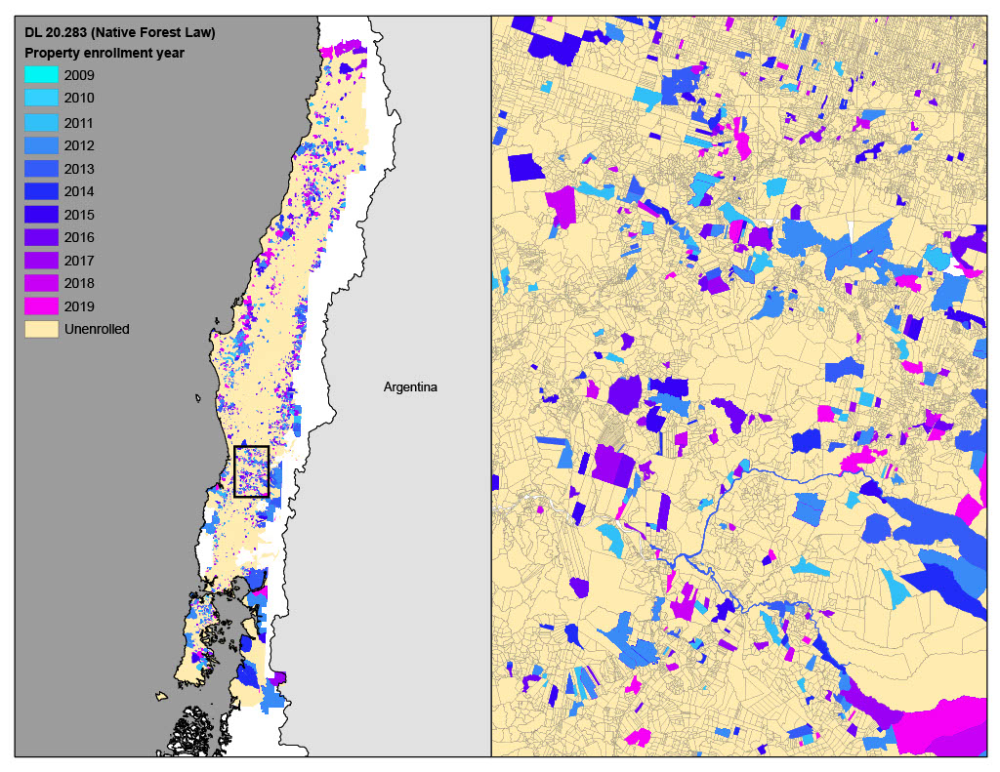
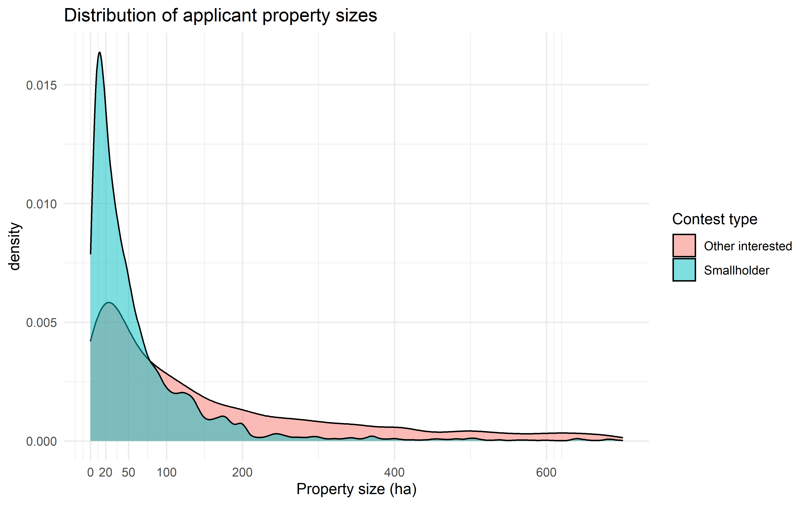
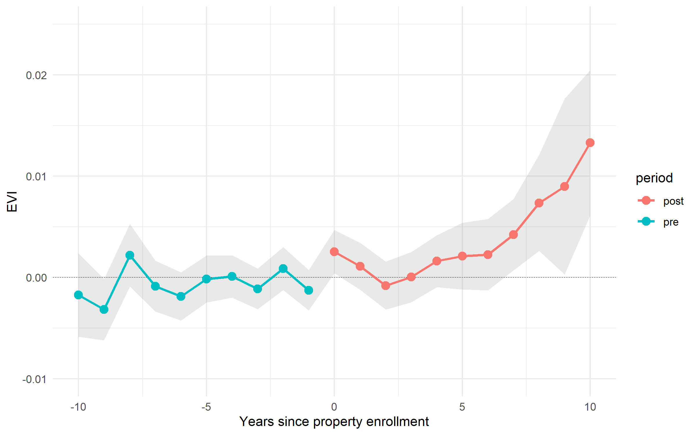
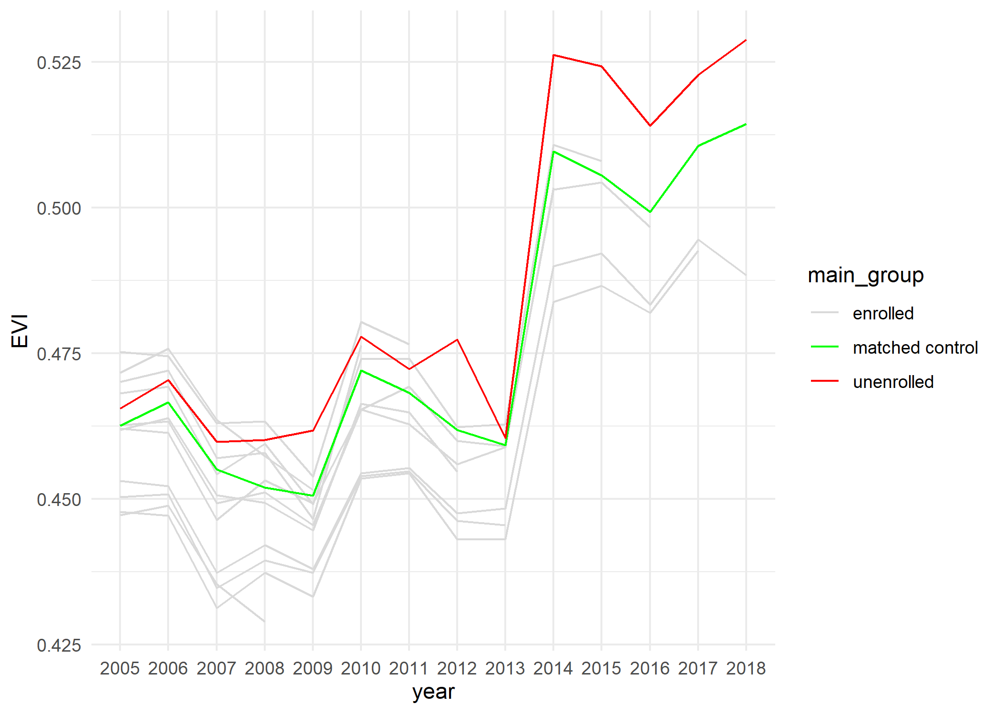
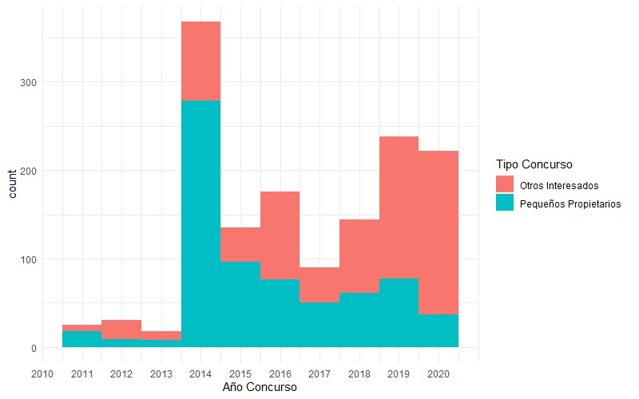

\sectionfont{\fontsize{12}{12}\selectfont}
\subsectionfont{\fontsize{12}{12}\selectfont}

```{r setup, include=FALSE}
library(dplyr)
library(plyr)
source('schart.R')
library(knitr)
library(ggplot2)
library(stringi)
library(stargazer)
library(sandwich)
library(kableExtra)
library(tidyverse)
library(ggplot2)
library(sjmisc)

knitr::opts_chunk$set(echo = FALSE, warnings = FALSE, messages = FALSE, out.width="49%", fig.align = "center")

options(scipen = 999)
```

# Abstract {-}

Widespread landscape restoration has become an important part of global efforts to address the intertwined challenges posed by climate change, biodiversity loss, and rural poverty. Payments for ecosystem services are popular, and policymakers often target priority groups in an effort to achieve dual objectives of increased forest cover and social development. This approach has proven to create tradeoffs in payments for avoided deforestation, however, limited evidence exists on its effectiveness in the restoration context. We evaluate the land cover impacts and targeting strategy of a Chilean federal program that pays landowners to restore their property with native species and prioritizes program co-benefits such as the engagement of rural smallholders and indigenous communities. While program compliance was low, we find small but statistically significant vegetation cover impacts amongst compliant properties. Although prioritized social characteristics were negatively associated with compliance, administrators verified project completion, preventing significant unconditional cash transfers. In contrast to many studies on avoided deforestation, socially prioritized smallholders and landowners in high-poverty communities generated greater environmental benefits. These findings illustrate key differences between targeting for multiple objectives in payments for restoration versus avoided deforestation. 

\clearpage

\doublespacing
# Introduction

In order to achieve the warming targets set by the IPCC, both emissions reductions and removals of carbon from the atmosphere will be necessary [@bastin_global_2019]. Restoration has been lauded as a potentially near term, large scale and low-cost option to achieve these carbon removals [@busch_potential_2019]. Global initiatives such as the Bonn Challenge, Trillion Trees Campaign, and UN Decade on Ecosystem Restoration highlight the enthusiasm for restoration and reforestation as a climate solution. However, there is limited evidence documenting the effectiveness of policies seeking to encourage restoration at large scales. Payments for ecosystem services (PES), which pay private landowners in exchange for providing environmental benefits, have been used extensively in the context of avoided deforestation [@borner2015], and are likely to play a major role as countries begin to scale up restoration in line with global commitments [@gichuki2019]. 

Political processes often lead policymakers to design programs aimed at multiple objectives []. PES programs are often designed to achieve social development goals in addition to environmental gains by targeting payments to alleviate povery [@wunder2008; @lipper2009]. However, subsidies that reflect political processes have the potential to undermine environmental benefits [@jack2008], and this strategy has proven to create significant tradeoffs in many payments for avoided deforestation programs [@alix-garcia2014]. Enrollment of groups targeted for poverty alleviation may be cost-ineffective for several reasons. Relatively poorer households and indigenous communities are often less likely to deforest even in the absence of payments [@pfaff1999; @cisneros_bolsa_2022]. As such, their participation generates relatively little additional forest cover [@alix-garcia_only_2015]. Further, credit constrained and low-income landowners may be more prone to leakage, meaning that they deforest unenrolled land  upon enrolling part of the property [@jack_leakage_2017; @alix-garcia2012]. 

While evidence detailing the pitfalls of targeting for "win-wins" in payments for avoided deforestation is widespread, there is a need for rigorous evidence in the restoration setting. Private information about the costs to providing forest often make targeting difficult [@jack_private_2013], and the underlying correlation between targeted characteristics and costs of producing forest may be different in the deforestation and reforestation cases. For example, relatively poor households may be unlikely to deforest in the absence of payments, but it may be more costly for them to produce new forest without payments either. In this setup, it is relatively more costly for prioritized groups to provide forest in the restoration case, but less costly in the avoided deforestation case. Second, non-compliance often plays a major role in the restoration context. Landowners may enroll in a PES program but fail to complete contracted activities if, for example, landowners are uncertain about restoration costs and benefits [@oliva2020]. If targeted characteristics are positively correlated with non-compliance, tension may arise.

In this paper, we use multiple novel datasets to quantify the land cover impacts of Chile’s Native Forest Law, which provided subsidies for native forest restoration and prioritized economic development of smallholder, indigenous, and rural communities. In fact, the Native Forest Law explicitly scored landowner applications based on both project-specific and social characteristics. We evaluate land cover impacts for eleven cohorts (2009–2019) using annual data from 2005–2020 and difference-in-differences approaches. Annual landcover data detailing tree cover and other land classes such as grasslands and croplands allow us a unique opportunity to evaluate restoration outcomes.

A key concern with evaluations of voluntary PES programs is that apparent effectiveness may be driven by unobservable differences in participation costs, meaning that performance may be attributed to these omitted characteristics rather than participation in the program [@alix-garcia_only_2015]. In order to alleviate concerns surrounding selection, we use two different strategies to construct the no-payment counterfactual. First, from a pool of all rural properties in the major forested regions of Chile, we use pre-processing techniques to construct a set of control properties that are comparable based on a detailed set of land use and property characteristics. This strategy, however, also implies a positive treatment effect for properties that did not comply with early-stage program requirements, dropped out within the first six months, and never received payment. We argue that this is implausible, because these landowners never completed any action with the program beyond initial application. Therefore, the non-complying properties are a more plausible counterfactual to complying properties had they never received payment. 

Estimates using both the matched properties and non-compliant properties as controls indicate the program increased tree cover amongst compliant properties, while reducing grassland and cropland. However, estimates based on the matched control group overestimate the impact of the program, highlighting the value of using control properties that actually indicated interest in the program. 

Using non-compliant properties as a control group further allows us to take a unique look at whether targeting for social development undermined environmental benefits in the Native Forest Law. All enrolled properties were assigned to either the smallholder or other interested party contest and given both a project and social score regardless of attrition within the first six months. We can therefore, take a unique look at treatment effect heterogeneity across contest type and components of the application scores. We find that smallholders and properties located in high-poverty communities were associated with greater treatment effects. Further, an increase in smallholders' social score was associated with greater treatment effects, even accounting for the project-specific score. 

Non-compliance in the Native Forest Law was high, as over two-thirds of applicants never received payment. Landowners with higher application social scores did suffer from relatively higher levels of non-compliance, however program administrators avoided unconditional payments by requiring verification of activity completion. While program administrators in the Native Forest Law avoided increased losses, this association may reduce cost-effectiveness in contexts where checking compliance is difficult or costly. 

Our results make several contributions to the literature. First, we add to the limited existing evidence on the environmental effectiveness of large-scale native forest restoration programs. Between 2009 and 2019, the National Forest Corporation (CONAF) allocated approximately US $58 million to enroll more than 235 hectares of land through the Native Forest Law, making it one of the largest native forest restoration programs in the world. As other countries begin to contemplate reforestation policies, Chile’s experience provides a valuable case study from which to draw.

Our second contribution is to highlight key differences between targeting in payments for reforestation in contrast to avoided deforestation. While targeting for social development has typically come at the cost of environmental gains in payments for avoided deforestation, no study to our knowledge has addressed this question in the restoration setting. First, non-compliance plays a significant role, and tension between cost-effectiveness may arise if checking compliance is difficult and non-compliance is positively correlated with targeted characteristics. In terms of environmental gains conditional on compliance, we identify a potential opportunity in the restoration context. Socially targeted groups actually yielded greater environmental gains, likely because of their lack of restoration activity without payments. 

# Program background and data

## Chile's Native Forest Law

Chile’s long history of public policies supporting tree cover expansion provides an incredibly useful setting in which to measure the impacts of payments for restoration. Chile's decree law no. 701 (DL 701) is one of the world's longest operating afforestation subsidies, but mainly promoted even-aged mococulture plantations of eucalyptus and pine that had negative effects on biodiversity and native forest cover [@heilmayr_impacts_2020]. Further, only about 3\% of subsidized plantations were additional. 

In an attempt to encourage the recovery and protection of native forests, Chile sought to pass the Ley de Recuperación del Bosque Nativo y Fomento Forestal (Native Forest Law) as a successor to DL701 [@clapp1998]. Initially expected in 1994, it became frozen in legislature before finally passing in 2008. In addition to protections for native forests, the law established an annual competition for grants to support private landowners in their efforts to manage, restore, or reforest their land using native species. Since 2009, more than \$58 million have been allocated through these competitions for projects covering 235 thousand hectares. Much of this allocated funding has not been paid to landowners, however, as program follow-through is relatively low. 

The subsidy component of the law encourages three types of activities: 1) the regeneration, restoration or protection of native preservation forests; 2) silvicultural activities aimed at restoring native forests for timber production purposes; and 3) silvicultural activities aimed at restoring native forests for non-timber production purposes. Of the 12,889 projects enrolled between 2009 and 2019, 10,912 (84.66\%) restored native forest for the purposes of timber production. Few estimates on the impacts of the Native Forest Law on land cover currently exist. CONAF estimated the carbon impacts of the Native Forest Law through 2018 as it relates to Chile's Nationally Determined Contribution (NDC) as part of the Paris Argeement. These estimates, however, assume that the carbon stored by every eligible subsidized hectare is the direct result of the law. These types of estimates ignore the concept of additionality, since some of this forest would likely exist even in the absence of the law. 

The Native Forest Law prioritizes not only forest cover in line with Chile's NDC goal of managing 200,000 ha of native forest, but also co-benefits such as biodiversity preservation and the participation of underrepresented groups. By prioritizing native forest rather than monocultures of pine or eucalyptus, the law seeks to incentivize the preservation of biological diversity. Prioritizing carbon-plantings without consideration of other co-benefits may result in negligible biodiversity co-benefits [@bryan2016]. In fact, DL701 resulted in the decline of native forest and biodiversity, as native forests provide significantly more biodiversity than plantation forests in Chile [@heilmayr_impacts_2020]. 

In response to concerns that large companies benefited disproportionately from the DL701 subsidies, Native Forest Law bonuses place an emphasis upon supporting smallholders and indigenous peoples. The contest provides additional support for properties awarded through the smallholder contest. In particular, smallholder awards are worth 15\% more than awards in the other interested parties contest for the same set of activities. It is also easier to be selected for a grant in the smallholder contest. Even within contests, smaller properties and those with indigenous status are given higher scores in the social component of the application score. 

### Receiving payment in the Native Forest Law

In order to receive payment, landowners must clear two primary administrative hurdles. Upon having an application selected by the program, landowners must first provide an updated native forest management plan. This management plan details the specific activities to be performed on the property and a timeline for activity completion. Landowners generally have six months from the date of selection to provide the management plan or be dropped from the program. Many landowners drop out at this stage of the program, as only XX \% of enrollees submitting the management plan within the required window. 

The timeframe for activities generally lasts over a year, and landowners are not eligible to receive their bonification until a minimum of two years after enrollment. Landowners must also have the project's completion verified by a third party, at which point they receive the payment. Roughly 32\% of projects enrolled between 2009 and 2019 have actually been paid out on. Conditional on submitting the management plan, this rate of payment jumps to 74\%. Program administrators have cited both capital constraints and a lack of labor supply as potential causes for such high rates of non-compliance. Submission of the management plan requires submission of the property cartography, which may also deter some landowners.

## Data

### administrative data

We have obtained property boundaries for all rural properties in the major forested regions of Chile as of the year 2009. Data on the awarded properties are available through CONAF and reflect aspects of the property and projects such as project objective, project surface area, bonus amount, and whether a management plan was submitted within six months. Also included is each property's parcel indentifier, which is unique to each property within a comuna, Chile's level 3 administrative unit. We match the enrolled properties to their corresponding boundaries via this unique parcel identifier. In addition, we observe payment recipients, which are matched to the corresponding program application, indicating whether a project was successfully completed. 

```{r map, fig.show="hold", fig.pos="H", out.width = '75%', fig.cap = "Properties enrolled through the Native Forest Law subsidy contest"}


```

### satellite data

We use annual Landsat (30m) resolution maps of landcover developed in @graesser2022 in order to examine how the law affected land cover on the extensive margin. These maps classify pixels into one of the following classes for each year between 1999-2018: forest, crop, grassland, shrub, and bareground.

We use the enhanced vegetation index (EVI 2) as a proxy for each property's annual cumulative level of vegetation cover. To generate the outcome for each property, we compute the average maximum EVI value of each pixel within a property for a given year. One benefit of the use of EVI is the ability to capture both new forest cover and changes in forest quality within a single index measure. We prefer EVI to normalized difference vegetation index (NDVI) because of NDVI's propensity to become saturated in high biomass regions. Given Chile's extensive native and plantation forests and the fact that many enrolled properties already have some degree of existing forest cover, this could limit our ability to detect small changes in the area or density of vegetation through time. In contrast, EVI corrects for canopy background noise and is more sensitive in areas with dense vegetation. 

Lastly, land-use classification maps of these regions in Chile developed in [@heilmayr_impacts_2020] allow us to distinguish the proportion of each property engaged in specific land uses prior to the existence of the Native Forest Law. Of particular interest is the distinction between plantation forest and native forest, which cannot be disentangled in the @graesser2022 product. In contrast to native forest, high levels of plantation forest may indicate greater ability to manage forest and undertake contracted activities. All of our satellite derived measures of land use cover the extent of the major forested areas of Chile, representing the regions that contain the vast majority of Native Forest Law enrollees. 

## Descriptive statistics

Trends through time of the following groups and variables:

- smallholders vs. other interested contest; above median social score for smallholders; above/below median communal poverty for smallholders

- evi, forest, agriculture, grasslands

Put table showing differences on observables here

# Targeting in the Native Forest Law

Compliance plays a major role in the Native Forest Law contest. Less than one-third of enrollees ever actually completed the agreed upon activities and received payment. Because the law requires several steps in order to receive payment, landowners could drop from the program at multiple times. First, landowners needed to submit a management plan within six months of selection in the contest. Then landowners must receive third-party verification that contracted activities were indeed completed.

In the case of the Native Forest Law, targeting is done in two main ways: 1) holding separate contests for smallholders and larger properties; and 2) a scoring mechanism that prioritizes indigenous peoples, smaller properties, and other landowner and property characteristics. 

In order to qualify for the smallholder contest, landowners must have a property size and assets below a set threshold for each region. The benefits of qualifying for the smallholder contest include 15\% higher payments as well as increased odds of receiving a grant through the contest. While the Native Forest Law used these separate contests to alleviate concerns that large corporations would reap the rewards from the program, smallholder classification is still quite broad. In some regions, properties up to 500 hectares can qualify for the smallholder contest. Figure \@ref(psize) shows that while many applicants in the smallholder contests are truly landowners with small properties, many larger properties are able to enter the smallholder contest.

In addition to holding separate contests, the program used a scoring system in order to assign project funding priority within each contest. Projects were granted funding in descending order of score until the allocated funding had been assigned. This meant that projects sometimes went unfunded because of a low score, although no ex-ante cutoff existed. This was particularly common in the other interested parties contests, which were granted funding after the smallholders. In some years, a second smallholder contest was held, causing smallholders to go unfunded because of low scores. The scoring criteria include factors related both to landowner, property, and project characteristics. This score, although not always critical for smallholder applicants, provides insight to program administrators' preferences for project prioritization. We provide a more detailed outline of the program's scoring system in Appendix \@ref(scoring-system), however, it amounts to a sum of social and project specific characteristics.


$$ score_i = social_i + project_i$$
- $social_i$ represents components of the score deemed to be of social importance by program designers. This includes factors such as property size and indigenous status. 

- $project_i$ represents components of the score representing project specific characteristics unrelated to the landowner themselves. This includes the specific activities carried out and characteristics related to the land. 

<!-- Projects are scored based on a weighted sum of four categories: -->

<!-- $$score_{assigned} = \gamma_tVI + \beta_tVPS + \lambda_t VP + \psi_tVP$$ -->

<!-- , where -->

<!-- - $VI$ = social characteristics of interest -->

<!-- - $VPS$ = other priority social characteristics -->

<!-- - $VP$ = project characteristics -->

<!-- - $VT$ = land characteristics -->

<!-- , and $\gamma_t$, $\beta_t$, $\lambda_t$, and $\psi_t$ represent the weights given to each category in year $t$. -->


# Program evaluation

## Generating a counterfactual

As is the problem with many PES impact evaluations, enrollment is non-random. Landowners choose to enroll in the program and, in theory, have an opportunity cost equal to or lower than program payment. It is then ill-advised to simply use unenrolled properties as the counterfactual, since unobservable factors affecting enrollment could drive changes in forest cover outcomes, not enrollment. 

### Candidate 1: matched control group

In order to move toward a more convincing counterfactual, we first use matching as a pre-processing technique to generate a control group from amongst all unenrolled rural properties in the major forested regions of Chile. This should yield control properties with more similar opportunity costs to enrollees than amongst the general population. This approach is similar to many studies in the literature. 

The covariates used for matching include environmental and economic characteristics likely to determine enrollment decisions and project performance. We include pre-enrollment property land-use including levels of native forest, plantation forest, and pasture. Landowners with similar levels of plantation forest, native forest, and other land uses on the property should face a similar decision about whether to enroll in a program involving native forest management. Other included covariates give a sense of a property's productive potential, remoteness, and timber market access. We also match on EVI pre-trends to help us to build confidence in the conditional common trends identification assumption that we make for the difference-in-differences strategy in the next section. We exclude the two year trends leading up to the enrollment year in order to avoid concerns of overfitting. Thus, seeing that pre-trends in the pre-trend period prior to enrollment hold should lend further creedence to the matching process. Matches are made with replacement based on nearest neighbor propensity scores from a logit model. Our main strategy matches each program enrollee with two control properties, however, we also include estimates based on mahalanobis distance metrics and matching each enrolled property with one and three nearest neighbors as robustness checks (Appendix \@ref(pre-process)).

Prior to pre-processing, enrolled and unenrolled properties differ significantly. The typical enrollee had significantly less land engaged in pasture or agriculture and significantly more native forest already, relative to the typical unenrolled property. Figure \@ref(fig:m-dist) shows how comparability between selected covariate distributions drastically improved between treatment and control properties after matching. Table \@ref(tab:covar-bal) in the Appendix displays a complete balance check for all covariates used. After processing, balance improved on every included covariate, and imbalance was reduced to below the standard normalized mean difference threshold of 0.25 for nearly every covariate. Figure \@ref(fig:trends) explores how the matching process improved unconditional pre-trends. 

```{r m-dist, fig.show="hold", fig.pos="H",  out.width = '40%', fig.cap = "Covariate distributions prior to and after matching for control and treatment groups.", fig.width = 10, fig.height = 12, echo=FALSE}
knitr::include_graphics(c("figs/balplot_unmatched_pasture.png", "figs/balplot_matched_pasture.png",
                          "figs/balplot_unmatched_forest.png", "figs/balplot_matched_forest.png",
                          "figs/balplot_unmatched_plantation.png", "figs/balplot_matched_plantation.png",
                         # "figs/balplot_unmatched_shrub.png", "figs/balplot_matched_shrub.png",
                          "figs/balplot_unmatched_slope.png", "figs/balplot_matched_slope.png",
                          "figs/balplot_unmatched_elev_legend.png", "figs/balplot_matched_elev_legend.png"
                          ))
```

### Candidate 2: non-compliant properties

Another candidate control group is the set of enrolled properties who never submitted a management plan within the first six months of their application being selected. These properties indicated some desire to participate in the program, but dropped out before taking any meaningful action - administrative or physical. Table XX shows that this group of early non-compliers is already quite similar to the treatment group based on observable characteristics. 

<!-- insert table here -->

One concern may be our decision to exclude rejected applicants from the control group. Given that these properties have revealed their intention to enroll in the program, it seems that they may have opportunity costs similar to program enrollees. However, the composition of the rejected applicants differs between smallholders and other interested parties depending on year, and the composition of the rejected applicant group is relatively unstable through time. Further, it would be difficult to make claims about the differences between the smallholders and other interested parties, because the rejected group differs through time and is not comparably balanced for each. We discuss the rejected applicants in more detail in Appendix \@ref(rejected). 

## Main specification

We take advantage of our panel data setting and estimate the following equation to reveal the land cover impacts of the Native Forest Law subsidy contest:

\begin{align}
outcome_{it} = \alpha + \beta intensity_{it} + \gamma_i + \lambda_t + X_{it} + \epsilon_{it} {#main-spec}
\end{align}

where 

- $outcome_{it}$ represents the share of property $i$ engaged in a specific land cover outcome in year $t$

- $intensity_{it}$ represents the percentage of property $i$ enrolled through the Native Forest Law subsidy contest in year $t$

- $\gamma_i$ and $\lambda_t$ represent property and year fixed effects, respectively

Conditional on covariates and fixed effects, $\beta$ recovers the impact of enrollment in the Native Forest Law contest, conditional on compliance. 

Because \@ref{main-spec} relies on property and year fixed effects, it falls under the umbrella of two-way fixed effects (TWFE) estimators. This literature has received ample attention in recent years, particularly in the case on binary treatment (i.e., whether a property enrolled) [@roth2022; @dechaisemartin2022]. In this context, binary treatment would ignore the proportion of the property enrolled through the contest. This is of concern, because the typical landowner only enrolls less that 5\% of their land in the program, with significant variation across properties. 

Importantly, $intensity_{it}$ represents a continuous treatment in the context of TWFE estimation. @callaway2022 decompose TWFE estimators when treatment is continuous and show that $\beta$ represents the weighted average change in outcomes from incremental changes in land enrollment across and within periods. Thus, my identification relies on the following assumption: properties that enrolled an additional percentage point of land in the Native Forest Law contest, must experience the same evolution in outcomes as properties that never enrolled the increment. I use an event study design of the following form to evaluate the parallel trends assumption in my setting:

\begin{align}
event study = eventy
\end{align}


<!-- robust to general treatment effect heterogeneity. We need to make an appropriate common trends assumption in order to make inference about causal effects of the program, and this choice leads us to our preferred estimator [@marcus2021]. As mentoned above, many PES programs operate on voluntary enrollment into the program. This is indeed the case with the Native Forest Law, in which enrollees must apply and be selected for participation. Because enrollment is unlikely to be exogenous, we opt for a relatively weak common trends assumption:  -->

<!-- \textbf{Conditional common trends based on unawarded properties:} -->
<!-- For all $g, t = 2,...,\Tau,$ such that $t\geq g$,  -->
<!-- \begin{align} -->
<!-- E[evi_{it}(0)-evi_{it-1}(0)|X_i, G_g=1] = E[evi_{it}(0)-evi_{it-1}(0)|X_i, C=1] -->
<!-- \end{align} -->

<!-- This amounts to assuming that without enrolling in the Native Forest Law contest, awarded properties would have continued to follow the same evolution in EVI as matched control properties, after conditioning on pre-treatment covariates. In order to rely on this common trends assumption, we must have a relatively large set of properties that do not experience treatment, or inference procedures may not be as precise as procedures that align with an alternative assumption. However, it is important to stress that this potential “loss of efficiency” is a direct consequence of not exploiting restrictions on pretreatment trends across cohorts [@marcus2021]. Luckily, in our case, we can take advantage of our matching procedure, which uses an extremely large pool of unawarded properties, detailed covariates including pre-program land uses, and explicit pre-trends. As such, we benefit from the fact that our common trends assumption does not restrict pre-trends across cohorts and does not presume that later cohorts are viable counterfactuals for early cohorts. Settling on this specific common trends assumption helps us to determine the appropriate estimator. The estimator developed in @callaway_did_2020 relies on the common trends assumption above, which we believe is reasonable to make. Another benefit of this estimator is the fact that we are able to condition on pre-treatment covariates that do not vary through time. As many of the covariates in our data do not vary through time, we can utilize them effectively in our estimation strategy. This would not be possible in many other difference-in-differences estimation strategies including two-way fixed effects. Standard errors are clustered at the property, the level of the decision-making unit and at which treatment is assigned. A more detailed explanation of the particularities surrounding the approach can be found in Appendix \@ref(did-methods)  -->

## Program evaluation results

We first measure the impact of the program on compliant properties. This is the impact of the program conditional on successfully completing the project and subsequently receiving payment. Table XX shows that using the matched control group, the characteristic enrolled property sees an increase in tree cover after enrollment relative to the counterfactual. It also sees a decline in grassland and cropland. For the average property, a 1 percentage point increase in land enrolled through the contest led to a XX \% increase in tree cover. It also led to a XX \% and XX \% decline in grassland and cropland, respectively. 

<!-- Insert regression table of compliant results using matched control -->

However, using the non-compliant properties as the treatment group yields a similar interpretation, which is highly implausible (Table XX). These non-compliant properties, although selected to participate, never again engaged with the program after initial selection administratively. They failed to provide a management plan within 6 months of enrollment, and therefore, were dropped from the program. Having dropped within such a short time-frame and never submitted a management plan indicates that these landowners never engaged in what would have been subsidized restoration activities. 

# Targeting for social development

## The relationship between non-compliance and targeting

Targeting payments toward groups that suffer from high levels of non-complance may be costly. This is particularly true in contexts where non-compliance is particularly low, such as the Native Forest Law. Targeting groups that suffer from relatively greater levels of non-compliance may degrade the cost-effectiveness of the program if checking compliance is difficult or costly. 

To explore this relationship, we would ideally compare landowners in the smallholder and other interested party contest. However, it is not possible to disentangle the influence of priority characteristics and poverty from the influence of the higher payment. This is particularly true, because increased payments may have induced selection of different types of landowners into the program. For this reason, we focus on the social component of the score and measures of communal poverty.

In order to examine how prioritization of social characteristics in the Native Forest Law scoring system was correlated with compliance, we use regressions of the following form:

$$ complied_i = \beta_0 + \beta_1 social_i + \beta_2 project_i + \beta_3X_i + \epsilon_i $$

- $complied_i$ is a dummy variable equal to 1 if landowner $i$ followed through and received payment for successful project completion. 

Table XX shows the results of these regressions. Our main coefficient of interest in these regressions is $\beta_1$, which captures the association of an increase in the $score_{social}$ on compliance, holding the other parts of the project component constant. We see that higher values of $score_{social}$ are associated with a decreased probability of compliance, indicating that landowners who were prioritized by the program were less likely to comply. That said, the smallholder contest saw increased levels of compliance on average, relative to the other interested party contest. Columns (2) and (3) show that extensionists were associated with large increases in compliance probability, perhaps indicating that some of the risk of non-compliance by priority groups can be mitigated. 

<!-- Insert results table here -->
```{r compliance-tab, results = 'asis'}
load("results/compliance_models.rdata")
model.lst = list(compliance_mod1, compliance_mod2, compliance_mod3, compliance_mod4)

stargazer(compliance_mod1, compliance_mod2, compliance_mod3, compliance_mod4,
          title="Social scoring is associated with compliance",
          type = "latex",
          float = TRUE,
          report = "vcs*",
          se=lapply(model.lst, function(x) sqrt(diag(vcovHC(x, type = "HC1")))),
          no.space = TRUE,
          header=FALSE,
          single.row = TRUE,
          #font.size = "small",
          intercept.bottom = T,
          covariate.labels = c("ln(Social score)", "ln(Project score)", "Extensionist", "Smallholder", "ln(Social score) x Smallholder"),#, "intercept"),
         keep = c(1, 2, 'extensionista', 'smallholder', 'log(social_puntaje + 1):smallholder'),#, 'Constant'),
          dep.var.labels= c("Received bonus"),
          digits = 3,
          keep.stat = c("n","adj.rsq"),
          add.lines=list(c('Region FE', 'Yes','Yes', 'Yes', 'No'))
)
```

## Verification saved significant resources

CONAF saved significant resources in not paying landowners who never completed contracted activities. In cases where compliance checks are costly or infeasible, as may be the case in many developing countries, non-compliance may degrade a program's cost-effectiveness. Program administrators may spend resources checking compliance or by paying landowner who never provided environmental benefits. Because Chile is a country with stong institutional capacity, this was avoided in the Native Forest Law.

Landowners were not eligible to receive the payments until after third-party varification of completed activities. For most projects, this verification was not accepted until two years after enrollment, meaning that landowners had to sustain progress for a substantial period of time. This hurdle may have made compliance more difficult for credit constrained individuals. We see evidence of this through reduced compliance by relatively poorer and socially prioritized landowners. However, these compliance checks prevented payment of XX USD to landowners who never completed their planned forest restoration activities, greatly improving overall cost-effectiveness.  


## The relationship between program impact and targeting

### Results

```{r, include = FALSE}
contest_ttest <- readRDS("results/contest_ttest.rds")
extension_ttest <- readRDS("results/extension_ttest.rds")
compliance_ttest <- readRDS("results/compliance_ttest.rds")

```

```{r contest-covars, fig.pos="HOLD"}

kable(contest_ttest, format = "latex", row.names = FALSE, booktabs = T, col.names = c("Covariate", "Smallholder mean", "Other interested mean", "T-test p value"), align='c',
      caption = "differences in observables between properties enrolled in the smallholder vs. other interested parties contest)")%>%
  row_spec(0,bold=TRUE)
```

# Discussion and conclusion

Prominent initiatives such as the Bonn Challenge, Trillion Trees Initiative, and UN Decade on Ecosystem Restoration hope to address the intertwined challenges of rural poverty, climate change and biodiversity loss through large-scale afforestation and reforestation. Initial national plans indicate that many countries will follow Chile’s model for tree cover expansion, relying heavily upon subsidies and plantation forests to achieve their commitments [@heilmayr_impacts_2020]. In light of the fact that this model may have negative impacts on native forest extent, biodiversity, and other outcomes, payments for native forest restoration may provide a more sustainable and socially beneficial path forward. Further, this may lead to increased additionality if alternative policies simply subsidize plantation forests that would have been planted anyways. Native Forest Law payments led to increased vegetation cover on enrolled properties, indicating that this model may a viable approach to designing payments for reforestation. 

Whether or not program administrators can successfully target priority groups without sacrificing environmental benefits depends on two key factors. First, priority groups that have relatively lower costs of providing forest cover are likely to generate little additional carbon benefits. Second, if priority groups are less likely to complete contracted activities, benefits may be lost to both program administrators and landowners in rural or poor communities. In the context of Chile's Native Forest Law, we find that smallholders, including prioritized landowners in smallholder, rural, and indigenous communities were less likely to comply with the PES contracts. However, this did not undermine program cost-effectiveness, because administrators only paid landowners who were confirmed to have completed projects. Further, these prioritized landowners had greater environmental impacts, indicating that targeting these groups was not detrimental to environmental benefits, as has often been seen in payments for avoided deforestation. 

# References

<div id="refs"></div>

\clearpage

# Appendix 

## Descriptive statistics

### Property size distributions {#psize}
```{r psize, fig.pos="H", out.width = '100%', fig.cap = "Distribution of property sizes amongst applicants in both contests", echo=FALSE}


```


### Beneficiaries vs. non-compliers

Table \@ref(tab:compliance-covars) shows that landowners who follow-through differ from those who do not on a number of characteristics. This includes project and property characteristics. Notably, projects that do follow-through are likely to belong to properties with more plantation forest, but there is no detectable difference in native forest. Future iterations of this paper will take a more active approach to predicting compliance and understanding the potential foregone benefits from a lack of compliance. 

```{r compliance-covars, fig.pos="H"}

kable(compliance_ttest, format = "latex", row.names = FALSE, booktabs = T, col.names = c("Covariate", "Complier mean", "Unpaid mean", "T-test p value"), align='c',
      caption = "differences in observables between paid and unpaid properties (limited to pre-2019 applicants)")%>%
  row_spec(0,bold=TRUE)
```

### Enrollees with extensionists vs. no extensionist support

```{r extension-covars, fig.pos="H"}

kable(extension_ttest, format = "latex", row.names = FALSE, booktabs = T, col.names = c("Covariate", "Received extensionist mean", "No-extensionist mean", "T-test p value"), align='c',
      caption = "differences in observables between properties applying with or without extensionist")%>%
  row_spec(0,bold=TRUE)
```

\clearpage
## DID estimator details {#did-methods}

Recent papers have shown that the typical two-way fixed effects estimator may generate biased results in the presence of treatment effect heterogeneity [e.g., @goodman-bacon_did_2018; @callaway_did_2020; @de_chaisemartin_2020]. This could be particularly important in our case, given that there are over 150 cohort-time cells. This means that there is ample opportunity for undesirable or even perhaps negative weights on each cohort-time cell to plague our estimates if we were to use a two-way fixed effects specification.

We individually estimate the average treatment effect for each cohort-time cell, $ATT_{g,t}$, where $g$ denotes the cohort, and $t$ denotes the year, before aggregating the $ATT_{g,t}$s into a summary measure of the overall $ATT$ based on @callaway_did_2020. The estimand for each of the $ATT_{g,t}$s is as follows:

$$ATT_{g,t} =  E[evi_{it}(1) - evi_{it}(0) | G_i = g, t \geq t_o]$$

Each $ATT_{g,t}$ then represents the treatment effect for cohort $g$ in time $t$. To generate the $ATT_{g,t}$s, we first subset the data to only contain observations at time $t$ and $g − 1$, from units with either $G_i = g$ or that are in the control group. For example, for the $ATT_{2015, 2019}$, we subset to only the 2015 cohort and control group for the years 2014 and 2019. Then using only the observations from this subset, we calculate $ATT_{g,t}$ using a 2x2 difference-in-differences method. 

We opt to use the doubly robust difference-in-differences estimator developed in @santanna_doubly_2020. This involves first estimating a propensity score using a logit model and allows for common trends to hold only after conditioning on pre-treatment covariates. With this method, we can identify the $ATT_{g,t}$s if either (but not necessarily both) the propensity score or outcome regression is correctly specified [@santanna_doubly_2020].

We use two primary measures of the $ATT$ in this paper. Our first summary measure, $ATT_{ovr}$, provides an estimate of the overall $ATT$ and represents the estimates provided in paper tables.
$$ ATT_{ovr} =\frac{1}{ \sum_{t_0}^{T}\sum_{g \in G} \mathbb{1}\{ g \leq t \} P(G_i=g | G_i\leq \Tau)} \sum_{t_0}^{T}\sum_{g \in G}\mathbb{1}\{ g \leq t \} P(G_i=g | G_i\leq \Tau) ATT_{g,t}$$
, where in our case $t_0 = 2009$ and $T=2020$.

We view $ATT_{ovr}$ as a conservative measure of program impact in this context. In the case of forest regeneration, restoration, and reforestation, we shouldn't expect a huge "on-impact" treatment effect, but rather a steady accumulation of biomass and foliage through time. Further, the benefits of these activities are closely related to their permanence, meaning that forest cover must be sustained over time. $ATT_{ovr}$ inherently places more weight on earlier event time periods, since the $ATT_{g,t}$s we expect to be least influential (representing earlier event times) are represented more frequently. 

The second measure provides event study estimates. Here, within each event time window, we aggregate the $ATT_{g,t}$s with weights corresponding to group size.

$$ ATT_{es}(e) = \sum_{g\in G} \mathbb{1}\{ g+e \leq \Tau\} P(G_i=g | G_i+e\leq \Tau)ATT_{g,g+e} $$

This is the average effect of participating in the treatment $e$ time periods after a characteristic property is enrolled in the program across all cohorts that are ever observed to have participated in the treatment for exactly $e$ time periods. The year a property enrolls in the program is denoted by $e=0$.

## DID results across other stratifications

### Specification chart

```{r schart, echo = FALSE, warnings = FALSE, results = FALSE, message=FALSE, fig.cap="Specification chart displays estimates across a variety of matching methods and subgroups of the data. Our preferred specification is highlighted",  fig.width = 10, fig.height = 7, out.width="100%"}

spec_results <- readRDS("results/spec_results.rds")%>%
  mutate_at(vars(all:area.weights), as.logical)%>%
  arrange(area.weights, desc(all))%>%
  as.data.frame()

par(oma=c(1,0,1,1))

labels <- list("Subsample:" = c("all", "smallholders", "other interested", "timber production", "non-timber objectives"),
               "Pre-processing:" = c("1 to 1", "2 to 1", "3 to 1", "logit", "mahalanobis"),
               "Control group:" = c("includes not yet treated"),
               "Weighting" = c("area weights"))

my_palette  <- list("black" = "#000000", 
                    "green"  = "#009E73", 
                    "blue" =  "#0072B2", 
                    "red" = "#D55E00")

schart(spec_results, ci=c(.9,.95), ylab="ATT", labels = labels,
       col.dot=c(my_palette$black,"grey","white", my_palette$blue),
       bg.dot=c("white","grey","white", my_palette$red),
       col.est=c(my_palette$black, my_palette$blue),
       highlight = 2
) 


```

### Alternative pre-processing {#pre-process}

```{r}

match_did <- did_results %>% filter(name %in% c("mahalanobis", "matched 1 to 1", "matched 3 to 1"))

```
\begin{table}[H]\centering
\caption{Overall treatment effect estimates for complying properties by pre-processing method}
\smallskip
\begin{tabular}{lc c c c}
\toprule
\hline
& \multicolumn{3}{c}{\textit{Dependent variable:}} \\ 
\cline{2-4} 
  & \multicolumn{3}{c}{EVI} \\ 
  \\[-1.8ex] & (1) & (2) & (3)\\ 
\midrule
 $\widehat{ATT}$  &   `r match_did$ATT_ovr[2]`** & `r match_did$ATT_ovr[3]`* & `r match_did$ATT_ovr[1]`**\\
                  &   (`r match_did$ovr_se[2]`) & (`r match_did$ovr_se[3]`) & (`r match_did$ovr_se[1]`)\\ 
\midrule
 N      &     `r match_did$N[2]`  & `r match_did$N[3]` &  `r match_did$N[1]`\\  
 Matching method &  3:1    &          1:1        & mahalanobis    \\  
 \hline
\bottomrule
\addlinespace[1ex]
\textit{Note:}  & \multicolumn{3}{r}{$^{*}$p$<$0.1; $^{**}$p$<$0.05; $^{***}$p$<$0.01} \\ 
\end{tabular}
\end{table}


### Timber production objective

```{r}
objective_did <- did_results %>% filter(name %in% c("timber", "ntimber"))

```

\begin{table}[H]\centering
\caption{Overall treatment effect estimates for complying properties}
\smallskip
\begin{tabular}{lc c c}
\toprule
\hline
& \multicolumn{2}{c}{\textit{Dependent variable:}} \\ 
\cline{2-3} 
  & \multicolumn{2}{c}{EVI} \\ 
  \\[-1.8ex] & (1) & (2) \\ 
\midrule
 $\widehat{ATT}$  &   `r objective_did$ATT_ovr[2]`*** & `r objective_did$ATT_ovr[1]`  \\
                  &   (`r objective_did$ovr_se[2]`) & (`r objective_did$ovr_se[1]`) \\ 
\midrule
project objective & timber production & other\\
 N      &     `r objective_did$N[2]` &  `r objective_did$N[1]`   \\  
 \hline
\bottomrule
\addlinespace[1ex]
\textit{Note:}  & \multicolumn{2}{r}{$^{*}$p$<$0.1; $^{**}$p$<$0.05; $^{***}$p$<$0.01} \\ 
\end{tabular}
\end{table}


### By cohort

In order to examine the robustness of our main event study estimates, we replicate our event study for each cohort separately. Figure \@ref(fig:cohort-es) shows that the early cohorts are largely driving the treatment effect estimates. We also see that the common trends assumption appears to be implausible for a couple of cohorts that experience a null result. Figure \@ref(fig:good-cohorts-es) replicates our main event study, excluding cohorts with a pretreatment estimate statistically different from zero, a strategy advised in @sun2021. We see that the results are not visually different from those in Figure \@ref(fig:main-es)

```{r}

cohort_did <- did_results[8:18, ]

```


```{r cohort-es, fig.show="hold", fig.pos="H",  out.width = '33%', fig.cap = "This figure shows event time treatment effects by cohort.",  echo=FALSE}
knitr::include_graphics(c("figs/cohort2009.png", "figs/cohort2010.png", "figs/cohort2011.png", "figs/cohort2012.png", "figs/cohort2013.png", "figs/cohort2014.png", "figs/cohort2015.png", "figs/cohort2016.png", "figs/cohort2017.png", "figs/cohort2018.png"))
```

```{r good-cohorts-es, fig.pos="H", out.width = '100%', fig.cap = "This figure shows event time treatment effects for cohorts that did not have a pre-trend violation", echo=FALSE}


```


\clearpage

## Matching diagnostics


```{r covar-bal, fig.pos = "H", fig.cap = "Covarate balance between treated and untreated groups with and without matching. The leftmost panel is based on nearest neighbor matching, and the right panel is the unmatched data"}

covar_bal <- readRDS("results/covar_balance.rds")

kable(covar_bal, format = "latex", row.names = FALSE, booktabs = T,
      caption = "Covariate balance with and without matching",
      col.names = c("Covariate", "Norm. diff.", "Threshold", "Norm. diff.", "Threshold"), escape = TRUE) %>%
  add_header_above(c(" "=1, "Matched"=2, "Unmatched" = 2), escape = TRUE, line =FALSE, bold = TRUE)%>%
  kable_classic()

```
\clearpage

### EVI trends

Figure \@ref(fig:trends) shows the pre-treatment trends of each cohort relative to both the entire unenrolled set of properties and the matched set of control properties. We see that the matched group seems to outperform the , meaning that our matching process likely improved the plausibility of the conditional common trends assumption we make. Note that these are the raw trends unconditional on covariates, so we prefer the pre-treatment event study estimates for discussing the plausibility of our assumption, however, this figure show the benefits of matching to obtain a more plausible counterfactual. 

```{r trends, fig.pos="H", out.width = '75%', fig.cap = "Raw EVI trends for unmatched control group, matched control group, and treatment group", echo=FALSE}

```

## Project scoring mechanism {#scoring-system}
  
The program used a scoring system in order to assign project funding priority in each contest. Projects were granted funding in descending order of project score until the allocated funding had been assigned. This meant that projects sometimes went unfunded because of a low project score. This was particularly common in the other interested parties contests, which were granted funding after the smallholders. In some years, a second smallholder contest was held, causing smallholders to also go unfunded because of low scores. The scoring criteria include factors related both to landowner, property, and project characteristics. This score, although not always critical for smallholder applicants, provides insight to program administrators' preferences for project prioritization. 

Projects are scored based on a weighted sum of four categories:
  
  $$score_{assigned} = \gamma_tVI + \beta_tVPS + \lambda_t VP + \psi_tVP$$
  
  , where

- $VI$ = social characteristics of interest

- $VPS$ = other priority social characteristics

- $VP$ = project characteristics

- $VT$ = land characteristics

, and $\gamma_t$, $\beta_t$, $\lambda_t$, and $\psi_t$ represent the weights given to each category in year $t$.

## Rejected applicants {#rejected}

During the annual Native Forest Law contest, applicants submit a management plan detailing the specifics of the project to be considered for an award. Judges score each application based on a number of criteria including the size of the property, project extent, specific activities to be performed, and the cost of the project. After scores are tallied, awards are dispersed in order of project score. Awards are given to the smallholder contest first, and subsequently to the other interested party contest. Thus, in years when the contest's funds run out, other interested parties generally go unfunded. In years in which the contest does not exceed the funding theshold for both groups, a second smallholder-only contest is held for any additional project applicants. These contests generate unawarded smallholders. Projects can become rejected either by scoring below the threshold that receives funding or because of unapproved proposed activities in the application itself. Thus there are two ways to get rejected.

Figure \@ref(fig:allreject-hist) shows the distribution of rejected applicants by contest across different contest years. One thing to note is that many of the rejected applicants are able to adjust their application, reapply, and enroll in subsequent years. We see that the two contests see different trends in the number of rejected applicants through time. 

```{r allreject-hist, fig.pos="H", out.width = '75%', fig.cap = "This histogram shows the number of rejected applicants by year across contest types", echo=FALSE}

```

