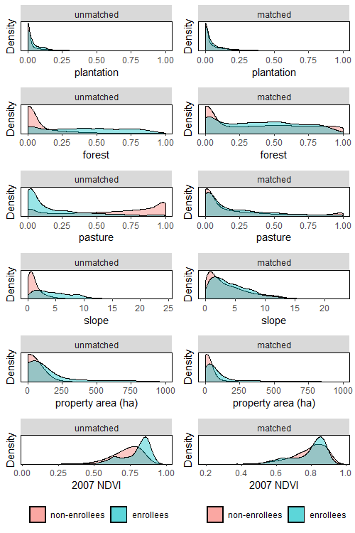

\sectionfont{\fontsize{11}{11}\selectfont}
\subsectionfont{\fontsize{11}{11}\selectfont}

```{r setup, include=FALSE}
library(dplyr)
library(plyr)
source('schart.R')
library(knitr)
library(ggplot2)
library(stringi)
library(stargazer)
library(sandwich)
library(kableExtra)
library(tidyverse)
library(ggplot2)
library(sjmisc)

knitr::opts_chunk$set(echo = FALSE, warnings = FALSE, messages = FALSE, out.width="49%", fig.align = "center")

options(scipen = 999)
```

# Abstract {-}

Widespread reforestation has become an important part of global efforts to address the intertwined challenges posed by climate change, biodiversity loss, and rural poverty. In response to concerns that plantations of exotic species may undermine objectives of increased carbon storage, biodiversity, and community involvement, some policies have sought to restore landscapes with native species. We evaluate land cover impacts of a Chilean federal program that pays landowners to restore their property with native species and prioritizes program co-benefits such as the engagement of rural smallholders and indigenous communities. Using panel econometric methods robust to general treatment effect heterogeneity, we address the program's impacts on vegetation cover. We find significant but small vegetation cover impacts for beneficiary properties, however, program compliance was low. While beneficiaries with prioritized social characteristics did provide additional forest cover benefits, these characteristics were negatively associated with compliance, undermining true win-wins. Further, these prioritized landowners were less likely to receive extensionist assistance, a major determinant of compliance. This paper highlights key differences for targeting in payments for reforestation in contrast to avoided deforestation. 

\doublespacing

TO DO:  

- cross references

- update property map
-- we now have properties up toward Argentina border

- figure adjustments
-- quartile plot colors and legend
-- matched distributions plots

- add language/descriptions


\clearpage

# Introduction

In order to achieve the warming targets set by the IPCC, both emissions reductions and removals of carbon from the atmosphere will be necessary [@bastin_global_2019]. Reforestation has been lauded as a potentially near term, large scale and low-cost option to achieve these carbon removals [@busch_potential_2019], however, there is limited evidence documenting the effectiveness of policies seeking to encourage reforestation at large scales. One policy that is expected to play an important role in helping countries meet their reforestation commitments is a system in which private landowners are paid to engage in forest restoration and reforestation [@gichuki_reviving_2019]. While similar payment for ecosystem services (PES) programs have garnered widespread scientific interest [@borner_effectiveness_2017], empirical studies documenting the impacts of large-scale reforestation programs are critical to guide the effective design of policies as more countries adopt this model. 

Within the natural climate solutions literature, ample attention has been given to the co-benefits and co-risks that can arise from the growing market for carbon removals. As a result of the emphasis on generating biomass, many programs have encouraged afforestation with monocultures of quick-growing exotic species such as eucalyptus and monterrey pine [@iucn_afforestation_2016]. This model can have co-risks such as the conversion of native ecosystems, loss of biodiversity, and exacerbation of distributional issues [@heilmayr_impacts_2020]. On the other hand, many argue that these schemes can avoid the aforementioned risks and generate substantial co-benefits if done properly. These often cited co-benefits include biodiversity conservation, habitat improvement, erosion reductions, watershed protection, and support for lower-income and indigenous communities. 

Efficient targeting of public programs is difficult when the costs or benefits to potential recipients is private information [@jack_private_2013; @jack_leakage_2017]. In many cases, the social planner hopes to target for both environmental and social development goals, but subsidies that reflect political processes may undermine environmental benefits [@jack2008]. This has often proven to be the case in the context of payments for avoided deforestation, where prioritized groups have relatively lower levels of deforestation risk [e.g., @alix-garcia_only_2015; @pfaff2007], reducing the program's cost-effectiveness and impact. In the restoration case, not only is the opportunity cost to landowners unknown to program administrators, but compliance may be relevant if landowners often fail to complete contracted activities [e.g., @oliva_technology_2020]. Tension may arise if targeted characteristics of interest are correlated with non-compliance and program impacts in opposite directions. 

In this paper, we provide some of the first causal estimates of a large-scale payments for restoration program: Chile’s Native Forest Law. The law included an annual contest for subsidies for native forest recovery and prioritized economic development of smallholder, indigenous, and rural communities. Between 2009 and 2019, the National Forest Corporation (CONAF) allocated approximately US $58 million to enroll more than 235 hectares of land through the Native Forest Law, making it one of the largest native forest restoration programs in the world. A key concern with evaluations of these types of programs is that apparent effectiveness may be driven by unobservable differences in participation costs, meaning that performance may be attributed to these omitted characteristics rather than participation in the program [@alix-garcia_only_2015]. From a pool of over one million untreated properties, we construct a set of counterfactual properties based on a detailed set of land use and property characteristics in order to alleviate some of the concerns surrounding selection. This vastly improves the plausibility of the conditional common trends assumption on which our identification strategy relies. We evaluate land cover impacts for eleven cohorts (2009–2019) using annual data from 2005–2020 and a difference-in-differences approach that is robust to general treatment effect heterogeneity.

We provide a framework to describe how the success of programs' targeting strategy to achieve multiple objectives depends on two underlying correlations: 1) the correlation between characteristics used for targeting and landowners' costs to providing forest carbon; and 2) the correlation between characteristics used for targeting and non-compliance. This applies both to programs that pay for avoided deforestation and reforestation, however, non-compliance may be more likely to play a role in the reforestation case if landowners struggle to perform contracted activities. This is indeed a major factor in the Native Forest Law, where compliance is quite low. We explore the influence of the Native Forest Law's targeting mechanisms on its ultimate environmental efficacy by examining how the program's scoring and contest system influenced expected compliance and environmental impacts of prioritized properties. Using detailed project-specific information, we reconstruct project scores and identify the influence of social components of the score. We find that increases in landowners' social scores were associated with decreased compliance on average. The program did, however, allocate extensionists to smallholders, which appears to have significantly increased compliance probability. Unfortunately, an increase in the social score was associated with decreased probability of extensionist assistance. This is, however, suggestive that perhaps the correlation between priority characteristics and non-compliance could be tempered with improved allocation of extensionist services. 

This paper contributes to the literature that addresses whether reforestation may be a viable large-scale method for removing and storing CO2 and adds to the limited existing evidence on the environmental effectiveness of large-scale native reforestation programs. More specifically, we speak to the literature on targeting in PES [@borner_effectiveness_2017; @alix-garcia2014] by examining tradeoffs of prioritizing certain groups when non-compliance is high. Our study suggests that while prioritized groups, in contrast to avoided deforestation, may provide significant additional forest gains, they may also be least poised to complete contracted activities without additional support. As other countries begin to contemplate reforestation policies, Chile’s experience provides a valuable case study from which to draw. 

<!-- The remainder of the paper is structured as follows. Section 2 provides a conceptual framework that generates predicitons for when PES programs' targeting strategy is likely to achieve both cost-effective carbon benefits and paricipation of priority groups. Section 3 provides background for Chile's Native Forest Law and its objectives. Section 4 conducts program evaluation using a difference-in-differences strategy that is robust against concerns surrounding the influence of general treatment effect heterogeneity. Section 5 explores whether the Native Forest Laws targeting strategy was able to target prioritized groups without sacrificing environmental gains. Section 6 further explores major drivers of heterogeneity in both program impacts and non-compliance. Section 7 concludes.   -->

# Targeting for multiple objectives with heterogeneous compliance and conservation costs: a conceptual framework

Much research has addressed targeting in PES programs in the context of avoided deforestation. The key to gaining high environmental effectiveness at least cost is to enroll only the parcels at risk of deforestation [@alix-garcia_payment_2014]. This can be achieved by providing adequate payments and focusing on parcels in areas of high deforestation. In these contexts, however, it has been difficult to achieve the dual objectives of environmental efficacy and participation of poor, rural, or indigenous communities. This is driven by the fact that these communities often have relatively lower deforestation risk [e.g., @alix-garcia_only_2015; @pfaff2007], meaning that they likely would have provided forest carbon benefits even in the absence of PES payments. 

This is not the case in the reforestation context, where high environmental effectiveness is determined by whether the payment induces landowners to generate and maintain new forest cover through sustained behavior change. As such, if priority groups would not have provided new forest cover in the absence of payments, they may still be cost-effective enrolles. However, non-compliance may play a major role if, for example, landowners are unertain as to the costs or benefits of generating forest cover [e.g., @oliva_technology_2020]. In order to illustrate how landowners' costs of providing forest carbon and non-compliance determine the effectiveness of program administrators' targeting strategy, we adapt a framework developed in @jack_self_2019.

Suppose that landowner $i$ is one of 15 landowners and experiences cost $c_i$ (ranging from -\$5 to \$10) to produce forest carbon benefits. For simplicity assume that all landowners have identical parcels, and reforesting the parcel produces carbon benefits of $10. Figure \@ref(fig:framework) depicts the aggregate supply of contracts for forest carbon provision, showing the aggregate number of applicants for payments against their costs to produce forest carbon on the x-axis. This framework is applicable to either the avoided deforestation or reforestation setting, with forest carbon provided either through conservation of forest or by providing additional forest cover.

A PES program is introduced that pays landowners \$5 in order to provide the \$10 of forest carbon benefits. Landowners with $c_i \geq 10$ do not apply to the program, as they would still experience negative costs of production after the PES payment of \$5. For simplicity, we assume that the landowner with a cost of \$5 does not apply to the program. 

All landowners with $c_i < \$10$ apply to the program. We assume that every landowner who produces forest carbon provides benefits equal to \$10, however, landowners with $c_i < \$0$ would produce these benefits even in the absence of PES payments, so the additional benefit provided by these landowners is equal to \$0. As such, landowners with costs below the dashed line are not cost-effective enrollees, as they produce no additional carbon relative to the no-PES scenario. 

```{r framework, fig.show="hold", fig.pos="H", out.width = '85%', fig.cap = "Graphical model depicting the aggregate supply of forest carbon in some conservation setting. The y-axis denotes the cumulative number of landowners who can produce 10 dollars of forest carbon benefits at a given cost or less. Given a PES contract worth 5 dollars, group (i) applies to the PES program but provides no additional carbon benefits relative to a no-PES scenario; group (ii) applies and contributes additional carbon benefits; and group (iii) does not apply."}

knitr::include_graphics("figs/framework.png")
```

We now begin to deviate from the framework provided by @jack_self_2019. Suppose there exists some characteristic $Z_i$, representative of a second policy priority and used for targeting by program administrators. Suppose that program administrators have funding such that they can enroll only 7 of the 10 applicants. As such, the cost-effectiveness of the program will be improved or worsened depending on which applicants are not selected to enroll.

Figure \@ref(fig:framework-pos) shows the case where $Z_i$ is positively correlated with costs to producing forest carbon. In this case, program administrators enroll all applicants that provide additional forest carbon and only inframarginal applicants are not admitted. This is representative of the case where program administrators truly experience win-wins. The targeting strategy achieves a cost-effective program design and enrolls landowners with high values of the priority targeting characteristic, $Z_i$. 

```{r framework-pos, fig.show="hold", fig.pos="H", out.width = '75%', fig.cap = "Graphical model depicting a targeting characteristic that is positively correlated with costs to producing forest carbon. Program administrators enroll applicants with the highest values of the targeting characteristic. In this case, this leads them to select applicants that are more likely to provide additional carbon benefits."}


```

We now consider the case in which win-wins are not likely to arise. This helps to illustrate the often cited risks of targeting for multiple objectives. This is the case when $Z_i$ is negatively correlated with costs of forest carbon production. We see that program administrators enroll the landowners who had the lowest costs to providing forest carbon. This is not cost-effective, as many of these landowners provided forest carbon in the absence of the program, so their enrollment provides no additional benefits. Further, the applicants that are not admitted would have provided additional carbon benefits. In the avoided deforestation case, targeting to encourage participation from low-income, indigenous, and smallholder communities may fall into this case if these communities see relatively lower risk of deforestation in the absence of PES programs. 

In general, 

\begin{align}
&E[benefits | Z_i \text{ positively correlated w/ } c_i] \nonumber\\
> &E[benefits | Z_i \text{ uncorrelated w/ } c_i] \\
> &E[benefits | Z_i \text{ negatively correlated w/ } c_i]. \nonumber
\end{align}


```{r framework-neg, fig.show="hold", fig.pos="H", out.width = '75%', fig.cap = "Graphical model depicting a targeting characteristic that is negatively correlated with costs to producing forest carbon. Program administrators enroll applicants with the highest values of the targeting characteristic. In this case, program administrators select more inframarginal applicants, decreasing program cost-effectiveness."}

knitr::include_graphics(c("figs/framework_neg.png"))
```

One additional factor is common to the restoration case: non-compliance. Whether due to uncertainty surrounding the costs of investing in tree survival or other unexpected events, many landowners cannot successfully ensure tree survival. This plays into the viability of program administrators' targeting strategy to achieve cost-effective conservation designs. 

Assume that payment is conditional on successful provision of forest carbon. If non-compliance probability is uncorrelated with $Z_i$, overall environmental impact of the program is decreased relative to the full-compliance case, however, the cost-effectiveness of the successful payments is not affected. Table 1 shows how positive and negative correlation between non-compliance and $Z_i$ influences the cost-effectiveness of the program when using $Z_i$ as a targeting characteristic. 

In order to provide intuition, we discuss the only case in which $Z_i$ is an ideal targeting characteristic. This is the case when $Z_i$ is positively correlated with $c_i$ and non-compliance probability is negatively correlated with $Z_i$. In this case, those with high values of $Z_i$ become relatively more likely to follow-through and receive payment. These also happen to be the applicants providing additional carbon benefits when compared to the no-PES scenario. In this scenario, targeting on $Z_i$ is cost-effective and non-compliance enhances this cost-effectiveness. 


\begin{table}[H]\centering
\caption{Correlation of non-compliance probability with $Z_i$ influences cost-effective program design}
\smallskip
\begin{tabular}{ |p{4cm}|p{2.5cm}|p{2.5cm}|}
 \hline
 & \multicolumn{2}{|c|}{ Correlation between $Z_i$ and $c_i$} \\
 \hline
Correlation between $Z_i$ and non-compliance  & positive &  negative \\
 \hline
 positive   & $\downarrow$ cost-effective    &$\uparrow$ cost-effective\\
 \hline
 negative &   $\uparrow$ cost-effective & $\downarrow$ cost-effective  \\
 \hline
\end{tabular}
\end{table}

This framework generates key conditions that are relevant for our exploration of the targeting strategy used in the native forest law. Win-wins of environmental effectiveness and prioritization of priority groups are less likely when either of the following arise:

\begin{enumerate}
\item when prioritized applicants are relatively less likely to have positive costs of producing forest carbon (i.e., they were likely to have provided carbon benefits even without the existence of the program)
\item when non-compliance is positively correlated with prioritized criteria
\end{enumerate}

In the deforestation case, costs of producing forest carbon are determined by deforestation risk. It is easy to see from this framework that achieving win-wins is unlikely if prioritized groups have lower deforestation risk and non-compliance  is not an issue. In the reforestation case, we might expect that these priority groups actually experience relatively higher costs to producing carbon. This is not necessarily ideal, however, if these groups are also less likely successfully complete and follow-through on contract activities. We explore both of these factors in the reforestation case in the context of Chile's Native Forest Law. 

# Chile's Native Forest Law

Chile provides an ideal setting in which to explore the potential for large-scale payments for reforestation. First, the country has experienced diverse and widespread tree cover expansion [@heilmayr_plantation-dominated_2016]. This expansion includes extensive afforestation of pine and eucalyptus plantations [@echeverria2006], natural forest regeneration in the wake of disturbance [@albornoz_nucleation-driven_2013], and active native reforestation and restoration. Second, Chile’s long history of public policies supporting tree cover expansion provides an incredibly useful natural experiment in which to measure the impacts of payments for reforestation. Chile's decree law no. 701 (DL 701) is one of the world's longest operating afforestation subsidies, but mainly promoted even-aged mococulture plantations of eucalyptus and pine that had negative effects on biodiversity and native forest cover [@heilmayr_impacts_2020]. Further, only about 3\% of subsidized plantations were additional. 

In an attempt to encourage the recovery and protection of native forests, Chile sought to pass the Ley de Recuperación del Bosque Nativo y Fomento Forestal (Native Forest Law) as a successor to DL701 [@clapp1998]. Initially expected in 1994, it became frozen in legislature before finally passing in 2008. In addition to protections for native forests, the law established an annual competition for grants to support private landowners in their efforts to manage, restore, or reforest their land using native species. Since 2009, more than \$58 million have been allocated through these competitions for projects covering 235 thousand hectares. Much of this allocated funding has not been paid to landowners, however, as program follow-through is relatively low. In order to receive payment, landowners must complete the project and have the completed activities verified by a third party. Roughly 48\% of projects enrolled between 2009 and 2019 have actually been paid out on. Program administrators are unsure exactly why enrolled applicants fail to complete projects at such high rates [@conaf_2019].

The subsidy component of the law encourages three types of activities: 1) the regeneration, recovery or protection of native preservation forests; 2) silvicultural activities aimed at recovering native forests for timber production purposes; and 3) silvicultural activities aimed at recovering native forests for non-timber production purposes. Of the 12,889 projects enrolled between 2009 and 2019, 10,912 (84.66\%) recovered native forest for the purposes of timber production. Few estimates on the impacts of the Native Forest Law on land cover currently exist. CONAF estimated the carbon impacts of the Native Forest Law through 2018 as it relates to Chile's Nationally Determined Contribution (NDC) as part of the Paris Argeement. These estimates, however, assume that the carbon stored by every subsidized hectare is the direct result of the law. These types of estimates ignore the concept of additionality, since some of this forest would likely exist even in the absence of the law. 

The Native Forest Law prioritizes not only forest cover in line with Chile's NDC goal of managing 200,000 ha of native forest, but also co-benefits such as biodiversity preservation and the participation of underrepresented groups. By prioritizing native forest rather than monocultures of pine or eucalyptus, the law seeks to incentivize the preservation of biological diversity. Prioritizing carbon-plantings without consideration of other co-benefits may result in negligible biodiversity co-benefits [@bryan2016]. In fact, DL701 resulted in the decline of native forest and biodiversity, as native forests provide significantly more biodiversity than plantation forests in Chile [@heilmayr_impacts_2020]. 

  In response to concerns that large companies benefited disproportionately from the DL701 subsidies, Native Forest Law bonuses place an emphasis upon supporting smallholders and indigenous peoples. The contest provides additional support for properties awarded through the smallholder contest. In particular, smallholder awards are worth 15\% more than awards in the other interested parties contest for the same set of activities. Further, smaller properties are more likely to be awarded based on the application scoring system. Applications from indigenous communities are also substantially more likely to receive funding based on the application scoring process. One major question is whether targeting for these co-benefits reduces the primary objective of the policy. This is particularly interesting in the case of the Native Forest Law, where program follow-through is low. Even when targeting specific groups for enrollment does not impact program cost-effectiveness, if these groups are ex-ante less likely to follow through, overall program impact will be reduced because of this targeting. 

# Data

## administrative data

We have obtained property boundaries for all rural properties in the major forested regions of Chile as of the year 2009. Data on the awarded properties are available through CONAF and reflect aspects of the property and projects such as project objective, project surface area, bonus amount, and applicant race and gender. Also included is each property's parcel indentifier, which is unique to each property within a comuna, Chile's level 3 administrative unit. We match the enrolled properties to their corresponding boundaries via this unique parcel identifier. In addition, we are able to match payment recipients to the corresponding program application, which indicates whether a project was successfully completed. 

```{r map, fig.show="hold", fig.pos="H", out.width = '60%', fig.cap = "Properties enrolled in the Native Forest Law through the subsidy contest"}


```

## satellite data

We use the enhanced vegetation index (EVI 2) as a proxy for each property's annual level of forest cover. To generate the outcome for each property, we compute the average maximum EVI value of each pixel within a property for a given year. We have generated EVI time series of this sort for each property in the regions of O'Higgins, Maule, Araucanía, Bío-Bío, Ñuble, Los Ríos, and Los Lagos. These regions constitute the major forested areas of Chile and the regions that contain the vast majority of the Native Forest Law enrollees. 

One benefit of the use of EVI is the ability to capture both new forest cover and changes in forest quality within a single index measure. We prefer EVI to normalized difference vegetation index (NDVI) because of its propensity to become saturated in high biomass regions. Given Chile's extensive native and plantation forests and the fact that many enrolled properties already have some degree of forest cover, this could limit our ability to detect small changes in the area or density of vegetation through time. In contrast, EVI corrects for canopy background noise and is more sensitive in areas with dense vegetation. Lastly, land-use classification maps of these regions in Chile developed in [@heilmayr_impacts_2020] allow us to see the proportion of each property engaged in specific land uses prior to the existence of the Native Forest Law. We are particularly interested in the extent of native forest, plantation forest, and pasture or agriculture, which are key predictors of both property enrollment and success. 

# Program evaluation for beneficiaries

## Generating a counterfactual

As is the problem with many PES impact evaluations, enrollment is non-random. Landowners choose to enroll in the program and, in theory, have an opportunity cost equal to or lower than program payment. It is then ill-advised to simply use unenrolled properties as the counterfactual, since unobservable factors affecting enrollment could drive changes in forest cover outcomes, not enrollment. In order to generate a more convincing counterfactual, we first use matching as a pre-processing technique to generate a control group from amongst more than one million unenrolled properties. This should yield control properties with more similar opportunity costs to enrollees than amongst the general population.

The covariates used for matching include property size, slope, elevation, distance to road, distance to timber processing (e.g., sawmill; separately for native specific), erosion levels, and proportion of the property under each of the following land-uses prior to property enrollment: native forest, plantation, pasture, shrubland, water, and bare soil. We also match on EVI pre-trends to help us to build confidence in the conditional common trends identification assumption that we make for the difference-in-differences strategy in the next section. We exclude the two year trends leading up to the enrollment year in order to avoid concerns of overfitting. Thus, seeing that pre-trends in the pre-trend period prior to enrollment hold should lend further creedence to the matching process. Matches are made with replacement based on nearest neighbor propensity scores from a logit model. Our main strategy matches each program enrollee with two control properties, however, we also include estimates based on matching each enrolled property with one and three nearest neighbors as robustness checks (Appendix \@ref(pre-process)).

The covariates included should allow us to match properties with similar opportunity costs to enrollment. Of particular value is the ability to match on land use prior to the existence of the program. Landowners with similar levels of plantation forest, native forest, and other land uses on the property should face a similar decision about whether to enroll in a program involving native forest management. Slope and elevation tend to be highly correlated with the productive potential of the land, and distance to road provides a proxy of a property's remoteness. Figure \@ref(fig:m-dist) in the Appendix shows how comparability between covariate distributions drastically improved between treatment and control properties after matching. Table \@ref(tab:covar-bal) in the Appendix displays a complete balance check for all covariates used. Figure \@ref(fig:trends) explores how the matching process improved unconditional pre-tends. 

One concern may be our decision to exclude rejected applicants from the control group. Given that these properties have revealed their intention to enroll in the program, it seems that they may have opportunity costs similar to program enrollees. However, the composition of the rejected applicants differs between smallholders and other interested parties depending on year, and many rejected applicants are able to reapply and be awarded in later years. This means that the composition of the rejected applicant group is relatively unstable through time. Further, it would be difficult to make claims about the differences between the smallholders and other interested parties, because the rejected group differs through time for each. We discuss the rejected applicants in more detail in Appendix \@ref(rejected). 

## Difference-in-differences

In addition to matching, we take advantage of panel nature of our data and utilize a difference-in-differences strategy robust to general treatment effect heterogeneity. We need to make an appropriate common trends assumption in order to make inference about causal effects of the program, and this choice leads us to our preferred estimator [@marcus2021]. As mentoned above, many PES programs operate on voluntary enrollment into the program. This is indeed the case with the Native Forest Law, in which enrollees must apply and be selected for participation. Because enrollment is unlikely to be exogenous, we opt for a relatively weak common trends assumption: 

\textbf{Conditional common trends based on unawarded properties:}
For all $g, t = 2,...,\Tau,$ such that $t\geq g$, 
\begin{align}
E[evi_{it}(0)-evi_{it-1}(0)|X_i, G_g=1] = E[evi_{it}(0)-evi_{it-1}(0)|X_i, C=1]
\end{align}

This amounts to assuming that without enrolling in the Native Forest Law contest, awarded properties would have continued to follow the same evolution in EVI as matched control properties, after conditioning on pre-treatment covariates. In order to rely on this common trends assumption, we must have a relatively large set of properties that do not experience treatment, or inference procedures may not be as precise as procedures that align with an alternative assumption. However, it is important to stress that this potential “loss of efficiency” is a direct consequence of not exploiting restrictions on pretreatment trends across cohorts [@marcus2021]. Luckily, in our case, we can take advantage of our matching procedure, which uses an extremely large pool of unawarded properties, detailed covariates including pre-program land uses, and explicit pre-trends. As such, we benefit from the fact that our common trends assumption does not restrict pre-trends across cohorts and does not presume that later cohorts are viable counterfactuals for early cohorts. Settling on this specific common trends assumption helps us to determine the appropriate estimator. The estimator developed in @callaway_did_2020 relies on the common trends assumption above, which we believe is reasonable to make. Another benefit of this estimator is the fact that we are able to condition on pre-treatment covariates that do not vary through time. As many of the covariates in our data do not vary through time, we can utilize them effectively in our estimation strategy. This would not be possible in many other difference-in-differences estimation strategies including two-way fixed effects. Our results are similar with the use of not yet treated observations (and thus, a stronger common trends assumption). Standard errors are clustered at the property, the level of the decision-making unit and at which treatment is assigned. A more detailed explanation of the particularities surrounding the approach can be found in Appendix \@ref(did-methods) 

## DID results

```{r}
did_results <- readRDS("results/did_results.rds")%>%
  mutate(ovr_z = ATT_ovr/ovr_se)

evi_mean = 0.4767666

main_did <- did_results %>% filter(name %in% c("main", "notyettreated"))

main_pct <- round(main_did$ATT_ovr[2] / evi_mean, digits = 4)
se_pct <- main_did$ovr_se[2] / evi_mean
pct_lower <- main_pct - 1.96 * se_pct
pct_upper <- main_pct + 1.96 * se_pct

```

We first measure the impact of the program on compliant properties. This is the impact of the program conditional on successfully completing the project and subsequently receiving payment. Table 2 shows that the characteristic awarded property sees an increase in EVI after enrollment relative to the counterfactual following treatment. For the average property, the program led to a `r main_pct * 100`\% [95\% CI: `r pct_lower * 100`, `r pct_upper * 100` \%] increase in EVI. 


\begin{table}[H]\centering
\caption{Overall treatment effect estimates for complying properties}
\smallskip
\begin{tabular}{lc c c}
\toprule
\hline
& \multicolumn{2}{c}{\textit{Dependent variable:}} \\ 
\cline{2-3} 
  & \multicolumn{2}{c}{EVI} \\ 
  \\[-1.8ex] & (1) & (2) \\ 
\midrule
 $\widehat{ATT}$  &   `r main_did$ATT_ovr[2]`** & `r main_did$ATT_ovr[1]`**  \\
                  &   (`r main_did$ovr_se[2]`) & (`r main_did$ovr_se[1]`) \\ 
\midrule
not yet treated in control & No & Yes\\
 N      &     `r main_did$N[2]` &  `r main_did$N[1]`   \\  
 \hline
\bottomrule
\addlinespace[1ex]
\textit{Note:}  & \multicolumn{2}{r}{$^{*}$p$<$0.1; $^{**}$p$<$0.05; $^{***}$p$<$0.01} \\ 
\end{tabular}
\end{table}

Figure \@ref(fig:main-es) displays how the treatment effect varies based on time since enrollment. This figure also allows us to examine the plausibility of our conditional common trends assumption. We do see that pre-trends are relatively stable, lending creedence to the assumption made previously. As discussed, matching on detailed land use and property characteristics allows us to compare properties that likely had similar future land use intentions and opportunity costs. This section provides evidence that the Native Forest Law subsidies did induce landowners to provide additional vegetation cover relative to the counterfactual without payment. 

```{r main-es, fig.pos="H", out.width = '100%', fig.cap = "This figure shows event time treatment effects of the native forest law for awarded and complying properties.", echo=FALSE}
knitr::include_graphics("figs/did_main.png")
```

# Evaluating the Native Forest Law's targeting strategy

In the case of the Native Forest Law, targeting is done in two main ways: 1) holding separate contests for smallholders and larger properties, where the smallholder contest pays 15\% higher; and 2) a scoring mechanism that prioritizes indigenous peoples, smaller properties, and other landowner and property characteristics. In this section, we explore how these two design components interacted with program impacts and compliance. 

## Contest heterogeneity

The clearest way in which the Native Forest Law subsidy contest targets specific groups is through holding separate contests for smallholders and larger, other interested party applicants. Table 3 shows our DID estimates for subsets of the data, including only smallholders or other interested parties. Smallholders drive the program's impact on vegetation cover. We do note that the average smallholder enrolls a higher percentage of their property than the average other interested party applicant, potentially explaining the smaller property level EVI response.

```{r}
contest_did <- did_results %>% filter(name %in% c("smallholder", "other interested"))

```


\begin{table}[H]\centering
\caption{Overall treatment effect estimates for complying smallholders vs. other interested parties}
\smallskip
\begin{tabular}{lc c c}
\toprule
\hline
& \multicolumn{2}{c}{\textit{Dependent variable:}} \\ 
\cline{2-3} 
  & \multicolumn{2}{c}{EVI} \\ 
  \\[-1.8ex] & (1) & (2) \\ 
\midrule
 $\widehat{ATT}$  &   `r contest_did$ATT_ovr[2]`*** & `r contest_did$ATT_ovr[1]`  \\
                  &   (`r contest_did$ovr_se[2]`) & (`r contest_did$ovr_se[1]`) \\ 
\midrule
Contest & Smallholder & Other interested party\\
 N      &     `r contest_did$N[2]` &  `r contest_did$N[1]`   \\  
 \hline
\bottomrule
\addlinespace[1ex]
\textit{Note:}  & \multicolumn{2}{r}{$^{*}$p$<$0.1; $^{**}$p$<$0.05; $^{***}$p$<$0.01} \\ 
\end{tabular}
\end{table}


## Social scoring mechanism

While the Native Forest Law used these separate contests to alleviate concerns that large corporations would reap the rewards from the program, smallholder classification is still quite broad. In some regions, properties up to 500 hectares can qualify for the smallholder contest. Figure \@ref(psize) shows that while many applicants in the smallholder contests are truly landowners with small properties, many larger properties are able to enter the smallholder contest. Within the smallholder contest, 20.22\% of landowners have properties in excess of 100 hectares, and 39.47\% have properties over 50 hectares. 

In order to prioritize projects within the contests, the Native Forest Law subsidy contest also assigned a score to each project. This score depends not only on specific project characteristics, but also includes landowner characteristics deemed to be of social importance. For example, smallholders receive a higher score if they have a smaller property, are located in an indigenous community, and depends on whether a landowner is located in a less populated region. A more detailed description of the scoring breakdown can be found in Appendix \@ref(scoring-system).  

As discussed in Section 2, if characteristics used for targeting are positively correlated with non-compliance, the targeting strategy not be optimal. In order to examine how prioritization of social characteristics in the Native Forest Law scoring system was correlated with compliance, we use regressions of the following form:

\begin{align}
complied_i = \beta_0 + \beta_1 score_{social} + \beta_2 score_{adjusted} + \epsilon_i
\end{align}

- $complied_i$ is a dummy equal to 1 if landowner $i$ followed through and received payment for successful project completion. 

- $score_project$ is the component of the score related to project specific characteristics (forest type, specific activities, bonus area, etc.)

- $score_social$ is the component of the score related to socially prioritized characteristics (property size, landowner ethnicity, indigenous community status, etc.)

Table 3 shows the results of these regressions. Our main coefficient of interest in these regressions is $\beta_1$, which captures the association of an increase in the $score_{social}$ on compliance, holding the other parts of the project component constant. We see that higher values of $score_{social}$ are associated with a decreased probability of compliance, indicating that landowners who were prioritized by the program were less likely to comply. That said, the smallholder contest saw increased levels of compliance on average, relative to the other interested party contest. Columns (2) and (3) show that extensionists were associated with large increases in compliance probability, perhaps indicating that some of the risk of non-compliance by priority groups can be mitigated. 

<!-- Insert results table here -->
```{r compliance-tab, results = 'asis'}
load("results/compliance_models.rdata")
model.lst = list(compliance_mod1, compliance_mod2, compliance_mod3, compliance_mod4)

stargazer(compliance_mod1, compliance_mod2, compliance_mod3, compliance_mod4,
          title="Social scoring is associated with compliance",
          type = "latex",
          float = TRUE,
          report = "vcs*",
          se=lapply(model.lst, function(x) sqrt(diag(vcovHC(x, type = "HC1")))),
          no.space = TRUE,
          header=FALSE,
          single.row = TRUE,
          #font.size = "small",
          intercept.bottom = T,
          covariate.labels = c("ln(Social score)", "ln(Project score)", "Extensionist", "Smallholder", "ln(Social score) x Smallholder"),#, "intercept"),
         keep = c(1, 2, 'extensionista', 'smallholder', 'log(social_puntaje + 1):smallholder'),#, 'Constant'),
          dep.var.labels= c("Received bonus"),
          digits = 3,
          keep.stat = c("n","adj.rsq"),
          add.lines=list(c('Region FE', 'Yes','Yes', 'Yes', 'No'))
)
```


The association of the score with program impacts also has ramifications for whether targeting on social characteristics is optimal. In the context of avoided deforestation, studies have found that payments targeted on social characteristics may have low impact, because they have relatively lower levels of deforestation risk [@cisneros2022]. In order to examine this in the restoration context, Figure \@ref(fig:qdid-assigned) plots DID results against the assigned score for both contests. Within the smallholder contest, projects in the first quartile of the assigned score did not see statistically or economically meaningful vegetation cover effects. This indicates that the score as currently designed seems to be an effective way to screen out projects in the smallholder contest. The score did not seem to be associated with program impact at all within the other interested party contest. 

```{r qdid-assigned, fig.show="hold", fig.pos="H", out.width = '49%', fig.cap = "DID results against quartile of the assigned score suggests that the score was associated with property level impacts in Left: the smallholder contest; and Right: the other interested party contest.", echo=FALSE}
knitr::include_graphics(c("figs/small_q_assigned.png", "figs/other_q_assigned.png"))
```

In order to examine how inclusion of the social score was associated with environmental effectiveness while holding the project component fixed, Figure \@ref(fig:qdid-social) plots DID results against the project component of the score. Relative to the actual assigned score, there is no significant distinction. It appears that the addition of the social score had little effect on environmental impact across quartiles, conditional on the project component.

```{r qdid-social, fig.show="hold", fig.pos="H", out.width = '49%', fig.cap = "There is little distinction between quartiles of the assigned score and only the project component of the priority score.", echo=FALSE}
knitr::include_graphics(c("figs/small_q.png", "figs/other_q.png"))
```

## Understand the role of extensionists

The strong association between extensionists and compliance raises several questions about both the impact and allocation of extensionists to projects in the Native Forest Law. Because receiving extensionist assistance is likely correlated with a number of factors that also determine compliance, we cannot make the causal claim that extensionists increased compliance based on regression (3). As such, we ask 1) were extensionists allocated in a way that mitigated or exacerbated the correlation between priority characteristics and compliance?; and 2) what is the causal impact of extensionist support on compliance?

We explore the first question with regressions of the following form:

\begin{align}
extensionist_i = \lambda_0 + \lambda_1 score_{social} + \lambda_2 score_{adjusted} + \lambda_3 X_i + u_i
\end{align}

- $extensionist_i$ is a dummy variable equal to one if landowner $i$ received extensionist assistance at the time of application submission

```{r extension-tab, results = 'asis'}
load("results/extension_models.rdata")
model.lst = list(ext_mod1, ext_mod2, ext_mod3, ext_mod4)

stargazer(ext_mod1, ext_mod2, ext_mod3, ext_mod4,
          title="Social scoring is associated with compliance",
          type = "latex",
          float = TRUE,
          report = "vcs*",
          se=lapply(model.lst, function(x) sqrt(diag(vcovHC(x, type = "HC1")))),
          no.space = TRUE,
          header=FALSE,
          single.row = TRUE,
          #font.size = "small",
          intercept.bottom = T,
         covariate.labels = c("ln(Social score)", "ln(Project score)", "Smallholder", "ln(Social score) x Smallholder"),
         keep = c(1, 2, 'smallholder', 'log(social_puntaje + 1):smallholder'),#, 'Constant'),
          dep.var.labels= c("Extensionist"),
          digits = 3,
          keep.stat = c("n","adj.rsq"),
          add.lines=list(c('Contest', 'Both','Both', 'Smallholder', 'Smallholder'),
                         c('Region FE', 'Yes','Yes', 'Yes', 'No'))
)
```


# Discussion and conclusion

Prominent initiatives such as the Bonn Challenge, Trillion Trees Initiative, and UN Decade on Ecosystem Restoration hope to address the intertwined challenges of rural poverty, climate change and biodiversity loss through large-scale afforestation and reforestation. Initial national plans indicate that many countries will follow Chile’s model for tree cover expansion, relying heavily upon subsidies and plantation forests to achieve their commitments [@heilmayr_impacts_2020]. In light of the fact that this model may have negative impacts on native forest extent, biodiversity, and other outcomes, payments for native reforestation may provide a more sustainable and socially beneficial path forward. Further, this may lead to increased additionality if alternative policies simply subsidize plantation forests that would have been planted anyways. Native Forest Law payments led to increased vegetation cover on enrolled properties, indicating that this model may a viable approach to designing payments for reforestation. 

Whether or not program administrators can successfully target priority groups without sacrificing environmental benefits depends on two key factors. First, priority groups that have relatively lower costs of providing forest cover are likely to generate little additional carbon benefits. Second, if priority groups are less likely to complete contracted activities, benefits may be lost to both program administrators and landowners in rural or poor communities. In the context of Chile's Native Forest Law, we find that smallholders, including prioritized landowners in smallholder, rural, and indigenous communities were unlikely to be nonadditional. However, landowners with prioritized social characteristics suffered from relatively higher levels of non-compliance. As such, the Native forest Law's goals of rural, smallholder, and indigenous development may have fallen short. Non-compliant properties had indicated interest in providing native forest, but were unable to complete projects at a high rate. Extensionists were associated with large increases in compliance. While prioritized landowners were less likely to receive this support in the other interested party contest, prioritized smallholders were more likely to engage with extensionists. The use of extensionists may have alleviated priority groups' relatively higher rates of non-compliance. 

Chile's native forest law did yield positive, although small vegetation cover impacts amongst beneficiary properties. Unfortunately, the potential for greater impact was hampered by low compliance, which was higher amongst socially prioritized landowners. In order to maximize program impacts, ensure participation of marginalized groups, and properly allocate extension services, payment for reforestation plans must carefully consider which landowners are likely to generate additional forest cover and successfully complete restoration activities. 


# References

<div id="refs"></div>

\clearpage

# Appendix 

## Descriptive statistics

### Smallholder vs. other interested contests

```{r, include = FALSE}

NFL_df <- readRDS("C:/Users/garci/Dropbox/chile_reforestation/data/submittedmp_analysis/NFL_df.rds")
#property_df <- readRDS("property_df.rds")

my_match <- data.frame(readRDS("C:/Users/garci/Dropbox/chile_reforestation/data/submittedmp_analysis/my_match.rds"))
my_match$geometry.x<- NULL
my_match$geometry.y<- NULL

native_df <- NFL_df %>%
  dplyr::mutate(submitted_mp = ifelse( rptpro_tiene_plan_saff=="Si", 1, 0))%>%
  dplyr::distinct(prop_ID, submitted_mp, .keep_all = TRUE)

accents <- function(x){
  x <- stri_trans_general(x, id = "Latin-ASCII")
}


follow_thru <- my_match %>%
  inner_join(native_df, by = "prop_ID")%>%
  dplyr::mutate(treat=1,
         forest = c_1,
         plantation = c_3,
         baresoil = c_12,+c_10,
         pasture = c_9,
         shrub = c_5,
         water = c_15,
         urban = c_16,
         road_dist = unlist(road_dist),
         industry_dist = unlist(industry_dist),
         native_industry_dist = unlist(native_industry_dist),
         female = ifelse(rptprop_sexo == "Femenino", "Female", ifelse(rptprop_sexo == "Masculino", "Male", "Not reported")),
         reported_female = ifelse(rptprop_sexo != "Femenino" | is.na(rptprop_sexo), 0, 1),
         indig_etnia = ifelse(is.na(rptprop_etnia) & treat==1, 0, ifelse(treat==0, NA, 1)), 
         ind_comunidad = grepl(pattern = "indigena", accents(tolower(rptprop_razon_social)))*1,
         indigenous = ifelse(ind_comunidad==1 | indig_etnia==1, "indigenous", "not indigenous"))%>%
  filter(rptpro_ano < 2019)%>%
  drop_na(submitted_mp)

source('summarySE.R')

full_samp <- summarySE(follow_thru, measurevar="submitted_mp", na.rm = TRUE)%>%
  dplyr::mutate(submitted_mp= round(submitted_mp, digits = 4),
         se= round(se, digits = 5))

contest <- summarySE(follow_thru, measurevar="submitted_mp",groupvars = c("rptpro_tipo_concurso"), na.rm = TRUE)%>%
  dplyr::mutate(submitted_mp= round(submitted_mp, digits = 4),
         se= round(se, digits = 5))

objective <- summarySE(follow_thru, measurevar="submitted_mp", groupvars=c("rptpro_objetivo_manejo"), na.rm = TRUE)%>%
  dplyr::mutate(submitted_mp= round(submitted_mp, digits = 4),
         se= round(se, digits = 5))

rep_female <- summarySE(follow_thru, measurevar="submitted_mp", groupvars=c("reported_female"), na.rm = TRUE)%>%
  dplyr::mutate(submitted_mp= round(submitted_mp, digits = 4),
         se= round(se, digits = 5))

indig <- summarySE(follow_thru, measurevar="submitted_mp", groupvars=c("indigenous"), na.rm = TRUE)%>%
  dplyr::mutate(submitted_mp= round(submitted_mp, digits = 4),
         se= round(se, digits = 5))

```


```{r, include = FALSE}
follow_thru <- subset(follow_thru, submitted_mp == 1)

score <- t.test(rptpro_puntaje ~ rptpro_tipo_concurso, data = follow_thru)
payment <- t.test(rptpre_monto_total ~ rptpro_tipo_concurso, data = follow_thru)
area_bono <- t.test(rptpre_superficie_bonificada ~ rptpro_tipo_concurso, data = follow_thru)
area_prop <- t.test(rptpre_superficie_predial ~ rptpro_tipo_concurso, data = follow_thru)
forest <- t.test(forest ~ rptpro_tipo_concurso, data = follow_thru)
plantation <- t.test(plantation ~ rptpro_tipo_concurso, data = follow_thru)
pasture <- t.test(pasture ~ rptpro_tipo_concurso, data = follow_thru)
slope <- t.test(slope ~ rptpro_tipo_concurso, data = follow_thru)
elev <- t.test(elev ~ rptpro_tipo_concurso, data = follow_thru)
native_ind <- t.test(native_industry_dist ~ rptpro_tipo_concurso, data = follow_thru)
industry <- t.test(industry_dist ~ rptpro_tipo_concurso, data = follow_thru)
road <- t.test(road_dist ~ rptpro_tipo_concurso, data = follow_thru)
erosion <- t.test(proportion_erosion ~ rptpro_tipo_concurso, data = follow_thru)
shrub <- t.test(shrub ~ rptpro_tipo_concurso, data = follow_thru)


covar <- c("score", "award (UTM)", "bonus area (ha)", "property area (ha)", "proportion forest", "proportion plantation", "proportion pasture", "proportion shrub", "mod-to-severe erosion", "slope", "elevation", "dist. to native timber processing", "dist. to any timber processing", "dist. to road" )
paid <- c(score$estimate[2], payment$estimate[2], area_bono$estimate[2],  area_prop$estimate[2],  forest$estimate[2], plantation$estimate[2], pasture$estimate[2], shrub$estimate[2], erosion$estimate[2], slope$estimate[2], elev$estimate[2], native_ind$estimate[2], industry$estimate[2], road$estimate[2])
unpaid <- c(score$estimate[1], payment$estimate[1], area_bono$estimate[1],  area_prop$estimate[1],  forest$estimate[1], plantation$estimate[1], pasture$estimate[1], shrub$estimate[1], erosion$estimate[1], slope$estimate[1], elev$estimate[1], native_ind$estimate[1], industry$estimate[1], road$estimate[1])
p_value <-  c(score$p.value, payment$p.value, area_bono$p.value,  area_prop$p.value,  forest$p.value, plantation$p.value, pasture$p.value, shrub$p.value, erosion$p.value, slope$p.value, elev$p.value, native_ind$p.value, industry$p.value, road$p.value)

contest_covars <- data.frame(covar, paid, unpaid, p_value) %>%
  mutate(p_value = round(p_value, digits = 5))


```


```{r contest-covars, fig.pos="HOLD"}

kable(contest_covars, format = "latex", row.names = FALSE, booktabs = T, col.names = c("covariate", "smallholder mean", "other mean", "p-value from t-test of difference"), align='c',
      caption = "differences in observables between properties awarded in the smallholder vs. other interested parties contest)")%>%
  row_spec(0,bold=TRUE)
```

\clearpage


### Property size distributions {#psize}
```{r psize, fig.pos="H", out.width = '100%', fig.cap = "Distribution of property sizes amongst applicants in both contests", echo=FALSE}


```


### Beneficiaries vs. non-compliers

Table \@ref(tab:compliance-covars) shows that landowners who follow-through differ from those who do not on a number of characteristics. This includes project and property characteristics. Notably, projects that do follow-through are likely to belong to properties with more plantation forest, but there is no detectable difference in native forest. Future iterations of this paper will take a more active approach to predicting compliance and understanding the potential foregone benefits from a lack of compliance. 


```{r compliance-covars, fig.pos="H"}

compliance_covars <- readRDS("results/compliance_ttest.rds")

kable(compliance_covars, format = "latex", row.names = FALSE, booktabs = T, col.names = c("covariate", "complier mean", "unpaid mean", "p-value from t-test of difference"), align='c',
      caption = "differences in observables between paid and unpaid properties (limited to pre-2019 applicants)")%>%
  row_spec(0,bold=TRUE)
```
\clearpage
## DID estimator details {#did-methods}

Recent papers have shown that the typical two-way fixed effects estimator may generate biased results in the presence of treatment effect heterogeneity [e.g., @goodman-bacon_did_2018; @callaway_did_2020; @de_chaisemartin_2020]. This could be particularly important in our case, given that there are over 150 cohort-time cells. This means that there is ample opportunity for undesirable or even perhaps negative weights on each cohort-time cell to plague our estimates if we were to use a two-way fixed effects specification.

We individually estimate the average treatment effect for each cohort-time cell, $ATT_{g,t}$, where $g$ denotes the cohort, and $t$ denotes the year, before aggregating the $ATT_{g,t}$s into a summary measure of the overall $ATT$ based on @callaway_did_2020. The estimand for each of the $ATT_{g,t}$s is as follows:

$$ATT_{g,t} =  E[evi_{it}(1) - evi_{it}(0) | G_i = g, t \geq t_o]$$

Each $ATT_{g,t}$ then represents the treatment effect for cohort $g$ in time $t$. To generate the $ATT_{g,t}$s, we first subset the data to only contain observations at time $t$ and $g − 1$, from units with either $G_i = g$ or that are in the control group. For example, for the $ATT_{2015, 2019}$, we subset to only the 2015 cohort and control group for the years 2014 and 2019. Then using only the observations from this subset, we calculate $ATT_{g,t}$ using a 2x2 difference-in-differences method. 

We opt to use the doubly robust difference-in-differences estimator developed in @santanna_doubly_2020. This involves first estimating a propensity score using a logit model and allows for common trends to hold only after conditioning on pre-treatment covariates. With this method, we can identify the $ATT_{g,t}$s if either (but not necessarily both) the propensity score or outcome regression is correctly specified [@santanna_doubly_2020].

We use two primary measures of the $ATT$ in this paper. Our first summary measure, $ATT_{ovr}$, provides an estimate of the overall $ATT$ and represents the estimates provided in paper tables.
$$ ATT_{ovr} =\frac{1}{ \sum_{t_0}^{T}\sum_{g \in G} \mathbb{1}\{ g \leq t \} P(G_i=g | G_i\leq \Tau)} \sum_{t_0}^{T}\sum_{g \in G}\mathbb{1}\{ g \leq t \} P(G_i=g | G_i\leq \Tau) ATT_{g,t}$$
, where in our case $t_0 = 2009$ and $T=2020$.

We view $ATT_{ovr}$ as a conservative measure of program impact in this context. In the case of forest regeneration, restoration, and reforestation, we shouldn't expect a huge "on-impact" treatment effect, but rather a steady accumulation of biomass and foliage through time. Further, the benefits of these activities are closely related to their permanence, meaning that forest cover must be sustained over time. $ATT_{ovr}$ inherently places more weight on earlier event time periods, since the $ATT_{g,t}$s we expect to be least influential (representing earlier event times) are represented more frequently. 

The second measure provides event study estimates. Here, within each event time window, we aggregate the $ATT_{g,t}$s with weights corresponding to group size.

$$ ATT_{es}(e) = \sum_{g\in G} \mathbb{1}\{ g+e \leq \Tau\} P(G_i=g | G_i+e\leq \Tau)ATT_{g,g+e} $$

This is the average effect of participating in the treatment $e$ time periods after a characteristic property is enrolled in the program across all cohorts that are ever observed to have participated in the treatment for exactly $e$ time periods. The year a property enrolls in the program is denoted by $e=0$.

## DID results across other stratifications

### Specification chart

```{r schart, echo = FALSE, warnings = FALSE, results = FALSE, message=FALSE, fig.cap="Specification chart displays estimates across a variety of matching methods and subgroups of the data. Our preferred specification is highlighted",  fig.width = 10, fig.height = 7, out.width="100%"}

spec_results <- readRDS("results/spec_results.rds")%>%
  mutate_at(vars(all:area.weights), as.logical)%>%
  arrange(area.weights, desc(all))%>%
  as.data.frame()

par(oma=c(1,0,1,1))

labels <- list("Subsample:" = c("all", "smallholders", "other interested", "timber production", "non-timber objectives"),
               "Pre-processing:" = c("1 to 1", "2 to 1", "3 to 1", "logit", "mahalanobis"),
               "Control group:" = c("includes not yet treated"),
               "Weighting" = c("area weights"))

my_palette  <- list("black" = "#000000", 
                    "green"  = "#009E73", 
                    "blue" =  "#0072B2", 
                    "red" = "#D55E00")

schart(spec_results, ci=c(.9,.95), ylab="ATT", labels = labels,
       col.dot=c(my_palette$black,"grey","white", my_palette$blue),
       bg.dot=c("white","grey","white", my_palette$red),
       col.est=c(my_palette$black, my_palette$blue),
       highlight = 2
) 


```

### Alternative pre-processing {#pre-process}

```{r}

match_did <- did_results %>% filter(name %in% c("mahalanobis", "matched 1 to 1", "matched 3 to 1"))

```
\begin{table}[H]\centering
\caption{Overall treatment effect estimates for complying properties by pre-processing method}
\smallskip
\begin{tabular}{lc c c c}
\toprule
\hline
& \multicolumn{3}{c}{\textit{Dependent variable:}} \\ 
\cline{2-4} 
  & \multicolumn{3}{c}{EVI} \\ 
  \\[-1.8ex] & (1) & (2) & (3)\\ 
\midrule
 $\widehat{ATT}$  &   `r match_did$ATT_ovr[2]`** & `r match_did$ATT_ovr[3]`* & `r match_did$ATT_ovr[1]`**\\
                  &   (`r match_did$ovr_se[2]`) & (`r match_did$ovr_se[3]`) & (`r match_did$ovr_se[1]`)\\ 
\midrule
 N      &     `r match_did$N[2]`  & `r match_did$N[3]` &  `r match_did$N[1]`\\  
 Matching method &  3:1    &          1:1        & mahalanobis    \\  
 \hline
\bottomrule
\addlinespace[1ex]
\textit{Note:}  & \multicolumn{3}{r}{$^{*}$p$<$0.1; $^{**}$p$<$0.05; $^{***}$p$<$0.01} \\ 
\end{tabular}
\end{table}


### Timber production objective

```{r}
objective_did <- did_results %>% filter(name %in% c("timber", "ntimber"))

```

\begin{table}[H]\centering
\caption{Overall treatment effect estimates for complying properties}
\smallskip
\begin{tabular}{lc c c}
\toprule
\hline
& \multicolumn{2}{c}{\textit{Dependent variable:}} \\ 
\cline{2-3} 
  & \multicolumn{2}{c}{EVI} \\ 
  \\[-1.8ex] & (1) & (2) \\ 
\midrule
 $\widehat{ATT}$  &   `r objective_did$ATT_ovr[2]`*** & `r objective_did$ATT_ovr[1]`  \\
                  &   (`r objective_did$ovr_se[2]`) & (`r objective_did$ovr_se[1]`) \\ 
\midrule
project objective & timber production & other\\
 N      &     `r objective_did$N[2]` &  `r objective_did$N[1]`   \\  
 \hline
\bottomrule
\addlinespace[1ex]
\textit{Note:}  & \multicolumn{2}{r}{$^{*}$p$<$0.1; $^{**}$p$<$0.05; $^{***}$p$<$0.01} \\ 
\end{tabular}
\end{table}


### By cohort

In order to examine the robustness of our main event study estimates, we replicate our event study for each cohort separately. Table XX and Figure \@ref(fig:cohort-es) show that the 2009 and 2010 cohorts are largely driving the treatment effect estimates. We also see that the common trends assumption appears to be implausible for a couple of cohorts that experience a null result. Figure \@ref(fig:good-cohorts-es) replicates our main event study, excluding cohorts with a pretreatment estimate statistically different from zero. We see that the results are not visually different from those in Figure \@ref(fig:main-es)

```{r}

cohort_did <- did_results[8:18, ]

```


```{r cohort-es, fig.show="hold", fig.pos="H",  out.width = '33%', fig.cap = "This figure shows event time treatment effects by cohort.", echo=FALSE}
knitr::include_graphics(c("figs/cohort2009.png", "figs/cohort2010.png", "figs/cohort2011.png", "figs/cohort2012.png", "figs/cohort2013.png", "figs/cohort2014.png", "figs/cohort2015.png", "figs/cohort2016.png", "figs/cohort2017.png", "figs/cohort2018.png"))
```

```{r good-cohorts-es, fig.pos="H", out.width = '100%', fig.cap = "This figure shows event time treatment effects for cohorts that did not have a pre-trend violation", echo=FALSE}
knitr::include_graphics("figs/good_cohorts_es.png")

```


\clearpage

## Matching diagnostics

```{r m-dist, fig.pos="H", out.width = '75%', fig.cap = "Covariate distributions prior to and after matching for control and treatment groups", echo=FALSE}

```


```{r covar-bal, fig.pos = "H", fig.cap = "Covarate balance between treated and untreated groups with and without matching. The leftmost panel is based on nearest neighbor matching, and the right panel is the unmatched data"}

covar_bal <- readRDS("results/covariate_balance.rds")
covar_bal[8, 1] <- "elevation"
covar_bal[9, 1] <- "area (ha)"
covar_bal[10, 1] <- "dist. to road"
covar_bal[11, 1] <- "dist. to timber processing"
covar_bal[12, 1] <- "dist. to native timber processing"
covar_bal[13, 1] <- "moderate-to-severe erosion"
covar_bal[14, 1] <- "2007 NDVI"


kable(covar_bal, format = "latex", row.names = FALSE, booktabs = T,
      caption = "Covariate balance with and without matching",
      col.names = c("covariate", "norm. diff.", "threshold", "norm. diff.", "threshold"), escape = TRUE) %>%
  add_header_above(c(" "=1, "matched"=2, "unmatched" = 2), escape = TRUE, line =FALSE, bold = TRUE)%>%
  kable_classic()

```
\clearpage

### EVI trends

Figure \@ref(fig:trends) shows the pre-treatment trends of each cohort relative to both the entire unenrolled set of properties and the matched set of control properties. We see that the matched group seems to outperform the , meaning that our matching process likely improved the plausibility of the conditional common trends assumption we make. Note that these are the raw trends unconditional on covariates, so we prefer the pre-treatment event study estimates for discussing the plausibility of our assumption, however, this figure show the benefits of matching to obtain a more plausible counterfactual. 

```{r trends, fig.pos="H", out.width = '75%', fig.cap = "Raw EVI trends for unmatched control group, matched control group, and treatment group", echo=FALSE}
knitr::include_graphics("figs/trends.png")
```

## Project scoring mechanism {#scoring-system}
  
The program used a scoring system in order to assign project funding priority in each contest. Projects were granted funding in descending order of project score until the allocated funding had been assigned. This meant that projects sometimes went unfunded because of a low project score. This was particularly common in the other interested parties contests, which were granted funding after the smallholders. In some years, a second smallholder contest was held, causing smallholders to also go unfunded because of low scores. The scoring criteria include factors related both to landowner, property, and project characteristics. This score, although not always critical for smallholder applicants, provides insight to program administrators' preferences for project prioritization. 

Projects are scored based on a weighted sum of four categories:
  
  $$score_{assigned} = \gamma_tVI + \beta_tVPS + \lambda_t VP + \psi_tVP$$
  
  , where

- $VI$ = social characteristics of interest

- $VPS$ = other priority social characteristics

- $VP$ = project characteristics

- $VT$ = land characteristics

, and $\gamma_t$, $\beta_t$, $\lambda_t$, and $\psi_t$ represent the weights given to each category in year $t$.

## Rejected applicants {#rejected}

During the annual Native Forest Law contest, applicants submit a management plan detailing the specifics of the project to be considered for an award. Judges score each application based on a number of criteria including the size of the property, project extent, specific activities to be performed, and the cost of the project. After scores are tallied, awards are dispersed in order of project score. Awards are given to the smallholder contest first, and subsequently to the other interested party contest. Thus, in years when the contest's funds run out, other interested parties generally go unfunded. In years in which the contest does not exceed the funding theshold for both groups, a second smallholder-only contest is held for any additional project applicants. These contests generate unawarded smallholders. Projects can become rejected either by scoring below the threshold that receives funding or because of unapproved proposed activities in the application itself. Thus there are two ways to get rejected.

Figure \@ref(fig:allreject-hist) shows the distribution of rejected applicants by contest across different contest years. One thing to note is that many of the rejected applicants are able to adjust their application, reapply, and enroll in subsequent years. We see that the two contests see different trends in the number of rejected applicants through time. 

```{r allreject-hist, fig.pos="H", out.width = '75%', fig.cap = "This histogram shows the number of rejected applicants by year across contest types", echo=FALSE}
knitr::include_graphics("figs/rejected_hist.png")
```

