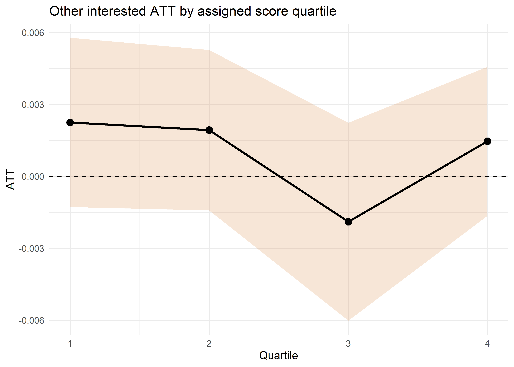
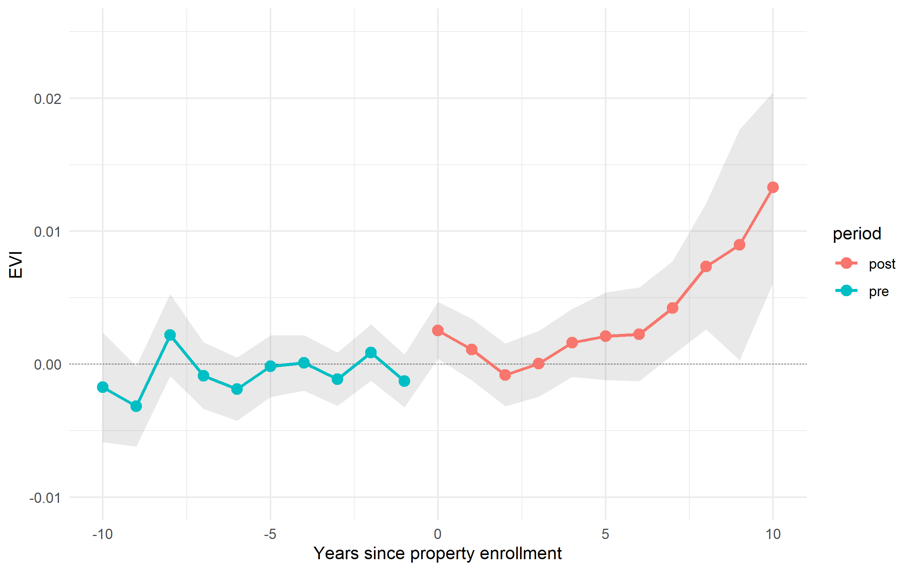

\doublespacing
\sectionfont{\fontsize{11}{11}\selectfont}
\subsectionfont{\fontsize{11}{11}\selectfont}

```{r setup, include=FALSE}
library(dplyr)
library(plyr)
source('summarySE.R')
library(knitr)
library(ggplot2)
library(stringi)
library(stargazer)
library(kableExtra)
library(tidyverse)
library(ggplot2)

knitr::opts_chunk$set(echo = FALSE, warnings = FALSE, messages = FALSE, out.width="49%", fig.align = "center")

options(scipen = 999)
```

# Abstract {-}

Widespread reforestation has become an important part of global efforts to address the intertwined challenges posed by climate change, biodiversity loss, and rural poverty. In response to concerns that plantations of exotic species may undermine objectives of increased carbon storage, biodiversity, and community involvement, some policies have sought to reforest with native species. We evaluate land cover impacts of a Chilean federal program that pays landowners to reforest their property with native species and prioritizes program co-benefits such as the engagement of smallholders, indigenous peoples, and rural communities. Panel data for program beneficiaries and comparable unawarded properties allow us to control for fixed differences and time trends affecting both groups using difference-in-differences methods that avoid concerns surrounding heterogeneous treatment effects. We find that the program increased vegetation cover on the properties of both smallholders and larger landowners, however, program compliance was rather low. Whether a program's targeting strategy enhances or undermines carbon benefits depends on the underlying correlation between prioritized characteristics and both non-compliance and landowners' costs of providing those benefits. This paper highlights key differences in targeting for reforestation in contrast to avoided deforestation, where program impact is driven by the presence of deforestation risk and incentivizing a lack of action rather than sustained behavior changes.

<!-- List of to dos for next draft: -->
<!-- \begin{itemize} -->
<!-- \item some appendix work still needs to be added back after new round of estimates, primarily surrounding rejected applicants and robustness checks -->
<!-- \item mechanisms section, integrating land-cover classification maps into narrative -->
<!-- \end{itemize} -->

\clearpage

# Introduction

In order to achieve the warming targets set by the IPCC, both emissions reductions and removals of carbon from the atmosphere will be necessary [@bastin_global_2019]. Reforestation has been lauded as a potentially near term, large scale and low-cost option to achieve these carbon removals [@busch_potential_2019], however, there is limited evidence documenting the effectiveness of policies seeking to encourage reforestation at large scales. One policy that is expected to play an important role in helping countries meet their reforestation commitments is a system in which private landowners are paid to engage in reforestation [@gichuki_reviving_2019]. While similar payment for ecosystem services (PES) programs have garnered widespread scientific interest [@borner_effectiveness_2017], empirical studies documenting the impacts of large-scale reforestation programs are critical to guide the effective design of policies as more countries adopt this model. 

Within the natural climate solutions literature, ample attention has been given to the co-benefits and co-risks that can arise from the growing market for carbon removals. As a result of the emphasis on generating biomass, many programs have encouraged afforestation with monocultures of quick-growing exotic species such as eucalyptus and monterrey pine [@iucn_afforestation_2016]. This model can have co-risks such as the conversion of native ecosystems, loss of biodiversity, and exacerbation of distributional issues [@heilmayr_impacts_2020]. On the other hand, many argue that these schemes can avoid the aforementioned risks and generate substantial co-benefits if done properly. These often cited co-benefits include biodiversity conservation, habitat improvement, erosion reductions, watershed protection, and support for lower-income and indigenous communities. 

Efficient targeting of public programs is difficult when the costs or benefits to potential recipients is private information [@jack_private_2013; @jack_leakage_2017]. This is a major consideration in the payments for reforestation case, where not only is the opportunity cost of restoration to landowners unknown to program administrators, but factors such as uncertainty can influence landowner compliance [@oliva_technology_2020]. In many cases, the social planner hopes to target for both environmental and social development goals. The underlying correlation between environmental gains and poverty alleviation through these programs has ramifications for whether targeting on social characteristics can provide the touted win-wins of natural climate solutions in practice [@alix-garcia_payment_2014]. In some cases subsidies that reflect political processes may undermine environmental benefits [@jack2008]. This has proven to be the case in the context of many PES programs, especially in the context of payments for avoided deforestation [e.g., @alix-garcia_only_2015; @pfaff2007]. If prioritized groups have relatively lower levels of deforestation risk, their participation is likely to reduce the program's cost-effectiveness and impact. In the reforestation setting, compliance further influences whether policy makers can successfully meet these multiple policy objectives with a single tool. Tension may arise if targeted characteristics of interest are correlated with non-compliance and program impacts in opposite directions. 

In this paper, we evaluate the land cover impacts of Chile’s Native Forest Law, which provided subsidies for native forest recovery and prioritized economic development of smallholder, indigenous, and rural communities. A key concern with evaluations of these types of programs is that apparent effectiveness may be driven by unobservable differences in participation costs, meaning that performance may be attributed to these omitted characteristics rather than participation in the program [@alix-garcia_only_2015]. From a pool of over one million untreated properties, we construct a set of counterfactual properties based on a detailed set of land use and property characteristics in order to alleviate some of the concerns surrounding selection. This vastly improves the plausibility of the conditional common trends assumption on which our identification strategy relies. We evaluate land cover impacts for eleven cohorts (2009–2019) using annual data from 2005–2020 and a difference-in-differences approach that is robust to general treatment effect heterogeneity and relies on a conditional parallel trends assumption.

We provide a framework to describe how the success of program's targeting strategy to achieve multiple objectives depends on two underlying correlations: 1) the correlation between characteristics used for targeting and landowners' costs to providing forest carbon; and 2) the correlation between characteristics used for targeting and non-compliance. This applies both to programs that pay for avoided deforestation and reforestation, however, non-compliance is far more likely to play a role in the reforestation case, where payments must incentivize sustained behavior changes. This is indeed a major factor in the Native Forest Law, where compliance is quite low. We explore the influence of the Native Forest Law's targeting mechanisms on its ultimate environmental efficacy by examining how the program's scoring and contest system influenced expected compliance and environmental impacts of prioritized properties. Using detailed project-specific information, we reconstruct project scores and identify the influence of social components of the score. We find that an increase in landowners' social score was associated with a decrease in compliance on average. The program, however, allocated extensionists to smallholders, which appear to massively increase compliance probability. This may temper the correlation between priority characteristics and non-compliance. 

This draft aims to advance the literature that addresses whether reforestation may be a viable large-scale method for removing and storing CO2 and add to the limited existing evidence on the environmental effectiveness of large-scale native reforestation programs. Between 2009 and 2019, the National Forest Corporation (CONAF) allocated approximately US $58 million to enroll more than 235 hectares of land through the Native Forest Law, making it one of the largest native forest restoration programs in the world. As other countries begin to contemplate reforestation policies, Chile’s experience provides a valuable case study from which to draw. 

The remainder of the paper is structured as follows. Section 2 provides a conceptual framework that generates predicitons for when PES programs' targeting strategy is likely to achieve both cost-effective carbon benefits and paricipation of priority groups. Section 3 provides background for Chile's Native Forest Law and its objectives. Section 4 conducts program evaluation using a difference-in-differences strategy that is robust against concerns surrounding the influence of general treatment effect heterogeneity. Section 5 explores whether the Native Forest Laws targeting strategy was able to target prioritized groups without sacrificing environmental gains. Section 6 further explores major drivers of heterogeneity in both program impacts and non-compliance. Section 7 concludes.  

# Targeting for multiple objectives with heterogeneous compliance and conservation costs: a conceptual framework

Much research has addressed targeting in PES programs in the context of avoided deforestation. The key to gaining high environmental effectiveness at least cost is to enroll only the parcels at risk of deforestation [@alix-garcia_payment_2014]. This can be achieved by providing adequate payments and focusing on parcels in areas of high deforestation. In these contexts, however, it has been difficult to achieve the dual objectives of environmental efficacy and participation of poor, rural, or indigenous communities. This is driven by the fact that these communities often have relatively lower deforestation risk [e.g., @alix-garcia_only_2015; @pfaff2007], meaning that they likely would have provided forest carbon benefits even in the absence of PES payments. 

This is not the case in the reforestation context, where high environmental effectiveness is determined by whether the payment induces landowners to generate and maintain new forest cover through sustained behavior change. As such, if priority groups would not have provided new forest cover in the absence of payments, they may still be cost-effective enrolles. However, non-compliance may play a major role if, for example, landowners are unertain as to the costs or benefits of generating forest cover [e.g., @oliva_technology_2020]. In order to illustrate how landowners' costs of providing forest carbon and non-compliance determine the effectiveness of program administrators' targeting strategy, we adapt a framework developed in @jack_self_2019.

Suppose that landowner $i$ is one of 15 landowners and experiences cost $c_i$ (ranging from -\$5 to \$10) to produce forest carbon benefits. Figure \@ref(fig:framework) depicts the aggregate supply of contracts for forest carbon provision, showing the aggregate number of applicants for payments against their costs to produce forest carbon on the x-axis. This framework is applicable to either the avoided deforestation or reforestation setting, with forest carbon provided either through conservation of forest or by providing additional forest cover.

A PES program is introduced that pays landowners \$5 in order to provide forest carbon with benefits equal to \$10. Landowners with $c_i \geq 10$ do not apply to the program, as they would still experience negative costs of production after the PES payment of \$5. For simplicity, we assume that the landowner with a cost of \$5 does not apply to the program. 

All landowners with $c_i < \$10$ apply to the program. We assume that every landowner who produces forest carbon provides benefits equal to \$10, however, landowners with $c_i < \$0$ would produce these benefits even in the absence of PES payments, so the additional benefit provided by these landowners is equal to \$0. As such, landowners with costs below the dashed line are not cost-effective enrollees, as they produce no additional carbon relative to the no-PES scenario. 

```{r framework, fig.show="hold", fig.pos="H", out.width = '100%', fig.cap = "Graphical model depicting the aggregate supply of forest carbon in some conservation setting"}


```

We now begin to deviate from the framework provided by @jack_self_2019. Suppose there exists some characteristic $Z_i$, representative of a second policy priority and used for targeting by program administrators. Suppose that program administrators have funding such that they can enroll only 7 of the 10 applicants. Figure \@ref(fig:framework-no) shows the case where $Z_i$ is uncorrelated with conservation costs. In this case, the set of enrollees provides expected additional benefits per enrollee equal to 10 times the proportion of applicants with non-negative costs of carbon production divided by the number of applicants. 
 

```{r framework-no, fig.show="hold", fig.pos="H", out.width = '75%', fig.cap = "Graphical model depicting a targeting characteristic that is not correlated with costs to producing forest carbon"}

knitr::include_graphics(c("figs/framework_no.png"))
```

Figure \@ref(fig:framework-pos) shows the case where $Z_i$ is positively correlated with costs to producing forest carbon. In this case, program administrators enroll all applicants (Right panel of Figure \@ref(fig:framework-pos)) that provide additional forest carbon and only inframarginal applicants are not admitted. This is representative of the case where program administrators truly experience win-wins, and the targeting strategy achieves a cost-effective program design and enrolls landowners with high values of the priority targeting characteristic, $Z_i$. 

```{r framework-pos, fig.show="hold", fig.pos="H", out.width = '49%', fig.cap = "Graphical model depicting a targeting characteristic that is positively correlated with costs to producing forest carbon. Left: applicants; Right: enrollees"}

knitr::include_graphics(c("figs/framework_perfect.png", "figs/framework_perfect_enrolled.png"))
```

We now consider the case in which win-wins are not likely to arise. This helps to illustrate the often cited risks of targeting for multiple objectives. This is the case when $Z_i$ is negatively correlated with costs of forest carbon production. We see that program administrators enroll the landowners who had the lowest costs to providing forest carbon. This is not cost-effective, as many of these landowners provided forest carbon in the absence of the program, so their enrollment provides no additional benefits. Further, the applicants that are not admitted would have provided additional carbon benefits. In the avoided deforestation case, targeting to encourage participation from low-income, indigenous, and smallholder communities may fall into this case. These communities often see relatively lower risk of deforestation in the absence of PES programs, so allocating funding to these groups is likely to provide less additional carbon benefits. 

In general, $E[benefits | Z_i \text{ positively correlated w/ } c_i] > E[benefits | Z_i \text{ uncorrelated w/ } c_i] > E[benefits | Z_i \text{ negatively correlated w/ } c_i]$.

```{r framework-neg, fig.show="hold", fig.pos="H", out.width = '49%', fig.cap = "Graphical model depicting a targeting characteristic that is negatively correlated with costs to producing forest carbon. Left: applicants; Right: enrollees"}

knitr::include_graphics(c("figs/framework_neg.png", "figs/framework_defor.png"))
```

One additional factor is common to the restoration case that less frequently arises in the avoided deforestation context: non-compliance. Whether due to uncertainty surrounding the costs of investing in tree survival or other unexpected events, many landowners cannot successfully ensure tree survival. This plays into the viability of program administrators' targeting strategy to achieve cost-effective conservation designs. 

Assume that payment is conditional on successful provision of forest carbon. If non-compliance probability is uncorrelated with $Z_i$, overall environmental impact of the program is decreased relative to the full-compliance case, however, the cost-effectiveness of the successful payments is not affected. Table 1 shows how positive and negative correlation between non-compliance and $Z_i$ influences the cost-effectiveness of the program when using $Z_i$ as a targeting characteristic. 

In order to provide intuition, we discuss the only case in which $Z_i$ is an ideal targeting characteristic. This is the case when $Z_i$ is positively correlated with $c_i$ and non-compliance probability is negatively correlated with $Z_i$. In this case, those with high values of $Z_i$ become relatively more likely to follow-through and receive payment. These also happen to be the applicants providing additional carbon benefits when compared to the no-PES scenario. In this scenario, targeting on $Z_i$ is cost-effective and non-compliance enhances this cost-effectiveness. 


\begin{table}[H]\centering
\caption{Correlation of non-compliance probability with $Z_i$ influences cost-effective program design}
\smallskip
\begin{tabular}{ |p{4cm}|p{2.5cm}|p{2.5cm}|}
 \hline
 & \multicolumn{2}{|c|}{ Correlation between $Z_i$ and $c_i$} \\
 \hline
Correlation between $Z_i$ and non-compliance  & positive &  negative \\
 \hline
 positive   & $\downarrow$ cost-effective    &$\uparrow$ cost-effective\\
 \hline
 negative &   $\uparrow$ cost-effective & $\downarrow$ cost-effective  \\
 \hline
\end{tabular}
\end{table}

This framework generates key conditions that are relevant for our exploration of the targeting strategy used in the native forest law. Win-wins of environmental effectiveness and prioritization of priority groups are less likely when either of the following arise:

\begin{enumerate}
\item when prioritized applicants are relatively less likely to have positive costs of producing forest carbon (i.e., they were likely to have provided carbon benefits even without the existence of the program)
\item when non-compliance is positively correlated with prioritized criteria
\end{enumerate}

In the deforestation case, costs of producing forest carbon are determined by deforestation risk. It is easy to see from this framework that achieving win-wins is unlikely if prioritized groups have lower deforestation risk and non-compliance is not an issue. In the reforestation caase, we might expect that these priority groups actually experience relatively higher costs to producing carbon. This is not necessarily ideal, however, if these groups are also less likely successfully complete and follow-through on contract activities. We explore both of these factors in the reforestation case in the context of Chile's Native Forest Law. 

# Chile's Native Forest Law and its desired co-benefits

## Program background

Chile provides an ideal setting in which to explore the potential for large-scale payments for reforestation. First, the country has experienced diverse and widespread tree cover expansion [@heilmayr_plantation-dominated_2016]. This expansion includes extensive afforestation of pine and eucalyptus plantations [@echeverria2006], natural forest regeneration in the wake of disturbance [@albornoz_nucleation-driven_2013], and active native reforestation and restoration. Second, Chile’s long history of public policies supporting tree cover expansion provides an incredibly useful natural experiment in which to measure the impacts of payments for reforestation. Chile's decree law no. 701 (DL 701) is one of the world's longest operating afforestation subsidies, but mainly promoted even-aged mococulture plantations of eucalyptus and pine that had negative effects on biodiversity and native forest cover [@heilmayr_impacts_2020]. Further, only about 3\% of subsidized plantations were additional. 

In an attempt to encourage the recovery and protection of native forests, Chile sought to pass the Ley de Recuperación del Bosque Nativo y Fomento Forestal (Native Forest Law) as a successor to DL701 [@clapp1998]. Initially expected in 1994, it became frozen in legislature before finally passing in 2008. In addition to protections for native forests, the law established an annual competition for grants to support private landowners in their efforts to manage, restore, or reforest their land using native species. Since 2009, more than \$58 million have been allocated through these competitions for projects covering 235 thousand hectares. Much of this allocated funding has not been paid to landowners, however, as program follow-through is relatively low. In order to receive payment, landowners must complete the project and have the completed activities verified by a third party. Roughly 48\% of projects enrolled between 2009 and 2019 have actually been paid out on. Program administrators are unsure exactly why enrolled applicants fail to complete projects at such high rates [@conaf_2019].

The subsidy component of the law encourages three types of activities: 1) the regeneration, recovery or protection of native preservation forests; 2) silvicultural activities aimed at recovering native forests for timber production purposes; and 3) silvicultural activities aimed at recovering native forests for non-timber production purposes. Of the 12,889 projects enrolled between 2009 and 2019, 10,912 (84.66\%) recovered native forest for the purposes of timber production. Few estimates on the impacts of the Native Forest Law on land cover currently exist. CONAF estimated the carbon impacts of the Native Forest Law through 2018 as it relates to Chile's Nationally Determined Contribution (NDC) as part of the Paris Argeement. These estimates, however, assume that the carbon stored by every subsidized hectare is the direct result of the law. These types of estimates ignore the concept of additionality, since some of this forest would likely exist even in the absence of the law. 

The Native Forest Law prioritizes not only forest cover in line with Chile's NDC goal of managing 200,000 ha of native forest, but also co-benefits such as biodiversity preservation and the participation of underrepresented groups. By prioritizing native forest rather than monocultures of pine or eucalyptus, the law seeks to incentivize the preservation of biological diversity. Prioritizing carbon-plantings without consideration of other co-benefits may result in negligible biodiversity co-benefits [@bryan2016]. In fact, DL701 resulted in the decline of native forest and biodiversity, as native forests provide significantly more biodiversity than plantation forests in Chile [@heilmayr_impacts_2020]. 

<!-- Reforestation is well understood to mitigate erosion, both stabilizing eroded areas and preventing new erosion. In Chile, widespread erosion on marginal agricultural lands has motivated forest policy for over a century [@heilmayr_impacts_2020; @clapp1998]. DL701 and the Native Forest Law both prioritize erosion mitigation in the implementation of the law. The Native Forest law prioritizes areas with moderate to severe erosion and subsidizes projects aimed at erosion mitigation. All projects that occur in areas of moderate-to-severe erosion must specify additional measures to prevent erosion in the management plan.  -->

In response to concerns that large companies benefited disproportionately from the DL701 subsidies, Native Forest Law bonuses place an emphasis upon supporting smallholders and indigenous peoples. The contest provides additional support for properties awarded through the smallholder contest. In particular, smallholder awards are worth 15\% more than awards in the other interested parties contest for the same set of activities. Further, smaller properties are more likely to be awarded based on the application scoring system. Applications from indigenous communities are also substantially more likely to receive funding based on the application scoring process. One major question is whether targeting for these co-benefits reduces the primary objective of the policy. This is particularly interesting in the case of the Native Forest Law, where program follow-through is low. Even when targeting specific groups for enrollment does not impact program cost-effectiveness, if these groups are ex-ante less likely to follow through, overall program impact will be reduced because of this targeting. 

## Data

### administrative data

We have obtained property boundaries for all rural properties in the major forested regions of Chile as of the year 2009. Data on the awarded properties are available through CONAF and reflect aspects of the property and projects such as project objective, project surface area, bonus amount, and applicant race and gender. Also included is each property's parcel indentifier, which is unique to each property within a comuna, Chile's level 3 administrative unit. We match the enrolled properties to their corresponding boundaries via this unique parcel identifier. In addition, we are able to match payment recipients to the corresponding program application, which indicates whether a project was successfully completed. 

```{r map, fig.show="hold", fig.pos="H", out.width = '60%', fig.cap = "Properties enrolled in the Native Forest Law through the subsidy contest"}

knitr::include_graphics( "figs/propertymap_updated.jpg")
```

### satellite data

In this version of the paper, we use the enhanced vegetation index (EVI 2) as a proxy for each property's annual level of vegetation/forest cover. To generate the outcome for each property, we compute the average maximum EVI value of each pixel within a property for a given year. We have generated EVI time series of this sort for each property in the regions of O'Higgins, Maule, Araucanía, Bío-Bío, Ñuble, Los Ríos, and Los Lagos. These regions constitute the major forested areas of Chile and the regions that contain the vast majority of the Native Forest Law enrollees. Generating time series for all properties in these regions , including those that never enrolled in the program, allows us to match on pre-trends of the outcome variable in the matching part of the program evaluation.

One benefit of the use of EVI is the ability to capture both new forest cover and changes in forest quality within a single index measure. We prefer EVI to normalized difference vegetation index (NDVI) because of its propensity to become saturated in high biomass regions. Given Chile's extensive native and plantation forests and the fact that many enrolled properties already have some degree of forest cover, this could limit our ability to detect small changes in the area or density of vegetation/forest cover through time. In contrast, EVI corrects for canopy background noise and is more sensitive in areas with dense vegetation [add Cite]. Lastly, land-use classification maps of these regions in Chile allow us to see the proportion of each property engaged in specific land uses. We are particularly interested in the extent of native forest, plantation forest, and pasture/agriculture. In this version of the paper, we use these maps to examine heterogeneity in treatment effects based on land uses prior to the existence of the Native Forest Law or the announcement of the annual contests. 

The next iteration of this paper will include integration of these land-use maps as an outcome variable. This will allow us to gain insight into whether landowners may substitute away from plantation to native forest rather than establishing new native forest cover on land allocated to other land uses. If it is the former, the true impacts of the program may be understated by simply looking at EVI. 

We are also planning to integrate annualized maps of woody biomass. This will allow us to determine the actual carbon price paid through the program per ton of forest carbon in aboveground biomass. 

# Program evaluation

## Parallel trends, matching, and a convincing counterfactual

As is the problem with many PES impact evaluations, enrollment is non-random. Landowners choose to enroll in the program and, in theory, have an opportunity cost equal to or lower than program enrollment. It is then ill-advised to simply use unenrolled properties as the counterfactual, since unobservable factors affecting enrollment could drive changes in forest cover outcomes, not enrollment. In order to generate a more convincing counterfactual, we match properties to ones that should have more similar opportunity costs than amongst the general population. 

The covariates used for matching include property size, slope, elevation, distance to road, distance to timber processing (e.g., sawmill; separately for native specific), erosion levels, and proportion of the property under each of the following land-uses prior to property enrollment: native forest, plantation, pasture, shrubland, water, and bare soil. We also include the 2007 levels of EVI for each property, which should correspond to the overall vegetation cover prior to the property's enrollment. Lastly, matching on EVI pre-trends will help us to build confidence in the conditional common trends identification assumption that we make for the difference-in-differences strategy in the next section. We exclude the two year trends leading up to the enrollment year in order to avoid concerns of overfitting. Thus, seeing that pre-trends in the pre-trend period prior to enrollment hold should lend further creedence to the matching process. Matches are made with replacement based on nearest neighbor propensity scores from a logit regression (We also consider mahalanobis matching, but this performed much worse in terms of balance). Our main strategy matches each program enrollee with two control properties, however, we also include estimates based on matching each enrolled property with one nearest neighbor as a robustness check (need to add this to the appendix).  

The covariates included should allow us to match properties with similar opportunity costs to enrollment. Of particular value is the ability to match on land use prior to the existence of the program. Landowners with similar levels of plantation forest, native forest, and other land uses on the property should face a similar decision about whether to enroll in a program involving native forest management. Slope and elevation tend to be highly correlated with the productive potential of the land, and distance to road provides a proxy of a property's remoteness. Figure \@ref(fig:m-dist) in the Appendix shows how comparability between covariate distributions drastically improved between treatment and control properties after matching. Table \@ref(tab:covar-bal) in the Appendix displays a complete balance check for all covariates used. Figure \@ref(fig:trends) explores how the matching process improved pre-tends. 

We need to make an appropriate common trends assumption in order to make inference about causal effects of the program, and this choice leads us to our preferred estimator [@marcus2021]. As mentoned above, many PES programs operate on voluntary enrollment into the program. This is indeed the case with the Native Forest Law, in which enrollees must apply and be selected for participation. Because enrollment is unlikely to be exogenous, we opt for a relatively weak common trends assumption: 

\textbf{Conditional common trends based on unawarded properties:}
For all $g, t = 2,...,\Tau,$ such that $t\geq g$, 
$$  E[evi_{it}(0)-evi_{it-1}(0)|X_i, G_g=1] = E[evi_{it}(0)-evi_{it-1}(0)|X_i, C=1] $$
This amounts to assuming that without enrolling in the Native Forest Law contest, awarded properties would have continued to follow the same evolution in EVI as matched control properties, after conditioning on pre-treatment covariates. In order to rely on this common trends assumption, we must have a relatively large set of properties that do not experience treatment, or inference procedures may not be as precise as procedures that align with an alternative assumption. However, it is important to stress that this potential “loss of efficiency” is a direct consequence of not exploiting restrictions on pretreatment trends across cohorts [@marcus2021]. Luckily, in our case, we can take advantage of our matching procedure, which uses an extremely large pool of unawarded properties, detailed covariates including pre-program land uses, and explicit pre-trends. As such, we benefit from the fact that our common trends assumption does not restrict pre-trends across cohorts and does not presume that later cohorts are viable counterfactuals for early cohorts. Settling on this specific common trends assumption helps us to determine the appropriate estimator. The estimator developed in @callaway_did_2020 relies on the common trends assumption above, which we believe is reasonable to make. Future robustness checks will include the use of not yet treated observations (and thus, a stronger common trends assumption).

One concern may be our decision to exclude rejected applicants from the control group. Given that these properties have revealed their intention to enroll in the program, it seems that they may have opportunity costs similar to program enrollees. However, the composition of the rejected applicants differs between smallholders and other interested parties depending on year, and many rejected applicants are able to reapply and be awarded in later years. This means that the composition of the rejected applicant group is relatively unstable through time. Further, it would be difficult to make claims about the differences between the smallholders and other interested parties, because the rejected group differs through time for each. We discuss the rejected applicants in more detail in the Appendix. 

## DID

In order to estimate the program impact, we use a difference-in-differences event study that is robust to general treatment effect heterogeneity. Recent papers have shown that the typical two-way fixed effects estimator may generate biased results in the presence of treatment effect heterogeneity [e.g., @goodman-bacon_did_2018; @callaway_did_2020; @de_chaisemartin_2020]. This could be particularly important in our case, given that there are over 150 cohort-time cells. This means that there is ample opportunity for undesirable or even perhaps negative weights on each cohort-time cell to plague our estimates if we were to use a two-way fixed effects specification. We individually estimate the average treatment effect for each cohort-time cell, $ATT_{g,t}$, where $g$ denotes the cohort, and $t$ denotes the year, before aggregating the $ATT_{g,t}$s into a summary measure of the overall $ATT$ based on @callaway_did_2020. The estimand for each of the $ATT_{g,t}$s is as follows:

$$ATT_{g,t} =  E[evi_{it}(1) - evi_{it}(0) | G_i = g, t \geq t_o]$$

Each $ATT_{g,t}$ then represents the treatment effect for cohort $g$ in time $t$. To generate the $ATT_{g,t}$s, we first subset the data to only contain observations at time $t$ and $g − 1$, from units with either $G_i = g$ or that are in the control group. For example, for the $ATT_{2015, 2019}$, we subset to only the 2015 cohort and control group for the years 2014 and 2019. Then using only the observations from this subset, we calculate $ATT_{g,t}$ using a 2x2 difference-in-differences method. Without covariates, the $ATT_{g,t}$s could be estimated by the following simple 2x2 DID regression:
$$ evi_{it} = \beta_1 \mathbb{1}\{ G_i = g \} + \beta_2 \mathbb{1}\{ t \geq t_0 \} + \beta_3 \mathbb{1}\{ G_i = g \}\mathbb{1}\{ t \geq t_0 \}  + \epsilon_{it}$$
, where $\beta_3 = ATT_{g, t}$.

We opt to use the doubly robust difference-in-differences estimator developed in @santanna_doubly_2020. This involves first estimating a propensity score using a logit model and allows for common trends to hold only after conditioning on pre-treatment covariates. With this method, we can identify the $ATT_{g,t}$s if either (but not necessarily both) the propensity score or outcome regression is correctly specified [@santanna_doubly_2020]. 

We use two primary measures of the $ATT$ in this paper. The first measure provides event study estimates. Here, within each event time window, we aggregate the $ATT_{g,t}$s with weights corresponding to group size. 

$$ ATT_{es}(e) = \sum_{g\in G} \mathbb{1}\{ g+e \leq \Tau\} P(G_i=g | G_i+e\leq \Tau)ATT_{g,g+e} $$

This is the average effect of participating in the treatment $e$ time periods after a characteristic property is enrolled in the program across all cohorts that are ever observed to have participated in the treatment for exactly $e$ time periods. The year a property enrolls in the program is denoted by $e=0$. 

Our second summary measure, $ATT_{ovr}$, provides an estimate of the overall $ATT$. 
$$ ATT_{ovr} =\frac{1}{T-t_0+1} \sum_{e=0}^{T-t_0}ATT_{es}(e)$$
, where in our case $t_0 = 2009$ and $T=2020$.

Thus, $ATT_{ovr}$ is simply an average of all event time treatment effect estimates after treatment. One potential concern about $ATT_{ovr}$ is that each $ATT_{es}(e)$ has equal weight, meaning cohorts that are treated for longer have a larger influence on the $ATT_{ovr}$ relative to their group size. In this circumstance, we view this as a benefit. In the case of forest regeneration, restoration, and reforestation, we shouldn't expect a huge "on-impact" treatment effect, but rather a steady accumulation of biomass and foliage through time. Further, the benefits of these activities are closely related to their permanence, meaning that forest cover must be sustained over time. As such, it is unclear that giving equal weight to later event time treatment effects is problematic in this context, given that those event times are the most representative of program success. 

Finally, we present a third summary measure, $ATT_{equal}$, which provides an estimate of the overall $ATT$ similar to $ATT_{ovr}$.  
$$ ATT_{equal} =\frac{1}{ \sum_{t_0}^{T}\sum_{g \in G} \mathbb{1}\{ g \leq t \} P(G_i=g | G_i\leq \Tau)} \sum_{t_0}^{T}\sum_{g \in G}\mathbb{1}\{ g \leq t \} P(G_i=g | G_i\leq \Tau) ATT_{g,t}$$

$ATT_{equal}$ is simply an average of all $ATT_{g,t}$s after treatment. Relative to $ATT_{ovr}$, $ATT_{equal}$ places less weight on time periods further from initial treatment. This may help reduce the influence of early cohorts at the expense of downweighting time periods in which we expect treament effects to be most relevant. 

## Overall program results
```{r}

n = 10913

did.ovr = 0.003353
did.ovr_se = 0.000735

did.equal = 0.001451
did.equal_se = 0.000526

avg_evi = 0.4738
percent.ovr = round((did.ovr/avg_evi)*100, digits = 2)
percent.equal = round((did.equal/avg_evi)*100, digits = 2)

```
We first measure the impact of the program on all enrolled properties. This is the impact of the payment, conditional on successfully completing the project and subsequently receiving payment. As such, these estimates represent treatment effects conditional on compliance. Figure \@ref(fig:main-es) shows that the characteristic awarded property sees an increase in EVI after enrollment relative to the counterfactual following treatment. 

```{r main-es, fig.pos="H", out.width = '70%', fig.cap = "This figure shows event time treatment effects of the native forest law for awarded and complying properties.", echo=FALSE}
knitr::include_graphics("figs/did_main_Dec2021.png")
```

Figure \@ref(fig:main-es) also allows us to examine the plausibility of our conditional common trends assumption. We do see that pre-trends are relatively stable, lending creedence to the assumption made previously. As discussed, matching on detailed land use and property characteristics allows us to compare properties that likely had similar future land use intentions and opportunity costs. Looking at Table 2, we see that the overall treatment effects ($ATT_{ovr}$, $ATT_{equal}$) are also positive and statistically significant. For reference, the average awarded property had a pre-treatment EVI equal to .4738, meaning that an effect size of `r did.ovr` represents a `r percent.ovr`\% increase on average. 

<!-- In the appendix, we show cohort specific event studies. These show that the results are driven primarily by early cohorts. Later cohorts do not experience any clear sustained treatment effect. As such, part of the growing effect through time seen in \@ref(fig:main-es) is due to the changing composition of cohorts in each event time window. -->

<!-- Figure \@ref(fig:balanced-es) begins to address this by providing estimates that maintain constant composition through time for properties exposed to treatment for at least 6 (left panel) and 9 (right panel) years.  -->

<!-- ```{r balanced-es, fig.show="hold", fig.pos="H", out.width = '49%', fig.cap = "This figure shows event time treatment effects of the native forest law for awarded properties with balanced groups for properties treated for at least 6 and 9 years respectively.", echo=FALSE} -->
<!-- knitr::include_graphics(c("figs/balanced_did_5.png", "figs/balanced_did_8.png")) -->

<!-- n = 8556 -->
<!-- ``` -->

\begin{table}[H]\centering
\caption{Overall treatment effect estimates for awarded properties}
\smallskip
\begin{tabular}{c c c}

\toprule
  Dependent variable: EVI & &\\ 
\midrule
 $ATT_{ovr}$  &           `r did.ovr`*** &  \\
             &         (`r did.ovr_se`)  &  \\ 
  $ATT_{equal}$      &  `r did.equal`*** & \\
                    &  (`r did.equal_se`)  & \\
\midrule
 N      &     `r n`    & \\          
\bottomrule
\addlinespace[1ex]
\multicolumn{3}{l}{\textsuperscript{***}$p<0.01$, 
  \textsuperscript{**}$p<0.05$, 
  \textsuperscript{*}$p<0.1$}
\end{tabular}
\end{table}

```{r}

##Read files 
filenames <- list.files(path="../results",
    pattern="*csv")

##Create list of data frame names without the ".csv" part 
names <-str_extract(filenames, '.*(?=\\.csv)')

myfunc <- function(path){
 temp <- read.csv(path)%>%
   dplyr::mutate(se = round(as.numeric(se), digits=5),
          ATT = round(as.numeric(ATT), digits=4))
 return(temp) 
  
}

###Load all files
for(i in names){
    filepath <- file.path("../results",paste(i,".csv",sep=""))
    assign(i, myfunc(filepath)
    #colClasses=c("character","factor",rep("numeric",4)),
    #sep = ",")
    )
}

subsample_res <- read.csv("../results/subsample_results/subsample_results.csv")%>%
  dplyr::mutate(std.error = round(as.numeric(std.error), digits=5),
          ATT = round(as.numeric(ATT), digits=4),
         subsample = ifelse(subsample == "not timber", "not_timber", subsample))

for (v in unique(subsample_res$subsample)){
  tmp <- subset(subsample_res, subsample == v)
  assign(paste0('df_', tolower(v)), tmp)
}

```


# Evaluating the Native Forest Law's targeting strategy

In the case of the Native Forest Law, targeting is done in two main ways: 1) holding separate contests for smallholders and larger properties, where the smallholder contest pays 15\% higher; and 2) a scoring mechanism that prioritizes indigenous peoples, smaller properties, and other landowner and property characteristics. 

<!-- ## Smallholder versus other interested party contest -->

<!-- \begin{table}[H]\centering -->
<!-- \caption{smallholder vs. other interested party treatment effects} -->
<!-- \smallskip -->
<!-- \begin{tabular}{c c c} -->

<!-- \toprule -->
<!--    Dependent variable: EVI & & \\  -->
<!-- \cmidrule(l){2-3}  -->
<!--  & \textbf{1} & \textbf{2}   \\  -->
<!-- \midrule -->
<!-- $ATT_{ovr}$   & `r df_smallholder$ATT[1]`*** & `r df_other$ATT[1]`***\\  -->
<!--                 & (`r df_smallholder$std.error[1]`) & (`r df_other$std.error[1]`)\\   -->
<!--    $ATT_{equal}$ &  `r df_smallholder$ATT[2]`*** & `r df_other$ATT[2]`*\\  -->
<!--                &  (`r df_smallholder$std.error[2]`) & (`r df_other$std.error[2]`)\\  -->
<!--  sample               & \textbf{smallholders} & \textbf{other interested parties} \\   -->
<!-- \bottomrule -->
<!-- \addlinespace[1ex] -->
<!-- \multicolumn{3}{l}{\textsuperscript{***}$p<0.01$,  -->
<!--   \textsuperscript{**}$p<0.05$,  -->
<!--   \textsuperscript{*}$p<0.1$} -->
<!-- \end{tabular} -->
<!-- \end{table} -->

## The scoring mechanism

The program used a scoring system in order to assign project funding priority in each contest. Projects were granted funding in descending order of project score until the allocated funding had been assigned. This meant that projects sometimes went unfunded because of a low project score. This was particularly common in the other interested parties contests, which were granted funding after the smallholders. In some years, a second smallholder contest was held, causing smallholders to also go unfunded because of low scores. The scoring criteria include factors related both to landowner, property, and project characteristics. This score, although not always critical for smallholder applicants, provides insight to program administrators' preferences for project prioritization. We briefly outline the program's scoring system here (I will add more detail to the appendix at a later time). 

Projects are scored based on a weighted sum of four categories:

$$score_{assigned} = \gamma_tVI + \beta_tVPS + \lambda_t VP + \psi_tVP$$

, where

- $VI$ = social characteristics of interest

- $VPS$ = other priority social characteristics

- $VP$ = project characteristics

- $VT$ = land characteristics

, and $\gamma_t$, $\beta_t$, $\lambda_t$, and $\psi_t$ represent the weights given to each category in year $t$.

In order to explore the influence of social prioritization, we break the scores into two additional pieces for either contest: 
$$score_{social} = \gamma_tVI + \beta_tVPS$$ 

$$score_{adjusted} = \lambda_t VP + \psi_tVP$$


Targeting based on social factors such as indigenous status or property size may come with costs or benefits in terms of both environmental impacts and compliance. In order to focus on the influence of the program's targeting of social characteristics, we isolate the influence of social characteristics on the score. 

## The relationship between targeting on non-compliance in the Native Forest Law

Compliance plays a major role in successful targeting for the Native Forest Law, particularly because it is so low. As we discussed in Section 2, if characterisitics used for targeting are positively correlated with non-compliance, the targeting strategy likely came with environmental costs. 

<!-- We now explore the relationship between the assigned project score and compliance in the smallholder contest. Figure \@ref(fig:compliance) shows that the assigned project scores were positively correlated with compliance in the smallholder contest, but there is no clear association in the other interested party contest. -->

<!-- ```{r compliance, fig.show="hold", fig.pos="H", out.width = '49%', fig.cap = "The assigned score is possitively associated with compliance in the smallholder contest, but no clear association exists in the other interested party contest", echo=FALSE} -->
<!-- knitr::include_graphics(c("figs/small_compliance_plot.png", "figs/other_compliance_plot.png")) -->
<!-- ``` -->

In order to examine how prioritization of social characteristics in the Native Forest Law scoring system was correlated with compliance, we use regressions of the following form:

$$ complied_i = \beta_0 + \beta_1score_{social} + \beta_2score_{adjusted} + \beta_3X_i + \epsilon_i $$

, where $complied_i$ is a dummy equal to 1 if landowner $i$ followed through and received payment for successful project completion. 

Table 3 shows the results of these regressions. Our main coefficient of interest in these regressions is $\beta_1$, which captures the association of an increase in the $score_{social}$ on compliance, holding the other parts of the project score constant. We see that higher values of $score_{social}$ are associated with a decreased probability of compliance, indicating that landowners who were prioritized by the program were less likely to comply. That said, the smallholder contest saw increased levels of compliance on average, relative to the other interested party contest. Columns (2) and (3) show that use of extensionists were accosiated with massive increases in compliance probability, perhaps indicating that some of the risk of non-compliance by priority groups can be mitigated. 

\begin{table}[!htbp] \centering 
  \caption{Increases in the social score of a project are associated with lower levels of compliance} 
  \label{} 
\small 
\begin{tabular}{@{\extracolsep{5pt}}lccc} 
\\[-1.8ex]\hline 
\hline \\[-1.8ex] 
 & \multicolumn{3}{c}{\textit{Dependent variable:}} \\ 
\cline{2-4} 
\\[-1.8ex] & \multicolumn{3}{c}{complied} \\ 
 & &  &  \\ 
\\[-1.8ex] & (1) & (2) & (3)\\ 
\hline \\[-1.8ex] 
 social score & $-$0.0198 (0.0014)$^{***}$ & $-$0.0180 (0.0014)$^{***}$ & $-$0.0131 (0.0015)$^{***}$ \\ 
  adjusted score & 0.0008 (0.0003)$^{**}$ & 0.0013 (0.0003)$^{***}$ & 0.0020 (0.0004)$^{***}$ \\ 
  extentionist &  & 0.1543 (0.0083)$^{***}$ & 0.1493 (0.0083)$^{***}$ \\ 
  smallholder contest &  &  & 0.0701 (0.0098)$^{***}$ \\ 
  intercept & 0.5232 (0.0220)$^{***}$ & 0.4154 (0.0223)$^{***}$ & 0.2867 (0.0285)$^{***}$ \\ 
 \hline \\[-1.8ex] 
Observations & 13,294 & 13,294 & 13,294 \\ 
R$^{2}$ & 0.0154 & 0.0411 & 0.0446 \\ 
 
\hline 
\hline \\[-1.8ex] 
\textit{Note:}  & \multicolumn{3}{r}{$^{*}$p$<$0.1; $^{**}$p$<$0.05; $^{***}$p$<$0.01} \\ 
\end{tabular} 
\end{table} 

### extensionist usage 

We explore the program's use of extensionists to see if the program allocated them primarily to socially prioritized landowners. Table 4 shows that an increase in the social component of the score was actually associated with a decreased probability of receiving extensionist support. However, landowners in the smallholder contest did receive significantly more access to extensionists. This indicates benefits of meeting the smallholder qualifications, but not necessarily of being a high priority social group within the smallholder contest. 

\begin{table}[!htbp] \centering 
  \caption{Extensionists were not necessarily allocated by social score} 
  \label{} 
\small 
\begin{tabular}{@{\extracolsep{5pt}}lcc} 
\\[-1.8ex]\hline 
\hline \\[-1.8ex] 
 & \multicolumn{2}{c}{\textit{Dependent variable:}} \\ 
\cline{2-3} 
\\[-1.8ex] & \multicolumn{2}{c}{extensionist used} \\ 
 &  &  \\ 
\\[-1.8ex] & (1) & (2)\\ 
\hline \\[-1.8ex] 
 social score & $-$0.0114 (0.0015)$^{***}$ & $-$0.0039 (0.0017)$^{**}$ \\ 
  adjusted score & $-$0.0031 (0.0004)$^{***}$ & $-$0.0020 (0.0004)$^{***}$ \\ 
  smallholder contest &  & 0.1057 (0.0106)$^{***}$ \\ 
  intercept & 0.6992 (0.0229)$^{***}$ & 0.5001 (0.0306)$^{***}$ \\ 
 \hline \\[-1.8ex] 
Observations & 13,294 & 13,294 \\ 
R$^{2}$ & 0.0090 & 0.0163 \\ 
\hline 
\hline \\[-1.8ex] 
\textit{Note:}  & \multicolumn{2}{r}{$^{*}$p$<$0.1; $^{**}$p$<$0.05; $^{***}$p$<$0.01} \\ 
\end{tabular} 
\end{table} 

## The relationship between targeting and program impacts in the Native Forest Law

In order to determine how social targeting influenced the scoring systems effectiveness, we compare the ability of the assigned score, $score_{assigned}$, to predict program impact compared to $score_{adjusted}$, which excludes priority social characteristics. Figure \@ref(fig:qdid-small) plots $ATT_{ovr}$ for each score quartile of the assigned score, $score_{assigned}$. Note that we determine score quartiles by cohort, so each quartile contains equal cohort representation. In order for the score to be a good predictor of increased forest cover, a primary goal of the program, we should see that treatment effect estimates increase across each quartile of the score. 

Figure \@ref(fig:qdid-small) shows a slight positive correlation between the assigned project scores and treatment effects. Perhaps most importantly, those with the lowest scores had the least impact, meaning that applicants rejected because of low scores where unlikely to provide much benefit anyway. These results suggest that overall, the program's scoring system successfully targeted projects that were likely to be impactful. 

```{r qdid-small, fig.show="hold", fig.pos="H", out.width = '60%', fig.cap = "This figure shows event time treatment effects by assigned score quartile for awards granted in the smallholder contest.", echo=FALSE}
knitr::include_graphics(c("figs/small_q_assigned.png"))
```

In the other interested party contest, we see that the score was not correlated with treatment effects. In fact, no score quartile produced treatment effect estimates that were statistically different from zero, although the point estimates were positive. This may reflect the fact that enrollees in the other interested parties contest are larger landowners more likely to engage in subsidized activities even in the absence of the program. Other interested parties on average have more plantation forest than smallholders, possibly indicating that they would have generated some level of forest cover even in the absence of the program. As such, the program's strategy to prioritize smallholder may have been beneficial if these smaller properties were less likely to engage in subsidized activities without the program. 


```{r qdid-other, fig.show="hold", fig.pos="H", out.width = '60%', fig.cap = "Assigned score in the other interested parties contest is not clearly associated with treatment effects", echo=FALSE}

```

The right panel of \@ref(fig:qdid-adj) shows that the association of our adjusted score, $score_{adjusted}$, with $ATT_{ovr}$ is not clearly different than that of the true assigned score in either the other interested or smallholder contests. However, in the smallholder contest, the $ATT_{ovr}$s are monotonically increasing in adjusted score quartile, while they were not in the assigned scores. This may be an indication of a more informative score. Ultimately, it appears that any costs or benefits of targeting based on social characteristics within contest type were rather small. Ultimately, this corresponds with our intuition that smallholders are likely to have positive costs to producing forest carbon, meaning that they are likely to provide additional benefits if they successfully complete projects. 


```{r qdid-adj, fig.show="hold", fig.pos="H", out.width = '49%', fig.cap = "The adjusted score, ignoring social characteristics is not clearly a better predictor of impact", echo=FALSE}
knitr::include_graphics(c("figs/other_q.png", "figs/small_q.png"))
```


# Major drivers of heterogeneity 

We saw how the score was correlated with compliance and treatment effect heterogeneity in this case study, and this section seeks to understand the factors that influence these relationships. 

On average, the Native Forest Law is effective in increasing vegetation on awarded properties. In the context of avoided deforestation, program additionality is likely to be highest in areas with high levels of deforestation risk. This is not applicable in the reforestation case, however, as additionality is driven by landowners that generate new forest cover at least cost and maintain it through time. Here, we explore the underlying factors that drive program impacts.

## Compliance 

Table \@ref(tab:compliance-covars) shows that landowners who follow-through differ from those who do not on a number of characteristics. This includes project and property characteristics. Notably, projects that do follow-through are likely to belong to properties with more plantation forest, but there is no detectable difference in native forest. Future iterations of this paper will take a more active approach to predicting compliance and understanding the potential foregone benefits from a lack of compliance. 


```{r compliance-covars, fig.pos="H"}

compliance_covars <- readRDS("compliance_ttest.rds")

kable(compliance_covars, format = "latex", row.names = FALSE, booktabs = T, col.names = c("covariate", "complier mean", "unpaid mean", "p-value from t-test of difference"), align='c',
      caption = "differences in observables between paid and unpaid properties (limited to pre-2019 applicants)")%>%
  row_spec(0,bold=TRUE)
```

## Treatment effect heterogeneity

### project objective

A majority of projects funded through the Native Forest Law had a primary objective of timber production. While harvested wood leads to a reduction in the carbon stock in forests themselves, the overall carbon impact of timber harvests is ambiguous and largely depends on the post-harvest use of the timber products. The use of wood for energy and production of wood-based materials provides no carbon storage but may result in emission reductions by substituting in place of greenhouse gas (GHG) intensive fuels and energy-intensive non-wood materials [@kohl2020]. The use of timber for long-lasting wood products such as housing or furniture is likely to generate positive and relatively longer term carbon removals, while short-term uses such as paper products are unlikely to result in much overall carbon reduction at all. 

Table 5 shows that projects for the purpose of timber production drive most of the forest cover gains, while other projects saw no statistically or economically meaningful impact. This implies that landowners may need the incentive of the future benefits of the harvest in order to make the investment in establishing native forest. 

\begin{table}[H]\centering
\caption{Treatment effect heterogeneity based on project objective}
\smallskip
\begin{tabular}{c c c}

\toprule
   Dependent variable: EVI & &\\ 
\cmidrule(l){2-3} 
 & \textbf{1} & \textbf{2} \\ 
\midrule

$ATT_{ovr}$    &     `r df_timber$ATT[1]`*** & `r df_not_timber$ATT[1]`         \\
                       &  (`r df_timber$std.error[1]`)  &(`r df_not_timber$std.error[1]`)\\

  $ATT_{equal}$   &      `r df_timber$ATT[2]`*** & `r df_not_timber$ATT[2]`         \\
                      &  (`r df_timber$std.error[2]`)  &(`r df_not_timber$std.error[2]`)\\
                       
\midrule
          
 subsample         &     timber production    &     other projects  \\          
 
\bottomrule
\addlinespace[1ex]
\multicolumn{3}{l}{\textsuperscript{***}$p<0.01$, 
  \textsuperscript{**}$p<0.05$, 
  \textsuperscript{*}$p<0.1$}
\end{tabular}
\end{table}


### Pre-program land use and property characteristics

We slightly adapt @callaway_did_2020 in order to highlight treatment effect heterogeneity that depends on property characteristics. We still estimate each $ATT_{g,t}$ individually before aggregating to our summary measures of the treatment effect, however, we adjust the method by which each $ATT_{g,t}$ is computed. After calculating propensity score weights in the fashion of @santanna_doubly_2020, we run the following difference-in-differences style regression:

$$ EVI_{it} = \alpha_1 + \alpha_2 \mathbb{1}\{ G_i = g \} + \alpha_3 \mathbb{1}\{ T = t \} +\beta_{1g,t} \mathbb{1}\{ G_i = g \} \mathbb{1}\{ T = t \} +\beta_{2g,t} \mathbb{1}\{ G_i = g \} \mathbb{1}\{ T = t \} \times Z_i+ \gamma X_i + e_{it}$$
, where $\beta{1g,t}$ represents the $ATT_{g,t}$ and $\beta{2g,t}$ represents the impact of $Z_i$ on the $ATT_{g,t}$. We aggregate $\beta{1g,t}$ and $\beta{2g,t}$ in order to retrieve a summary measure of both the overall $ATT$ and the overall effect of $Z_i$ on the Native Forest Law's effectiveness. 


Pre-program land use is likely to be a significant driver of this heterogeneity. Recent studies have found that a major barrier to reforestation success is a lack of technical skills and prior experience [e.g., @powlen_identifying_2019]. Further, landowners with high initial participation costs are less likely to engage in reforestation. These aspects of reforestation mean that pre-program land use characteristics likely play a major role in shaping a landowner's forest management success.  We examine how the make-up of a property's pre-program land uses affects the impact of the Native Forest Law on forest cover. 
In this section, $Z_i$ represents the proportion of each property under each of the following land uses in 2001: native forest, plantation forest, shrub, and pasture.

Thinking about the pre-program land uses of eventually enrolled properties raises some interesting questions about the additionality of the policy. If properties with high levels of native forest cover are receiving subsidies through the Native Forest Law contest, it is possible that additionality will be low. Landowners who maintain a significant amount of native forest may already undertake these activities in the absence of the payments. These properties may be able to provide native forest cover or forest quality gains at a lower cost, meaning they are inefficiently being paid above their opportunity cost for the projects. Properties with plantation forestry may be using funds from the Native Forest Law to substitute toward native forest. While the carbon additionality may be low in this case, co-benefits such as biodiversity gains and habitat connectivity would likely be had. If these landowners are extending forest cover on the property and doing so using native species, these properties may provide significant gains, because they have the experience and resources to ensure survival of trees and forest. If properties with high amounts of pasture or shrubland move away from livestock grazing or even enrich the existing vegetation on the property, carbon additionality could be high. These could, however, conceivably be properties that face higher costs to initiate forest management activities that the landowner does not have much experience with. 

\begin{table}[H]\centering
\caption{Treatment effect heterogeneity based on pre-program land uses}
\smallskip
\begin{tabular}{c c c c c c c c c}

\toprule
   outcome: EVI & & & & & & & &\\ 
\cmidrule(l){2-9} 
 & \textbf{1} & \textbf{2} & \textbf{3} & \textbf{4} & \textbf{5} & \textbf{6} & \textbf{7} & \textbf{8} \\ 
\midrule
enrolled    &     `r shrub_boot[3,3]`***   &  `r pasture_boot[3,3]`   & `r plantation_boot[3,3]`**  & `r forest_boot[3,3]` & `r shrub_boot[4,3]`***   &  `r pasture_boot[4,3]`   & `r plantation_boot[4,3]`  & `r forest_boot[4,3]` \\

         &      (`r shrub_boot[3,5]`)  &   (`r pasture_boot[3,5]`)  &  (`r plantation_boot[3,5]`) & (`r forest_boot[3,5]`)&      (`r shrub_boot[4,5]`)  &   (`r pasture_boot[4,5]`)  &  (`r plantation_boot[4,5]`) & (`r forest_boot[4,5]`)\\ 
                       
enrolled x shrub            &              `r shrub_boot[1,3]`*** &         &  &  &              `r shrub_boot[2,3]`*** &         &  &\\
                          &               (`r shrub_boot[1,5]`)      &      &   &  &               (`r shrub_boot[2,5]`)      &      &   &\\
                       
enrolled x pasture           & &         `r pasture_boot[1,3]`* &    &    & &         `r pasture_boot[2,3]`* &    &     \\
                          & &       (`r pasture_boot[1,5]`)    &       &   & &       (`r pasture_boot[2,5]`)    &       &  \\
                       
enrolled x plantation        & & &  `r plantation_boot[1,3]` &  & & &  `r plantation_boot[2,3]`** &\\
                          & & &    (`r plantation_boot[1,5]`)    &  & & &    (`r plantation_boot[2,5]`)    &\\
                          
enrolled x forest        & & & &  `r forest_boot[1,3]`   & & & &  `r forest_boot[2,3]` \\
                         & & & &    (`r forest_boot[1,5]`)    & & & &    (`r forest_boot[2,5]`)    \\
                       
\midrule

 aggregation                     &   $ATT_{ovr}$       &    $ATT_{ovr}$     & $ATT_{ovr}$   & $ATT_{ovr}$   &    $ATT_{equal}$      &   $ATT_{equal}$      & $ATT_{equal}$  & $ATT_{equal}$ \\
 
\bottomrule
\addlinespace[1ex]
\multicolumn{3}{l}{\textsuperscript{***}$p<0.01$, 
  \textsuperscript{**}$p<0.05$, 
  \textsuperscript{*}$p<0.1$}
\end{tabular}
\end{table}

Table 7 shows how pre-program land use drives treatment effect heterogeneity. Properties with more proportion of the land dedicated to pasture (columns 2 and 6) and plantation forest (columns 3 and 7) see relatively higher treatment effects. Meanwhile, properties with more land under shrubland (columns 1 and 5) see substantially lower treatment effects. 

Erosion mitigation has been recognized as one of the major co-benefits of reforestation. This has influenced Chile's forest policy, including the Native Forest Law. We take the same approach as above to examine how subsidizing reforestation and forest management on properties with more erosion affects project effectiveness. Our covariate of interest is the proportion of the property experiencing moderate to severe erosion. Table 8 shows that when more of a property lies on eroded land, the award is less effective in generating or improving forest cover. This implies that erosion reduction may come at the expense of forest cover and carbon removal in the medium-run. 

\begin{table}[H]\centering
\caption{Treatment effect heterogeneity based on proportion of property experiencing moderate-to-severe erosion}
\smallskip
\begin{tabular}{c c c}

\toprule
   Dependent variable: EVI & &\\ 
\cmidrule(l){2-3} 
 & \textbf{1} & \textbf{2} \\ 
\midrule

enrolled    &       `r erosion_boot[3,3]`**   & `r erosion_boot[4,3]`     \\
                      &   (`r erosion_boot[3,5]`)   &  (`r erosion_boot[4,5]`) \\

enrolled x erosion     &    `r erosion_boot[1,3]`**   &     `r erosion_boot[2,3]`***      \\
                         (`r erosion_boot[1,5]`)    &  (`r erosion_boot[2,5]`)  &\\
                       

\midrule

 aggregation         &     $ATT_{ovr}$    &     $ATT_{equal}$  \\          
 
\bottomrule
\addlinespace[1ex]
\multicolumn{3}{l}{\textsuperscript{***}$p<0.01$, 
  \textsuperscript{**}$p<0.05$, 
  \textsuperscript{*}$p<0.1$}
\end{tabular}
\end{table}

<!-- ### Targeted social groups -->

<!-- In this section, we repeat our main DID analysis on subsamples of the data to examine treatment effect heterogeneity across targeted groups. The program sought to balance efficiency and equity outcomes by targeting smallholders and encouraging participation amongst indigenous communities and female landowners. The Native Forest Law targeted for these outcomes by holding separate contests for smallholders, where smallholders were awarded 15\% higher bonuses. In addition, indigenous landowners were given score boosts, increasing their projects' odds of funding. Table 4 shows the overall performance of each targeted group compared to the subsample without these properties.  -->

<!-- \begin{table}[H]\centering -->
<!-- \caption{Overall treatment effect estimates for subsamples based on target group} -->
<!-- \smallskip -->
<!-- \begin{tabular}{c c c c c c} -->
<!-- \toprule -->
<!--   Outcome: EVI & & & & &\\ -->
<!-- \cmidrule(l){2-6}  -->
<!-- \midrule -->
<!--  $ATT_{ovr}$   &   `r df_indigenous$ATT[1]`*** & `r df_female$ATT[1]`*** & `r df_male$ATT[1]`*** & `r df_smallholder$ATT[1]`*** & `r df_other$ATT[1]`***\\ -->
<!--                &  (`r df_indigenous$std.error[1]`)  &(`r df_female$std.error[1]`) & (`r df_male$std.error[1]`) & (`r df_smallholder$std.error[1]`) & (`r df_other$std.error[1]`)\\  -->
<!--   $ATT_{equal}$ &  `r df_indigenous$ATT[2]`*** & `r df_female$ATT[2]`* & `r df_male$ATT[2]`*** & `r df_smallholder$ATT[2]`*** & `r df_other$ATT[2]`*\\ -->
<!--                &  (`r df_indigenous$std.error[2]`)  &(`r df_female$std.error[2]`) & (`r df_male$std.error[2]`) & (`r df_smallholder$std.error[2]`) & (`r df_other$std.error[2]`)\\  -->
<!-- \midrule -->
<!--  subsample         &    indigenous   &  reported female   &  not female  &  smallholder  &  other interested \\ -->
<!--  \# treated properties   &   `r df_indigenous$treated_props[1]` & `r df_female$treated_props[1]` & `r df_male$treated_props[1]` & `r df_smallholder$treated_props[1]` & `r df_other$treated_props[1]`\\           -->
<!-- \bottomrule -->
<!-- \addlinespace[1ex] -->
<!-- \multicolumn{3}{l}{\textsuperscript{***}$p<0.01$,  -->
<!--   \textsuperscript{**}$p<0.05$,  -->
<!--   \textsuperscript{*}$p<0.1$} -->
<!-- \end{tabular} -->
<!-- \end{table} -->

<!-- We see that smallholder projects on average experience a higher treatment effect than those awarded through the other interested party contest. We also see that indigenous peoples and communities tend to see higher treatment effects than other properties as well. Lastly, while female headed projects do not experience treatment effects as high as properties with projects without a female head of household reported, both groups see positive impacts from the program on forest cover. We note that smallholders were awarded 15\% more for than properties awarded through the other interested party contest for the same activities. This may affect the relative cost-effectiveness for smallholders vs. other interested parties. Future iterations of this paper will report carbon prices for each group separately to help compare which groups were provided the most cost-effective forest cover gains and carbon removals.  -->

# Discussion

Prominent initiatives such as the Bonn Challenge, Trillion Trees Initiative, and UN Decade on Ecosystem Restoration hope to address the intertwined challenges of rural poverty, climate change and biodiversity loss through large-scale afforestation and reforestation. Initial national plans indicate that many countries will follow Chile’s model for tree cover expansion, relying heavily upon subsidies and plantation forests to achieve their commitments [@heilmayr_impacts_2020]. In light of the fact that this model may have negative impacts on native forest extent, biodiversity, and other outcomes, payments for native reforestation may provide a more sustainable and socially optimal path forward. This paper shows that payments for native reforestation may be a viable policy to increase carbon removals from the atmosphere for many countries. Further, this may lead to increased additionality if alternative policies simply subsidize plantation forests that would have been planted anyways. Native Forest Law payments led to increased forest cover amongst smallholders, larger landowners, and several other groups.

Whether or not program administrators can successfully target priority groups without sacrificing environmental benefits depends on two key factors. First, priority groups that have relatively lower costs of providing forest cover are likely to generate little additional carbon benefits. Second, if priority groups . We find that while prioritized landowners in smallholder, rural, and indigenous communities were unlikely to be nonadditional, they did suffer from relatively higher levels of non-compliance. In order to maximize program impacts and ensure participation of smallholders and other marginalized groups, payment for reforestation plans must carefully consider which landowners are likely to ensure tree survivorship and generate additional forest cover. As such, the Native forest Law's goals of rural, smallholder, and indigenous development may have come at  a small cost in terms of project completion. That said, program administrators were able to allocate extensionists that had a massive influence on compliance. Careful use of this assistance may alleviate concerns that priority groups will suffer from high levels of non-compliance. Smallholders were most likely to generate additional forest cover. Further, projects that deal with the conversion of marginal cropland where little forest was present may be more additional. Ultimately, our results reinforce that well designed payments for reforestation can lead to increased forest cover.

# References

<div id="refs"></div>

# Appendix 

## Subsample event studies


```{r objective-es,  fig.show="hold", fig.pos="H", out.width = '49%', fig.cap = "This figure shows event time treatment effects for Left: projects awarded with the objective of timber production; and Right: other project objectives", echo=FALSE}
knitr::include_graphics(c("figs/timber_did.png", "figs/ntimber_did.png"))
```

```{r contest-es, fig.show="hold", fig.pos="H", out.width = '49%', fig.cap = "This figure shows event time treatment effects for awards granted in Left: the smallholder contest; and Right: the other interested parties contest", echo=FALSE}
knitr::include_graphics(c("figs/smallholder_did.png", "figs/otros_did.png"))
```

\clearpage


## Smallholders vs. other interested parties on observables

```{r, include = FALSE}

NFL_df <- readRDS("C:/Users/garci/Dropbox/chile_reforestation/data/submittedmp_analysis/NFL_df.rds")
#property_df <- readRDS("property_df.rds")

my_match <- data.frame(readRDS("C:/Users/garci/Dropbox/chile_reforestation/data/submittedmp_analysis/my_match.rds"))
my_match$geometry.x<- NULL
my_match$geometry.y<- NULL

native_df <- NFL_df %>%
  dplyr::mutate(submitted_mp = ifelse( rptpro_tiene_plan_saff=="Si", 1, 0))%>%
  dplyr::distinct(prop_ID, submitted_mp, .keep_all = TRUE)

accents <- function(x){
  x <- stri_trans_general(x, id = "Latin-ASCII")
}


follow_thru <- my_match %>%
  inner_join(native_df, by = "prop_ID")%>%
  dplyr::mutate(treat=1,
         forest = c_1,
         plantation = c_3,
         baresoil = c_12,+c_10,
         pasture = c_9,
         shrub = c_5,
         water = c_15,
         urban = c_16,
         road_dist = unlist(road_dist),
         industry_dist = unlist(industry_dist),
         native_industry_dist = unlist(native_industry_dist),
         female = ifelse(rptprop_sexo == "Femenino", "Female", ifelse(rptprop_sexo == "Masculino", "Male", "Not reported")),
         reported_female = ifelse(rptprop_sexo != "Femenino" | is.na(rptprop_sexo), 0, 1),
         indig_etnia = ifelse(is.na(rptprop_etnia) & treat==1, 0, ifelse(treat==0, NA, 1)), 
         ind_comunidad = grepl(pattern = "indigena", accents(tolower(rptprop_razon_social)))*1,
         indigenous = ifelse(ind_comunidad==1 | indig_etnia==1, "indigenous", "not indigenous"))%>%
  filter(rptpro_ano < 2019)%>%
  drop_na(submitted_mp)

source('summarySE.R')

full_samp <- summarySE(follow_thru, measurevar="submitted_mp", na.rm = TRUE)%>%
  dplyr::mutate(submitted_mp= round(submitted_mp, digits = 4),
         se= round(se, digits = 5))

contest <- summarySE(follow_thru, measurevar="submitted_mp",groupvars = c("rptpro_tipo_concurso"), na.rm = TRUE)%>%
  dplyr::mutate(submitted_mp= round(submitted_mp, digits = 4),
         se= round(se, digits = 5))

objective <- summarySE(follow_thru, measurevar="submitted_mp", groupvars=c("rptpro_objetivo_manejo"), na.rm = TRUE)%>%
  dplyr::mutate(submitted_mp= round(submitted_mp, digits = 4),
         se= round(se, digits = 5))

rep_female <- summarySE(follow_thru, measurevar="submitted_mp", groupvars=c("reported_female"), na.rm = TRUE)%>%
  dplyr::mutate(submitted_mp= round(submitted_mp, digits = 4),
         se= round(se, digits = 5))

indig <- summarySE(follow_thru, measurevar="submitted_mp", groupvars=c("indigenous"), na.rm = TRUE)%>%
  dplyr::mutate(submitted_mp= round(submitted_mp, digits = 4),
         se= round(se, digits = 5))

```


```{r, include = FALSE}
follow_thru <- subset(follow_thru, submitted_mp == 1)

score <- t.test(rptpro_puntaje ~ rptpro_tipo_concurso, data = follow_thru)
payment <- t.test(rptpre_monto_total ~ rptpro_tipo_concurso, data = follow_thru)
area_bono <- t.test(rptpre_superficie_bonificada ~ rptpro_tipo_concurso, data = follow_thru)
area_prop <- t.test(rptpre_superficie_predial ~ rptpro_tipo_concurso, data = follow_thru)
forest <- t.test(forest ~ rptpro_tipo_concurso, data = follow_thru)
plantation <- t.test(plantation ~ rptpro_tipo_concurso, data = follow_thru)
pasture <- t.test(pasture ~ rptpro_tipo_concurso, data = follow_thru)
slope <- t.test(slope ~ rptpro_tipo_concurso, data = follow_thru)
elev <- t.test(elev ~ rptpro_tipo_concurso, data = follow_thru)
native_ind <- t.test(native_industry_dist ~ rptpro_tipo_concurso, data = follow_thru)
industry <- t.test(industry_dist ~ rptpro_tipo_concurso, data = follow_thru)
road <- t.test(road_dist ~ rptpro_tipo_concurso, data = follow_thru)
erosion <- t.test(proportion_erosion ~ rptpro_tipo_concurso, data = follow_thru)
shrub <- t.test(shrub ~ rptpro_tipo_concurso, data = follow_thru)


covar <- c("score", "award (UTM)", "bonus area (ha)", "property area (ha)", "proportion forest", "proportion plantation", "proportion pasture", "proportion shrub", "mod-to-severe erosion", "slope", "elevation", "dist. to native timber processing", "dist. to any timber processing", "dist. to road" )
paid <- c(score$estimate[2], payment$estimate[2], area_bono$estimate[2],  area_prop$estimate[2],  forest$estimate[2], plantation$estimate[2], pasture$estimate[2], shrub$estimate[2], erosion$estimate[2], slope$estimate[2], elev$estimate[2], native_ind$estimate[2], industry$estimate[2], road$estimate[2])
unpaid <- c(score$estimate[1], payment$estimate[1], area_bono$estimate[1],  area_prop$estimate[1],  forest$estimate[1], plantation$estimate[1], pasture$estimate[1], shrub$estimate[1], erosion$estimate[1], slope$estimate[1], elev$estimate[1], native_ind$estimate[1], industry$estimate[1], road$estimate[1])
p_value <-  c(score$p.value, payment$p.value, area_bono$p.value,  area_prop$p.value,  forest$p.value, plantation$p.value, pasture$p.value, shrub$p.value, erosion$p.value, slope$p.value, elev$p.value, native_ind$p.value, industry$p.value, road$p.value)

contest_covars <- data.frame(covar, paid, unpaid, p_value) %>%
  mutate(p_value = round(p_value, digits = 5))


```


```{r contest-covars, fig.pos="H"}

kable(contest_covars, format = "latex", row.names = FALSE, booktabs = T, col.names = c("covariate", "smallholder mean", "other mean", "p-value from t-test of difference"), align='c',
      caption = "differences in observables between properties awarded in the smallholder vs. other interested parties contest)")%>%
  row_spec(0,bold=TRUE)
```

\clearpage


## Matching diagnostics

```{r m-dist, fig.pos="H", out.width = '75%', fig.cap = "Covariate distributions prior to and after matching for control and treatment groups", echo=FALSE}
knitr::include_graphics("figs/match_density.png")
```


```{r covar-bal, fig.pos = "H", fig.cap = "Covarate balance between treated and untreated groups with and without matching. The leftmost panel is based on nearest neighbor matching, and the right panel is the unmatched data"}

covar_bal <- readRDS("covariate_balance.rds")
covar_bal[8, 1] <- "elevation"
covar_bal[9, 1] <- "area (ha)"
covar_bal[10, 1] <- "dist. to road"
covar_bal[11, 1] <- "dist. to timber processing"
covar_bal[12, 1] <- "dist. to native timber processing"
covar_bal[13, 1] <- "moderate-to-severe erosion"
covar_bal[14, 1] <- "2007 NDVI"


kable(covar_bal, format = "latex", row.names = FALSE, booktabs = T,
      caption = "Covariate balance with and without matching",
      col.names = c("covariate", "norm. diff.", "threshold", "norm. diff.", "threshold"), escape = TRUE) %>%
  add_header_above(c(" "=1, "matched"=2, "unmatched" = 2), escape = TRUE, line =FALSE, bold = TRUE)%>%
  kable_classic()

```
\clearpage

Figure \@ref(fig:trends) shows the pre-treatment trends of each cohort relative to both the entire unenrolled set of properties and the matched set of control properties. We see that the matched group seems to outperform the , meaning that our matching process likely improved the plausibility of the conditional common trends assumption we make. Note that these are the raw trends unconditional on covariates, so we prefer the pre-treatment event study estimates for discussing the plausibility of our assumption, however, this figure show the benefits of matching to obtain a more plausible counterfactual. 

```{r trends, fig.pos="H", out.width = '75%', fig.cap = "Raw EVI trends for unmatched control group, matched control group, and treatment group", echo=FALSE}
knitr::include_graphics("figs/trends.png")
```
\clearpage


## Robustness of overall treatment effects

In order to examine the robustness of our main event study estimates, we replicate our event study for each cohort separately. Figure \@ref(fig:cohort-es) shows that the 2009 and 2010 cohorts are largely driving the treatment effect estimates. We also see that the common trends assumption appears to be implausible for a couple of cohorts that experience a null result. Figure \@ref(fig:good-cohorts-es) replicates our main event study, excluding groups with a pretreatment estimate statistically different from zero. We see that the results are not visually different from those in Figure \@ref(fig:main-es)

```{r cohort-es, fig.show="hold", fig.pos="H",  out.width = '33%', fig.cap = "This figure shows event time treatment effects by cohort.", echo=FALSE}
knitr::include_graphics(c("figs/cohort2009_Dec2021.png", "figs/cohort2010_Dec2021.png", "figs/cohort2011_Dec2021.png", "figs/cohort2012_Dec2021.png", "figs/cohort2013_Dec2021.png", "figs/cohort2014_Dec2021.png", "figs/cohort2015_Dec2021.png", "figs/cohort2016_Dec2021.png", "figs/cohort2017_Dec2021.png", "figs/cohort2018_Dec2021.png"))
```

```{r good-cohorts-es, fig.pos="H", out.width = '100%', fig.cap = "This figure shows event time treatment effects for cohorts that did not have a pre-trend violation", echo=FALSE}


```

<!-- The left panel of Figure \@ref(fig:bar1) shows that properies awarded in the smallholder contest are more likely to follow-through with the project to the point of receiving payment. On the other hand, the right panel of Figure \@ref(fig:bar1) shows that projects from indigenous landowners and communities are less likely to follow-through with approved projects relative to non-indigenous landowners.  -->

<!-- ```{r bar1,  fig.show="hold", out.width = '49%', fig.cap = "follow-through rates amongst Left: indigenous vs. non- indigenous landowners; and Right: smallholder vs. other interested party contest", echo=FALSE} -->
<!-- knitr::include_graphics(c("figs/followthru_contest.png", "figs/followthru_indingenous.png")) -->
<!-- ``` -->

<!-- ```{r bar2, fig.show="hold", out.width = '49%', fig.cap = "follow-through rates amongst Left: timber production vs. other project objectives; and Right: female landowners", echo=FALSE} -->
<!-- knitr::include_graphics(c("figs/followthru_sex.png")) -->
<!-- ``` -->


\clearpage

## Rejected applicants

During the annual Native Forest Law contest, applicants submit a management plan detailing the specifics of the project to be considered for an award. Judges score each application based on a number of criteria including the size of the property, project extent, specific activities to be performed, and the cost of the project. After scores are tallied, awards are dispersed in order of project score. Awards are given to the smallholder contest first, and subsequently to the other interested party contest. Thus, in years when the contest's funds run out, other interested parties generally go unfunded. In years in which the contest does not exceed the funding theshold for both groups, a second smallholder-only contest is held for any additional project applicants. These contests generate unawarded smallholders. Projects can become rejected either by scoring below the threshold that receives funding or because of unapproved proposed activities in the application itself. Thus there are two ways to get rejected.

Figure \@ref(fig:allreject-hist) shows the distribution of rejected applicants by contest across different contest years. One thing to note is that many of the rejected applicants are able to adjust their application, reapply, and enroll in subsequent years. We see that the two contests see different trends in the number of rejected applicants through time. 

```{r allreject-hist, fig.pos="H", out.width = '75%', fig.cap = "This histogram shows the number of rejected applicants by year across contest types", echo=FALSE}
knitr::include_graphics("figs/rejected_hist.png")
```

<!-- In order to understand whether the enrolled set of properties differs from the full set of applicants, We compare the two groups based on a set of covariates below. (still in progress) -->

<!-- Because so few projects went unawarded in the early years of the program, program officials awarded projects that might not have been awarded in later years. This has pros and cons with regards to our program evaluation. -->
