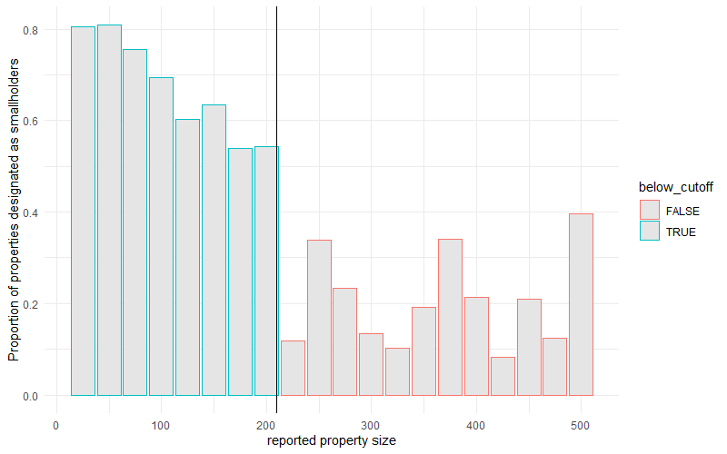
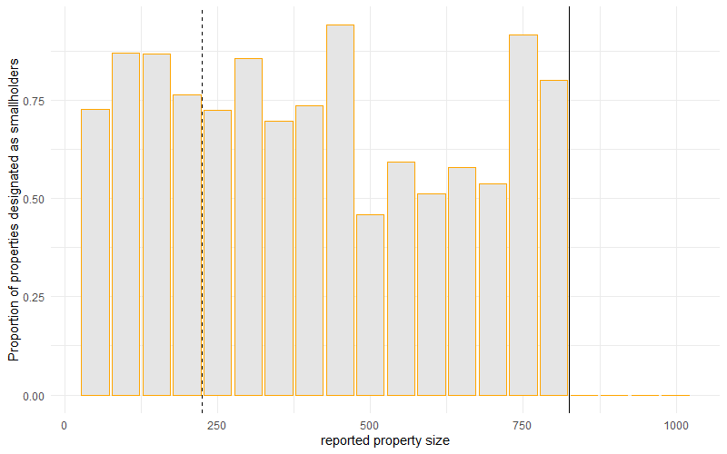
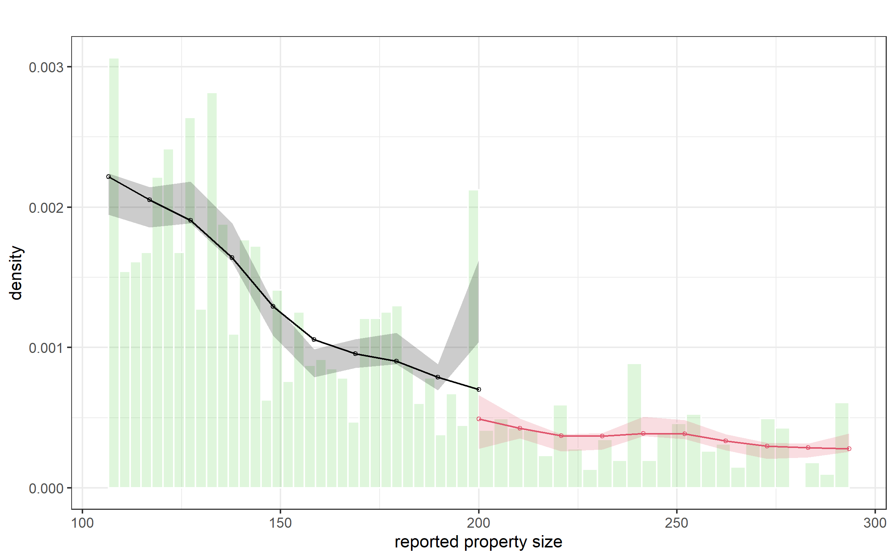
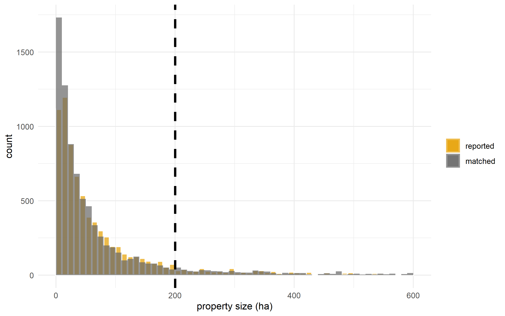
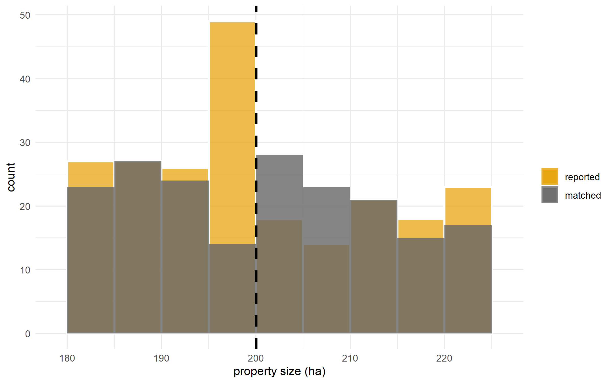

\doublespacing
\sectionfont{\fontsize{11}{11}\selectfont}
\subsectionfont{\fontsize{11}{11}\selectfont}

```{r setup, include=FALSE}

library(knitr)
#library(dplyr)
library(ggplot2)
library(stringi)
library(stargazer)
library(kableExtra)
library(tidyverse)


knitr::opts_chunk$set(echo = FALSE, warnings = FALSE, messages = FALSE, out.width="49%", fig.align = "center")

options(scipen = 999)
```

# Abstract {-}

Public programs often seek to encourage private landowners to provide environmental benefits through incentives that correspond to specific activities. However, the design of these programs as well as the incentives they provide can have consequences for how landowners choose to participate and the resulting tradeoff faced by program administrators. We explore these tradeoffs in the context of a Chilean program that pays private landowners to engage in reforestation and native forest management. The program's smallholder contest eligibility threshold provides increased payments to landowners below a certain size cutoff, which we are able to leverage for a fuzzy regression discontinuity design. We find evidence that this increased payment to smallholders leads to increased follow through in a program where attrition is relatively common. Further, to explore the mechanisms behind this increased follow-through, we explore how application decisions change across the threshold and find that this payment increase leads landowners to undertake more reforestation projects and enroll less land overall. We also find evidence of misreporting by properties just above the smallholder eligibility threshold and seek to disentangle the decisions made by these "heapers" and the non-heaping landowners of interest. 

\clearpage

# Motivation

In an attempt to encourage the recovery and protection of native forests, Chile sought to pass the Ley de Recuperación del Bosque Nativo y Fomento Forestal (Native Forest Law). In addition to protections for native forests, the law established an annual competition for grants to support private landowners in their efforts to manage, restore, or reforest their land using native species. Since 2009, more than $58 million have been allocated through these competitions for projects covering 235 thousand hectares. Much of this allocated funding has not been paid to landowners, however, as program follow-through is relatively low. Program administrators are unsure exactly why enrolled applicants fail to complete projects at such high rates [@conaf_2019]. 

Initially expected in 1994, the Native Forest Law became frozen in legislature before finally passing in 2008. The Native Forest Law acted as a successor to DL701 [@clapp1998], a law that largely subsidized afforestation with monocultures of eucalyptus and pine [@heilmayr_impacts_2020]. In response to concerns that large companies benefited disproportionately from the DL701 subsidies, Native Forest Law bonuses place an emphasis upon supporting smallholders. 

In practice, the contest benefits smallholders in several ways. First, CONAF holds separate contests for smallholders and other interested parties, where awards in the smalholder contest are worth 15\% more than awards in the other interested parties contest for the same set of activities. Further, participating in the smallholder contest essentially guarantees project approval and funding. When distributing funds, CONAF approves projects in the smallholder contest in order from the highest to lowest score, before moving to the other interested party contest. As such, other interested party applicants may not receive an award if their project score falls below the point at which the available funding has been distributed. To date, funding has never run out prior to awarding all eligible smallholder projects. 

CONAF defines smallholder eligibility in different ways depending on region, but with some exceptions, eligibility is determined by property size. In the regions of Chile in which forestry plays a major role, this cutoff is 200 hectares, and it is larger in other regions of the country. Further, these landowners cannot have assets exceeding the equivalent of 3,500 development units. Some exceptions apply to these rules, such as for indigenous communities. 

```{r status-200, fig.pos="H", out.width = '70%', fig.cap = "conditional probability of being granted smallholder status drops distinctly across main 200 hectare eligibility threshold", echo=FALSE}

```

Figure XX shows how the probability of being granted smallholder status changes across this property size threshold. We see a distinct drop in the proportion of properties granted smallholder status beyond the eligibility threshold, although there is some noncompliance. Figure XX shows that this discontinuity moves as expected in regions 11 and 12, where 800 hectares is the threshold for smallholder eligibility. This time, the dicontinuity is much sharper, as almost no properties above the cutoff were granted smallholder eligibility in these two regions. Note that there is no discontinuity at 200 hectares, acting as a placebo test that shows nothing about 200 hectares should affect conditional probability of smallholder status outside of the program threshold in the relevant regions. 

```{r status-800, fig.pos="H", out.width = '70%', fig.cap = "test", echo=FALSE}

```

# Manipulation around the cutoff

## Bunching at the eligibility threshold

Manipulation testing using local polynomial density estimation, p-value 0.039
- evidence of manipulation at 200 hectares
- visually clear
```{r rddensity-200, fig.pos="H", out.width = '70%', fig.cap = "test", echo=FALSE}

```

## Distinguishing misreporting from selective entry

We have boundaries for rural properties in Chile for the regions that comprise the main set of Native Forest Law enrollees. We match enrolled properties to property boundaries using the set of coordinates provided for each property. These matches are not always perfectly representative of the size of the enrolled parcel, as landowners sometimes are able to enroll only one parcel in an otherwise larger property. However, these matches provide a good estimate of the distribution of actual property sizes of Native Forest Law enrollees, and Figure XX shows that the distribution of reported and matched property sizes are comparable. 

```{r dists, fig.pos="H", out.width = '70%', fig.cap = "test", echo=FALSE}

```

In an effort to determine whether the bunching below the smallholder eligibility threshold of 200 hectares is due to misreporting or an increase in the number of enrollees just below the threshold, we explore these two distributions near the eligibility cutoff. Figure XX shows the distributions of the reported and matched property sizes near the 200 hectare threshold. We again see evidence of bunching just under the cutoff. In addition, we see evidence that properties with matched (true) property sizes just over the 200 hectare threshold were less likely to report their matched property size. This is suggestive of misreporting by properties just above the threshold.  

```{r dists-window, fig.pos="H", out.width = '70%', fig.cap = "test", echo=FALSE}

```

We can explore whether projects on either side of the treatment effect threshold within the manipulation range differe on application characteristics. 

# Benefits of smallholder classification

The benefits of being classified as a smallholder are fairly substantial. The main benefit of smallholder classification is a payment increase of 15\% for the same activities. Smallholder classification may also come with benefits related to extension services or technical assistance. 

## The policy relevant parameter

We now introduce our parameter of interest. While one may be interested in the causal impact of smallholder classification on property outcomes, this is a difficult parameter to recover. Properties just under the 200 hectare threshold may not have enrolled had the payment been 15\% less, meaning that increased enrollment could have resulted just under the policy threshold. As such, properties on either side of the threshold may not be perfect counterfactuals. However, we can still recover a parameter of extreme policy relevance: the expected impact of smallholder classification on outcomes for enrolled properties. This is likely to be the parameter policymakers are interested in if the primary objective is to generate forest cover at least cost. 

We define the parameter of interest below:

$$CLATE = E[Y_i(1) - Y_i(0) | X = c, i \in L]$$
, where $Y_i$ denotes the potential outcome for property $i$; $X$ is property size; $c$ is the smallholder eligibility threshold; and $L$ represents enrollment via the Native Forest Law. This is the local average treatment effect of smallholder classification, conditional on property $i$ participating in the program. 

## Fuzzy regression discontinuity design

### Disentangling misreporting heapers from non-heapers

Smallholder eligibility is largely determined by property size in the Native Forest Law contest. If properties fall below the regional property size cutoff, they are eligible for additional program benefits. While this size theshold determines smallholder status for the vast majority of properties, some can lose or gain eligibility through other means. Table XX shows the non-compliers in this setting. While a property size exceeding the threshold essentially disqualifies a property from smallholder benefits, a sizeable proportion of properties under the cutoff still get classified as other interested parties. 

We know that properties just above the smallholder eligibility threshold were likely to misreport their property sizes in order to obtain the benefits alotted for smallholders. The donut hole RDD can be used to circumvent problems introduced by these situations. [@balleca2016] shows that in the sharp RD setting, the donut RDD approach leads to an unbiased estimate of the treatment effect for non-heaped types. If we do not drop properties within the manipulation zone, a sharp RDD would recover unbiased estimates of the average treatment effect across the two types, weighted by the share of non-heaped data that are observed at data heaps. Because of the non-compliance observed in Table XX, we have a fuzzy setting, and with instrumental variables, we are estimating the CLATE for compliers only. That means our fuzzy regression discontinuity result is doubly robust. 

I use a nonparametric approach to explore the impact of the smallholder benefits on follow-through rates, application decisions, and forest cover outcomes. 


## Results

### Follow through

Policy makers are interested in the impact of these smallholder benefits for several reasons. First, the primary program objective seeks to protect and recover native forest. An increased payment may incentivize landowners to give more effort or simply attract better talent. Second, program administators have prioritized the participation of smallholders and indigenous communities. This is evidenced by both the application process, which prioritizes the funding of smallholders, and the increased payments. 

One of the primary challenges faced by program administrators is a lack of follow through. The average follow-through rate for projects in the program was -\% through 2018. Low follow through affects both of the above program goals. If projects are not completed, forest cover benefits are unrealized, and smallholders do not receive any payment. 

An interesting component of our data is the ability to access specific project activities. Increased payments may make previously unprofitable activities desirable choices. There may also be landowner benefits to scaling up the size of the reforestation project when payments increase. 

### Application decisions

### Accumulation of forest biomass

# Discussion