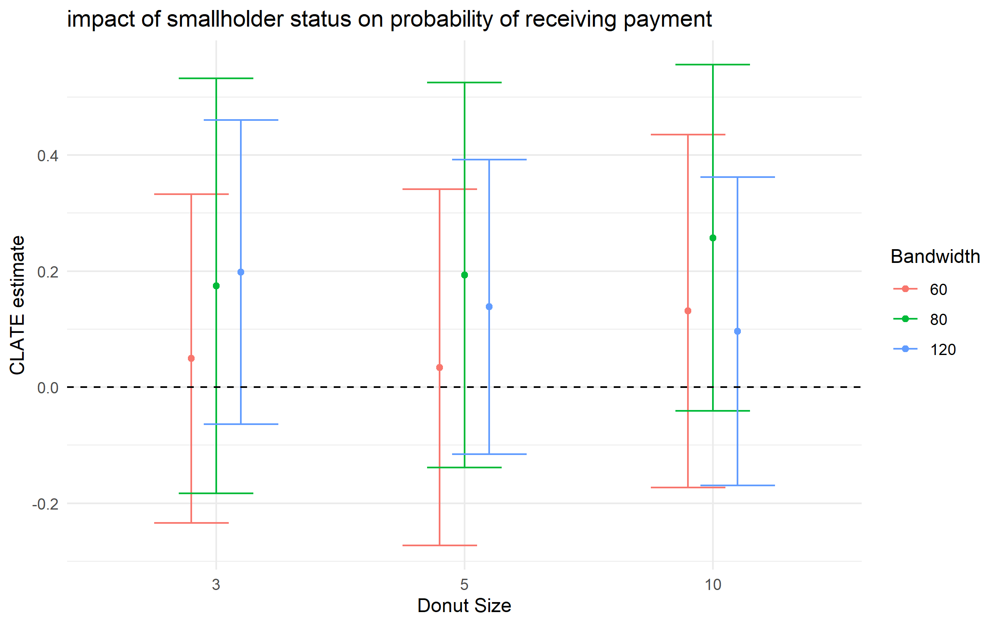

\doublespacing
\sectionfont{\fontsize{11}{11}\selectfont}
\subsectionfont{\fontsize{11}{11}\selectfont}

```{r setup, include=FALSE}
source('summarySE.R')
library(knitr)
#library(dplyr)
library(ggplot2)
library(stringi)
library(stargazer)
library(kableExtra)
library(tidyverse)


knitr::opts_chunk$set(echo = FALSE, warnings = FALSE, messages = FALSE, out.width="49%", fig.align = "center")

options(scipen = 999)
```

# Abstract {-}


\clearpage

# Motivation

In practice, program administrators face decisions over the level of incentives to offer in order to acheive environmental benefits at least cost. The incentives offered, however, affect program outcomes through both the direct payment increase as well as program selection. 

In an attempt to encourage the recovery and protection of native forests, Chile sought to pass the Ley de Recuperación del Bosque Nativo y Fomento Forestal (Native Forest Law). In addition to protections for native forests, the law established an annual competition for grants to support private landowners in their efforts to manage, restore, or reforest their land using native species. Since 2009, more than $58 million have been allocated through these competitions for projects covering 235 thousand hectares. Much of this allocated funding has not been paid to landowners, however, as program follow-through is relatively low. Program administrators are unsure exactly why enrolled applicants fail to complete projects at such high rates [@conaf_2019]. 

Initially expected in 1994, the Native Forest Law became frozen in legislature before finally passing in 2008. the new law acted as a successor to DL701 [@clapp1998], a law that largely subsidized afforestation with monocultures of eucalyptus and pine [@heilmayr_impacts_2020]. In response to concerns that large companies benefited disproportionately from the DL701 subsidies, Native Forest Law bonuses place an emphasis upon supporting smallholders. 

In practice, the contest benefits smallholders in several ways. First, CONAF holds separate contests for smallholders and other interested parties, where awards in the smalholder contest are worth 15\% more than awards in the other interested parties contest for the same set of activities. Further, participating in the smallholder contest essentially guarantees project approval and funding. When distributing funds, CONAF approves projects in the smallholder contest in order from the highest to lowest score, before moving to the other interested party contest. As such, other interested party applicants may not receive an award if their project score falls below the point at which the available funding has been distributed. To date, funding has never run out prior to awarding all eligible smallholder projects, so participating in the smallholder contest all but guarantees project approval and funding. 

## Smallholder eligibility

CONAF defines smallholder eligibility in different ways depending on region, but with some exceptions, eligibility is determined by property size. In the regions of Chile in which forestry plays a major role, this cutoff is 200 hectares, and it is larger in other regions of the country. Further, these landowners cannot have assets exceeding the equivalent of 3,500 development units. Some exceptions apply to these rules, such as for indigenous communities, who are eligible for the smallholder contest regardless of property size. 

```{r status-200, fig.pos="H", out.width = '70%', fig.cap = "conditional probability of being granted smallholder status drops distinctly across main 200 hectare eligibility threshold", echo=FALSE}
knitr::include_graphics("figs/status_discontinuity.png")
```

Figure \@ref(fig:status-200) shows how the probability of being granted smallholder status changes discontinuously across this property size threshold. We see a distinct drop in the proportion of properties granted smallholder status beyond the eligibility threshold, although there is some noncompliance. Figure \@ref(fig:status-800) shows that this discontinuity moves as expected in regions 11 and 12, where 800 hectares is the threshold for smallholder eligibility. This time, almost no properties above the cutoff were granted smallholder eligibility in these two regions. Note that there is no discontinuity at 200 hectares for properties in regions 11 and 12. Nothing about 200 hectares should affect conditional probability of smallholder status outside of the program threshold in the relevant regions, and the lack of a discontinuity at 200 ha for these regions confirms this.   

```{r status-800, fig.pos="H", out.width = '70%', fig.cap = "test", echo=FALSE}
knitr::include_graphics("figs/status_discontinuity_800.png")
```

# Bunching at the eligibility threshold

Testing for manipulation at the 200 hectare threshold reveals clear evidence of bunching right below the cutoff. A Mccrary density test rejects the null of a smooth distribution at this point. This ability to manipulate the running variable poses a threat to identification in an RDD design unless properly addressed. 

```{r rddensity-200, fig.pos="H", out.width = '70%', fig.cap = "test", echo=FALSE}
knitr::include_graphics("figs/psize_manipulation_200.png")
```

## Distinguishing misreporting from selective entry

We have boundaries for rural properties in Chile for the regions that comprise the main set of Native Forest Law enrollees. We match enrolled properties to property boundaries using the set of coordinates provided for each property. The property boundaries are sourced from the Centro de Informacion de Recursos Naturales (CIREN), who provide property boundaries based on the property divisions sent by the Internal Revenue Service (SII). As such, there is no reason to believe that these boundaries are minipulable. These matches provide a good estimate of the distribution of actual property sizes of Native Forest Law enrollees, and Figure \@ref(fig:dists) shows that the distribution of reported and matched true property sizes are comparable. 

```{r dists, fig.pos="H", out.width = '70%', fig.cap = "test", echo=FALSE}
knitr::include_graphics("figs/psize_distributions.png")
```

In an effort to determine whether the bunching below the smallholder eligibility threshold of 200 hectares is due to misreporting or an increase in the number of enrollees just below the threshold, we explore these two distributions near the eligibility cutoff. Figure \@ref(fig:dists-window) shows the distributions of the reported and matched property sizes near the 200 hectare threshold. We again see evidence of bunching just under the cutoff. In addition, we see evidence that properties with matched (true) property sizes just over the 200 hectare threshold were less likely to report their matched property size. This is suggestive of misreporting by properties just above the threshold.  

```{r dists-window, fig.pos="H", out.width = '70%', fig.cap = "test", echo=FALSE}
knitr::include_graphics("figs/psize_distributions_window.png")
```

Lastly, we explore the properties who have reported property sizes just under the threshold. Figure XX shows the reported and true property sizes for these properties after limiting the sample to only matched properties with a reported property size between 198 to 200 hectares. We see that not all of the properties are underreporting their property size. Some are likely unsure of their exact property size and simply round to the nearest 10 hectares or so. Roughly half of the properties bunching below the threshold had true property sizes below the threshold. 

<!-- ## Benefits of smallholder classification and the policy relevant parameter -->

<!-- The benefits of being classified as a smallholder are fairly substantial. The main benefit of smallholder classification is a payment increase of 15\% for the same activities. Smallholder classification may also come with benefits related to extension services or technical assistance.  -->

<!-- We now introduce our parameter of interest. While one may be interested in the causal impact of smallholder classification on property outcomes, this is a difficult parameter to recover. Properties just under the 200 hectare threshold may not have enrolled had the payment been 15\% less, meaning that increased enrollment could have resulted just under the policy threshold. As such, properties on either side of the threshold may not be perfect counterfactuals. However, we can still recover a parameter of extreme policy relevance: the expected impact of smallholder classification on outcomes for enrolled properties. This is likely to be the parameter policymakers are interested in if the primary objective is to generate forest cover at least cost.  -->

<!-- We define the parameter of interest below: -->

<!-- $$CLATE = E[Y_i(1) - Y_i(0) | X = c, i \in L]$$ -->
<!-- , where $Y_i$ denotes the potential outcome for property $i$; $X$ is property size; $c$ is the smallholder eligibility threshold; and $L$ represents enrollment via the Native Forest Law. This is the local average treatment effect of smallholder classification, conditional on property $i$ participating in the program.  -->

# Possible research questions and design

I see two paths forward with this project. The first surrounds the manipulation and misreporting at the thresholds. 

The second path would need to overcome the heaping to conduct a regression discontinuity design analysis. I still believe this is possible, as several papers in the economics literature have sought to overcome and analyze this issue in similar settings. @barreca2016 explore heaping in the context of birth weights. While extremely unlikely in "nature", birth documents show heaping at perfect 100 gram levels. They conduct monte carlo analyses to show that dropping data at heap points provides unbiased estimates of the LATE in these settings before showing that designation as "low birth weight" at the threshold improved outcomes.  


## Path one: manipulation and selection

I have shown evidence of manipulation and misreporting. Some of this is due to landowners not knowing their true property size. If this manipulation facilitates entrance into the program, program managers may sacrifice environmental benefits to properties that shouldn't even be enrolling. 

I first explore how heapers (i.e. those that report property sizes at the threshold or at very round numbers) differ in characteristics to other landowners. 

```{r}
regions_200 <- c(5,6,7,8,9, 10,14)
regions_500 <- c(1, 2, 3, 4, 15)
regions_800 <- c(11, 12)
NFL_df <- readRDS("C:/Users/agarcia/Dropbox/chile_collab/input_files/NFL_df.rds")

discontinuity_main <- NFL_df %>%
  rename(property_size = rptpre_superficie_predial)%>%
  mutate(received_bonus = as.numeric(ifelse(rptpro_tiene_bonificacion_saff == "Si", 1, 0)),
         size_cutoff = ifelse(
           rptpro_numero_region %in% regions_200, 200,
           ifelse(rptpro_numero_region %in% regions_800, 800, 500)
         ),
         size_centered = property_size - size_cutoff,
         below_cutoff = property_size <= size_cutoff,
         smallholder = ifelse(rptpro_tipo_concurso == "Otros Interesados", 0, 1),
         round_heaper = (property_size %% 50 == 0)*1,
         threshold_heaper = ifelse(
           between(property_size, 195, 200)*1, "threshold heaper",
         ifelse( between(property_size, 200.01, 225)*1, "just over", 
                 ifelse( rptpro_tipo_concurso != "Otros Interesados", "other smallholders over 150 ha", "other other")
                 )
         )
  )%>%
  # group_by(rptpro_id)%>%
  # mutate_at(.vars = vars(anillado:zanja),
  #           .funs = list(~ max(.)))%>%
  # ungroup()%>%
distinct(rptpro_id, .keep_all = TRUE)


ggplot(summarySE(subset(discontinuity_main, property_size > 150 ),
                 measurevar="rptpro_monto_total", groupvars=c("threshold_heaper"), na.rm = TRUE), 
       aes(x=threshold_heaper, y=rptpro_monto_total)
       ) + 
  geom_bar(position=position_dodge(), stat="identity") +
  geom_errorbar(aes(ymin=rptpro_monto_total-se, ymax=rptpro_monto_total+se), width=.25) +
  xlab("contest")+
  ylab("test")+ggtitle("test")+theme(legend.position = "none")


```
<!-- payment amount -->
<!-- bonus area relative to property size -->
<!-- objective -->
<!-- activities -->

## Path two: tradeoffs due to smallholder benefits offered at threshold

Public programs often seek to encourage private landowners to provide environmental benefits through incentive payments that correspond to specific activities. However, the design of these incentives has consequences for how landowners choose to participate and the resulting tradeoffs faced by program administrators. We would use a fuzzy regression discontinuity design to understand how selection into the program and application decisions affect program outcomes at the eligibility cutoff. We can explore whether the cutoff induces landowners who enroll in the program to enroll less land overall, apply for larger total payments, or follow through at higher rates. They may also be less likely to undertake projects with the objective of timber production, which may have environmental repercussions to offering increased payments. 


<!-- \textbf{certainty of funding:} -->
<!-- - other interested parties face the risk of not being funded -->
<!-- - smallholders are guaranteed funding -->
<!-- - other interested parties may add on additional components to increase score -->

<!-- \textbf{payment increase:} -->

<!-- selection: -->
<!-- - landowners with higher opportunity cost are likely to enter program -->
<!-- - whether this is good depends on how opportuniy cost is correlated with project selection and performance -->

<!-- application decisions:  -->
<!-- - lower profit activities may become more appealing -->
<!-- - landowners may simply increase project areas, etc. to generate more payments -->


<!-- ## Estimation -->

<!-- Smallholder eligibility is largely determined by property size in the Native Forest Law contest. If properties fall below the regional property size cutoff, they are eligible for additional program benefits. While this size theshold determines smallholder status for the vast majority of properties, some can lose or gain eligibility through other means. Table XX shows the non-compliers in this setting. While a property size exceeding the threshold essentially disqualifies a property from smallholder benefits, a sizeable proportion of properties under the cutoff still get classified as other interested parties.  -->

<!-- We know that properties just above the smallholder eligibility threshold were likely to misreport their property sizes in order to obtain the benefits alotted for smallholders. The donut hole RDD can be used to circumvent problems introduced by these situations. [@balleca2016] shows that in the sharp RD setting, the donut RDD approach leads to an unbiased estimate of the treatment effect for non-heaped types. If we do not drop properties within the manipulation zone, a sharp RDD would recover the average treatment effect across the two types, weighted by the share of non-heaped properties that are observed at the heap. -->

<!-- Because of the non-compliance observed in Figure \@ref(fig:status-200), we have a fuzzy setting, and with instrumental variables, we are estimating the CLATE for compliers only. We estimate the following 2sls set of equations: -->

<!-- $$ \widehat{smallholder}_i = \gamma_0 + \gamma_1 hectares_{i, centered} + \gamma_2 belowcutoff_i + \omega$$ -->
<!-- $$ Y_i = \beta_0 + \beta_1 hectares_{i, centered} +\beta_2 \widehat{smallholder}_i + \epsilon$$ -->

<!-- In order to minimize concern surrounding the misreporting of property size at the threshold, I report estimates with a variety of donut sizes. I aslo ensure that the estimates are robust to several different bandwidths.  -->


<!-- # Results -->

<!-- ## Follow through -->

<!-- Policy makers are interested in the impact of these smallholder benefits for several reasons. First, the primary program objective seeks to protect and recover native forest. An increased payment is likely to attract landowners with a higher opportunity cost. Second, program administators have prioritized the participation of smallholders and indigenous communities. This is evidenced by both the application process, which prioritizes the funding of smallholders, and the increased payments.  -->

<!-- One of the primary challenges faced by program administrators is a lack of follow through. The average follow-through rate for projects in the program was 33.91\% through 2018. The follow through rate for smallholders was 37.66\% and 26.63\% for other interested parties. Smallholders have a significantly higher follow through rate, which could be due to the increased payment. Low follow through affects both of the above program goals. If projects are not completed, forest cover benefits are unrealized, and landowners do not receive any benefits.   -->

<!-- ```{r received-bonus, fig.pos="H", out.width = '70%', fig.cap = "test", echo=FALSE} -->
<!--  -->
<!-- ``` -->

<!-- Figure \@ref(fig:received-bonus) shows that although all estimates are positive, smallholder status did not increase follow through rates at a statistically significant level for compliers at the eligibility cutoff.   -->

<!-- ## Application decisions -->

<!-- An interesting component of our data is access to specific project details, activities, and objectives. Increased payments may make previously unprofitable activities desirable choices. There may also be landowner benefits to scaling up the size of the reforestation project when payments increase.  -->

<!-- In this section, we explore the impact of smallholder status at the threshold on components of the project applications. Recall that these estimates the impact of both the direct payment increase and selection into the program.  -->

<!-- ```{r applications,  fig.show="hold", fig.pos="H", out.width = '49%', fig.cap = "test", echo=FALSE} -->
<!-- knitr::include_graphics(c("figs/payment_plot.png", "figs/area_enrolled_plot.png", "figs/timber_plot.png")) -->
<!-- ``` -->

<!-- Figure \@ref(fig:applications) shows that smallholder status decreases the average project area, total payment amount, and probability of undartaking projects with the objective of timber production for compliers at the cutoff.  -->

<!-- I need to further work to understand the tradeoffs discussed above.  -->

<!-- ## Specific activities undertaken -->

<!-- In progress -->

<!-- ## Accumulation of forest biomass -->

<!-- In progress -->

<!-- # Evidence of application construction to maximize score for other interested parties -->
